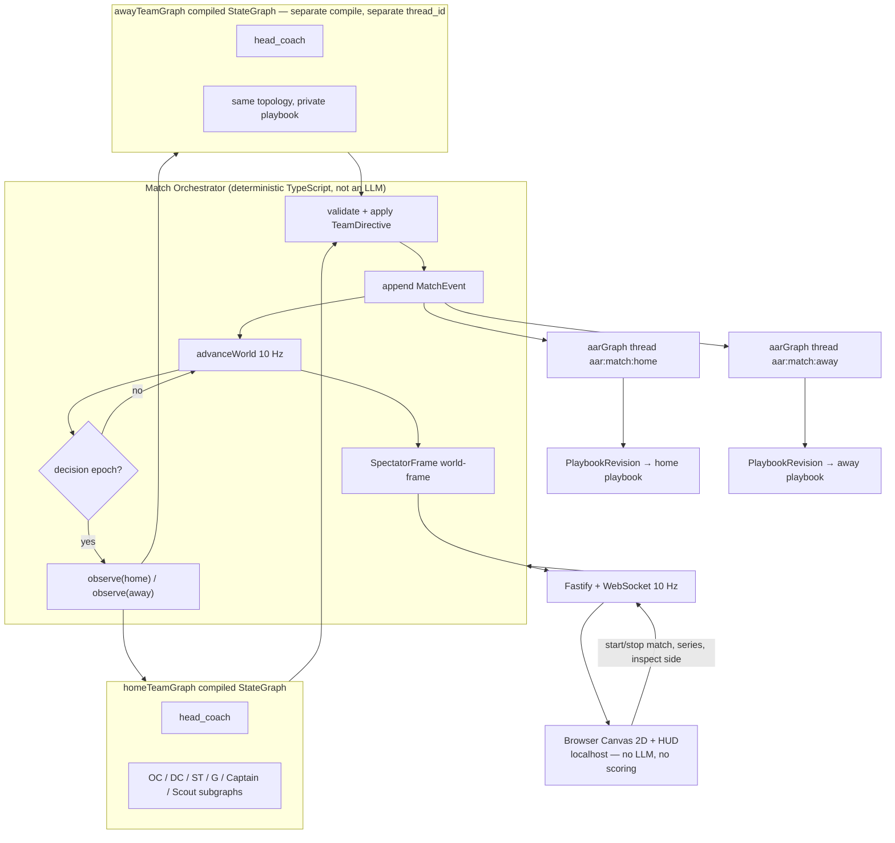
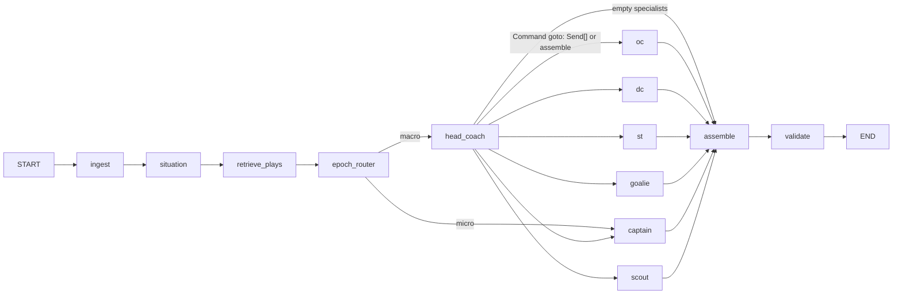
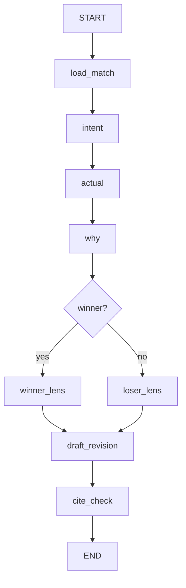

# Graph_Hockey — Competing LangGraph Agent Teams in a Realistic Hockey Game

| Field | Value |
| --- | --- |
| **Document title** | Graph_Hockey Design |
| **Author** | Graph_Hockey design |
| **Date** | 2026-08-24 |
| **Status** | **Approved (user decisions incorporated)** |
| **Approved** | 2026-08-24 |
| **Repo** | private GitHub repository `Graph_Hockey` (greenfield; no existing codebase) |
| **Runtime** | Node.js ≥ 20.11, TypeScript 5.x (strict) |
| **Agent framework** | LangGraph.js (`@langchain/langgraph`, `@langchain/core`) |
| **LLM provider** | xAI only (`XAI_API_KEY`, `https://api.x.ai/v1`) |

This document is the implementation spec for a senior engineer. File paths, graph node names, TypeScript types, schemas, tick/physics constants, and PR order are decisions, not placeholders.

---

## Overview

Graph_Hockey is a **localhost browser hockey game** backed by a **deterministic Node.js engine** in which **two independently compiled LangGraph.js team graphs compete**. The v1 primary UX is a **watchable 2D rink in the browser** (scoreboard, clock, on-ice players + puck, event ticker, AAR viewer, playbook diff, start/stop series). A non-LLM **Match Orchestrator** on the server ticks a 2D NHL-sized physics/rules engine at 10 Hz, presents **partial observations** to each team, collects **discrete tactical directives**, applies them as constraints on player locomotion, and writes an event log that is sufficient to **replay a game with zero LLM calls**.

The browser **never** scores goals, **never** calls xAI, and **never** receives the opponent’s private playbook. Canvas 2D is a renderer of server snapshots, not a second simulation.

Each team graph is a **hierarchical multi-agent system** (Head Coach supervisor + specialist subgraphs), not a single prompt. Between decision epochs, on-ice behavior is pure code derived from the currently selected **Play** object. After every game, a separate **AAR LangGraph** reads the event log and emits a structured **PlaybookRevision** (a capped patch). Over a self-play series (default **7 games**), playbooks mutate: plays are minted, counter-fitted, or retired.

A **headless CLI** (`gh simulate --no-llm`, golden hashes) remains mandatory for CI. It is not the primary product surface.

The learning goal is to make LangGraph concepts *visible in the repo*: `StateGraph`, `StateSchema` + reducers, `Send` fan-out, `Command` routing, subgraphs, checkpointers, `interrupt()`, and a second compiled graph for post-game work.

---

## Background & Motivation

### Why this project exists

The user is expanding skill in **LangGraph.js multi-agent systems**. Toy chat loops hide the hard parts: state reducers, information hiding, hybrid deterministic/agentic control, cost, and persistence. A competitive hockey sim forces those concepts:

- Two graphs that **must not share private state** during a match (information hiding).
- A **host that is not an LLM**, so graphs cannot invent goals.
- A **playbook that is data**, so “getting better” is a measurable patch, not a longer system prompt.
- **Epochs, not per-tick LLMs**, so cost and latency stay in the real world.

### Current state

Greenfield. There is no repository, no engine, no agents. After this design is approved, implementation creates the **private** GitHub repo and lands incremental PRs in the order given in [PR Plan](#pr-plan).

### Pain points this architecture is designed to avoid

| Pain | Design response |
| --- | --- |
| LLM invents a goal or teleports the puck | Engine is the only authority for puck/player kinematics and scoring |
| 36,000 ticks × 12 players × LLM | Hybrid: 10 Hz physics; LLMs only at **decision epochs** |
| “The team learned” = prompt soup | Structured `Play` DSL + versioned `PlaybookRevision` |
| AAR is a log dump | Post-game LangGraph with military AAR nodes and event-ID citations |
| Hidden LangGraph APIs | Named nodes, explicit reducers, subgraphs, checkpoint `thread_id`s |
| API-credit burn during tests | Engine unit-tested without LLM; agents tested with mocked `ChatXAI` |

---

## Goals & Non-Goals

### Goals (v1)

1. Private GitHub repo `Graph_Hockey`, TypeScript (strict), pnpm, Node.js.
2. Deterministic 2D NHL-sized engine: 5 skaters + 1 goalie per side, 3×20:00 periods, documented rule subset (faceoffs, icing, offside, penalties, PP/PK, line changes, shots/rebounds/dump-ins/cycling).
3. Two compiled `StateGraph`s (`homeTeamGraph`, `awayTeamGraph`) invoked by a Match Orchestrator. Same topology and default models; **private playbooks and private graph state**.
4. Multi-agent team graph: Head Coach supervisor + Offensive Coordinator, Defensive Coordinator, Special Teams, Goalie Coach, Scout, Captain.
5. Persistent playbook (structured plays, not free text) that AAR can patch.
6. AAR after **every** result (win, loss, or OT/regulation **tie**). Shootout is not v1.
7. **Browser game (v1 gate):** localhost Fastify + WebSocket + Canvas 2D rink: live match, scoreboard, period/clock, players + puck, inspect-side play name, public event ticker, cost/token readout, AAR report viewer, playbook diff viewer, start/stop match and 7-game series.
8. **Review footage (v1 gate):** every match is auto-recorded as deterministic game film. Film Room plays clips, jumps from AAR `eventIds` to ice, and keeps a series **improvement ledger** (metrics + paired before/after clips) so playbook evolution is visible, not just logged.
9. Headless CLI for CI/tests: simulate, replay, dump AAR, playbook diff, series, footage (`gh simulate --no-llm` required in CI).
10. Engine fully testable without `XAI_API_KEY` and without a browser. Seeded RNG for reproducible sims and golden fixtures.
11. Cost/latency budget documented and enforced with a circuit breaker.

### Non-goals (v1)

- Unity / Godot as a runtime. **Phaser is not used** (Canvas 2D is the renderer; a second game engine would duplicate simulation).
- Human vs AI skater control / multiplayer (optional tiny overlay later; v1 is two LangGraph teams watched in the browser).
- Remote/multi-user hosting, auth, or a public internet deploy. v1 is **localhost only**.
- Full NHL rulebook (coach’s challenge, fighting, major/misconduct, video review, too-many-men as a social call — see rule subset).
- OpenAI / Anthropic / Gemini as primary providers.
- Reinforcement learning, policy gradients, or learned locomotion.
- Asymmetric model labs as the default (flagged experiment only).
- LangSmith Cloud deployment / Agent Server. Local tracing **turns on automatically if** `LANGSMITH_API_KEY` or `LANGCHAIN_API_KEY` is set; the app **runs without** those keys.
- Audio, 60 fps interpolation as a requirement (10 Hz snapshots are the display rate).
- Betting, gambling, or real-world team/player likeness licensing. Starter teams are fictional (`original-six`, `expansion`).
- **3v3 as a v1 engine/CLI mode.** OT is 3v3 sudden death only. A `--mode 3v3` regulation variant is M4+ (would need its own lines, icing/offside, and substitution rules).
- **HITL on the default team-graph compile path.** `interrupt()` is PR 16 stretch; v1 compile ends at `validate_directive`.
- **Shootout.** OT 5:00 3v3; still tied → `result = "tie"`, AAR still runs.

---

## Research grounding (fetched 2026-08-24)

### xAI API

From [xAI Quickstart](https://docs.x.ai/developers/quickstart) and [Models](https://docs.x.ai/developers/models):

- Env: `XAI_API_KEY`. Base URL: `https://api.x.ai/v1`.
- Official JS paths: `openai` SDK pointed at `https://api.x.ai/v1`, or Vercel AI SDK `@ai-sdk/xai`. **This repo uses LangChain [`ChatXAI`](https://docs.langchain.com/oss/javascript/integrations/chat/xai) from `@langchain/xai`** (reads `XAI_API_KEY`, default base `https://api.x.ai/v1`). `ChatXAI` **extends `ChatOpenAICompletions`** and talks to **`POST /v1/chat/completions`**, not the Responses API.
- Structured outputs: `response_format.json_schema` / OpenAI `chat.completions.parse` with Zod ([docs](https://docs.x.ai/developers/model-capabilities/text/structured-outputs)). Tool arguments are implicitly strict.
- Chat Completions body field for effort is **`reasoning_effort`** (string). Cloudflare’s xAI Chat Completions examples send `"reasoning_effort": "low"`. Official xAI [Reasoning](https://docs.x.ai/developers/model-capabilities/text/reasoning) docs show `reasoning: { effort }` on the **Responses** API. We stay on Completions and pass `modelKwargs: { reasoning_effort }` so the JSON body matches Completions. See §11.
- Current text models (pricing per 1M tokens, < 200k prompt):

| Model | Context | Input | Cached in | Output | Role in Graph_Hockey |
| --- | ---: | ---: | ---: | ---: | --- |
| `grok-4.6` | 500k | $2.00 | $0.50 | $6.00 | Optional flagship override (`GRAPH_HOCKEY_COACH_MODEL`) |
| **`grok-4.5`** | 500k | $2.00 | $0.30 | $6.00 | **Default Head Coach + AAR** (product requirement) |
| `grok-4.3` | 1M | $1.25 | $0.20 | $2.50 | **Default fast model** for coordinators, Captain, Scout, play retrieval |

Reasoning (xAI docs 2026-08-24):

- **`grok-4.5` / `grok-4.6`:** `reasoning_effort` `low` | `medium` | `high` (4.6 also `xhigh`). **Default `high`. Cannot be disabled.** Reasoning tokens are billed as output. We set **`low` for in-game Head Coach** and **`high` for AAR**.
- **`grok-4.3`:** reasoning model; effort `none` | `low` | `medium` | `high` (pydantic-ai / Cloudflare; default typically `low`). We set **`none` for specialists/Captain/Scout** (structured extraction). If a live smoke gets HTTP 400 on `none`, fall back to `low` in `client.ts` and log `ReasoningNoneUnsupported`.

**Retired (2026-05-15):** `grok-4-1-fast-reasoning`, `grok-4-1-fast-non-reasoning`, `grok-4-fast-reasoning`, `grok-4-fast-non-reasoning`, `grok-code-fast-1` now redirect to `grok-4.3` / `grok-build-0.1`. Do **not** hard-code the retired slugs. Fast-path = `grok-4.3`.

### LangGraph.js (current Graph API)

From [LangGraph overview](https://docs.langchain.com/oss/javascript/langgraph/overview), [Graph API](https://docs.langchain.com/oss/javascript/langgraph/graph-api), [Subgraphs](https://docs.langchain.com/oss/javascript/langgraph/use-subgraphs), [Persistence](https://docs.langchain.com/oss/javascript/langgraph/persistence), [Checkpointers](https://docs.langchain.com/oss/javascript/langgraph/checkpointers), [Interrupts](https://docs.langchain.com/oss/javascript/langgraph/interrupts), [Multi-agent](https://docs.langchain.com/oss/javascript/langchain/multi-agent):

- Install: `pnpm add @langchain/langgraph @langchain/core @langchain/xai @langchain/langgraph-checkpoint-sqlite`. Pin `@langchain/xai` in `package.json` (do not leave it floating). `ChatXAI` constructor in current JS is `new ChatXAI(model: string, fields?)` **or** `new ChatXAI(fields?)` — we use the **two-arg form**.
- State: `StateSchema` + Zod field schemas, `ReducedValue` reducers, `MessagesValue`, `UntrackedValue`. (`Annotation.Root` still appears in some older snippets; **this repo uses `StateSchema`**, the current documented API.)
- Graph: `new StateGraph({ state, input, output }).addNode().addEdge(START, …).compile({ checkpointer })`.
- Parallel map-reduce: return `new Send("node", payload)` from **conditional edges**, or `new Command({ goto: Send | Send[] })` from a node. **`Send` is not a state update and must not be returned from a node as if it were.** Do not mix static `addEdge` and `Command`/`Send` from the same node.
- Combined update + route: `return new Command({ update, goto, graph?: Command.PARENT })`. Nodes that return `Command` **must** declare `ends: [...]`.
- Subgraphs: either `addNode("name", compiledSubgraph)` when keys are shared, or wrap `subgraph.invoke()` when schemas differ.
- Checkpointers: `MemorySaver` (tests), `SqliteSaver` from `@langchain/langgraph-checkpoint-sqlite` (dev). Compile with `checkpointer`. Invoke with `{ configurable: { thread_id } }`.
- HITL: `interrupt(payload)` inside a node; resume with `new Command({ resume })`. Requires checkpointer. Node **restarts from the beginning** on resume — side effects before `interrupt` must be idempotent.
- Recursion limit default 25; we set `recursionLimit: 12` on team graphs (shallow supervisor) and `8` on AAR.

### Hockey geometry (public NHL concepts)

NHL ice: **200 ft × 85 ft**, corner radius **28 ft**, goal line **11 ft** from end boards, blue lines **75 ft** from end boards (**50 ft** neutral zone), goal **6 ft × 4 ft**. These numbers are the engine’s world coordinates. We implement a **documented subset** of NHL-like rules, not a pirate of the NHL rulebook.

---

## Proposed Design

### 1. Repository and package layout

**Decision: single TypeScript package**, not a pnpm monorepo. One `package.json`, one `tsconfig.json`. The engine, agents, AAR, and CLI share types; splitting packages would add versioning noise without independent deployables.

**Package manager: pnpm** (lockfile committed). Node `>=20.11`. Module: `"type": "module"`. Build: `tsc` to `dist/`. Tests: `vitest`. Runner: `tsx` for CLI in dev.

Proposed GitHub: **private** `Graph_Hockey`. Default branch `main`. Feature branches + PRs. LICENSE: **MIT** (private repo, personal learning; MIT keeps downstream reuse simple). README describes setup, architecture, and the LangGraph learning map.

```
Graph_Hockey/
├── .github/workflows/ci.yml
├── .env.example
├── .gitignore
├── AGENTS.md                          # contributor map → LangGraph concepts
├── LICENSE                            # MIT
├── README.md
├── package.json                       # name: "graph-hockey"
├── pnpm-lock.yaml
├── tsconfig.json                      # strict, noUncheckedIndexedAccess, NodeNext
├── vitest.config.ts
├── data/
│   ├── teams/original-six.json        # roster + attributes
│   ├── teams/expansion.json
│   └── playbooks/
│       ├── seed-original-six.json
│       └── seed-expansion.json
├── fixtures/
│   ├── golden/period1-seed42.jsonl    # replayable event logs
│   └── observations/stoppage-oz.json
├── scripts/
│   ├── smoke-no-llm.ts
│   └── smoke-xai-reasoning.ts          # live: print usage + reasoning tokens
└── src/
    ├── index.ts                       # re-exports
    ├── cli/main.ts                    # `pnpm gh …`
    ├── config.ts                      # env + constants
    ├── types/                         # pure types, no I/O
    │   ├── ids.ts
    │   ├── hockey.ts
    │   ├── play.ts
    │   ├── observation.ts
    │   ├── directive.ts
    │   ├── events.ts
    │   ├── aar.ts
    │   └── film.ts                    # Clip, Recording, SeriesImprovement
    ├── engine/
    │   ├── rink.ts                    # geometry
    │   ├── physics.ts                 # integrate, collide
    │   ├── rules.ts                   # icing, offside, penalties, faceoff spots
    │   ├── tactics.ts                 # play → steering targets
    │   ├── xg.ts                      # expected-goals model
    │   ├── fatigue.ts
    │   ├── rng.ts                     # seeded mulberry32
    │   ├── world.ts                   # WorldState
    │   └── step.ts                    # advanceWorld / stepLive / resolveFaceoff
    ├── orchestrator/
    │   ├── match.ts                   # runMatch()
    │   ├── epochs.ts                  # shouldDecideLiveStoppage (PR8) + macro/micro (PR12)
    │   ├── observe.ts                 # public vs private views; mirror PublicEvent
    │   ├── invokeTeam.ts              # never throws; timeout + circuit
    │   └── applyDirective.ts          # validate + clamp
    ├── llm/
    │   ├── client.ts                  # ChatXAI factories
    │   ├── budgets.ts                 # circuit breaker
    │   └── schemas.ts                 # Zod structured-output schemas
    ├── agents/
    │   ├── teamGraph.ts               # compileTeamGraph()
    │   ├── state.ts                   # TeamGraphState
    │   ├── wrapSpecialist.ts          # Send payload → subgraph.invoke → memos
    │   ├── nodes/
    │   │   ├── ingest.ts
    │   │   ├── situation.ts
    │   │   ├── retrievePlays.ts
    │   │   ├── epochRouter.ts         # conditional: macro vs micro
    │   │   ├── headCoach.ts           # Command + Send; never a route_specialists node
    │   │   ├── assembleDirective.ts
    │   │   ├── validateDirective.ts
    │   │   └── hitlOverride.ts        # PR 16 only; not on default compile
    │   └── specialists/
    │       ├── ocSubgraph.ts
    │       ├── dcSubgraph.ts
    │       ├── stSubgraph.ts
    │       ├── goalieSubgraph.ts
    │       ├── captainSubgraph.ts
    │       └── scoutSubgraph.ts
    ├── playbook/
    │   ├── schema.ts
    │   ├── store.ts
    │   ├── retrieve.ts
    │   ├── mutate.ts                  # apply PlaybookRevision with caps
    │   └── similarity.ts
    ├── aar/
    │   ├── aarGraph.ts
    │   ├── nodes/
    │   │   ├── loadMatch.ts
    │   │   ├── intent.ts
    │   │   ├── actual.ts
    │   │   ├── why.ts
    │   │   ├── winnerLens.ts
    │   │   ├── loserLens.ts
    │   │   ├── draftRevision.ts
    │   │   └── citeCheck.ts
    │   └── apply.ts
    ├── persist/
    │   ├── db.ts                      # better-sqlite3 open
    │   ├── schema.sql
    │   ├── matches.ts
    │   ├── events.ts
    │   ├── playbooks.ts
    │   ├── clips.ts
    │   ├── improvement.ts
    │   └── checkpointer.ts            # SqliteSaver wrapper
    ├── film/                          # review footage (no LLM)
    │   ├── clipper.ts                 # auto-clips from event log
    │   ├── pairClips.ts               # series before/after pairing
    │   ├── improvement.ts             # ledger + deltas
    │   └── frames.ts                  # replay window → SpectatorFrame[]
    ├── sim/
    │   ├── series.ts
    │   └── replay.ts
    ├── server/                        # v1 primary UX host
    │   ├── http.ts                    # Fastify: static + REST
    │   ├── ws.ts                      # WebSocket hub
    │   ├── protocol.ts                # Zod WS message schemas
    │   ├── spectator.ts               # WorldState → SpectatorFrame (world frame)
    │   └── matchControl.ts            # start/stop match + series
    └── web/                           # static client (no LLM, no engine)
        ├── index.html
        ├── main.ts
        ├── rink.ts                    # Canvas 2D rink
        ├── hud.ts                     # scoreboard, clock, ticker, cost
        ├── inspect.ts                 # selected-side play name
        ├── aarView.ts
        ├── playbookView.ts
        ├── filmRoom.ts                # /film — timeline, clips, compare
        └── improvementBoard.ts        # series metrics + paired clips
```

`package.json` bin: `"gh": "dist/cli/main.js"` and `"graph-hockey": "dist/cli/main.js"`. Dev: `pnpm gh` via `tsx src/cli/main.ts`; `pnpm web` → `tsx src/server/http.ts` (serves `src/web` + `/ws`).

### 2. System architecture



**Information hiding:** the two team graphs never share a checkpointer thread, never see each other’s `activePlay`, `nextChange`, or scout notes. The browser receives **world-frame public snapshots** plus, if the operator inspects one bench, **that side’s play name only**. `XAI_API_KEY` never leaves the Node process.

**AAR auto-apply** after each game (caps in §12); `--aar-mode propose` is an override. Series default is **7 games**.

### 3. Match Orchestrator (`src/orchestrator/match.ts`)

`runMatch(opts: MatchOptions): Promise<MatchResult>` is a while-loop, not a LangGraph. The loop **must not** run 10 Hz physics during `whistle` / `faceoff_drop` (see §4.0). Epochs run only for sides that `shouldDecide` returns.

```ts
// src/llm/budgets.ts
export interface TokenUsage {
  promptTokens: number;
  completionTokens: number;  // billed output, includes reasoning
  reasoningTokens: number;
  usd: number;
  calls: number;
}
export interface SideBudget extends TokenUsage {}
export interface MatchBudget {
  home: SideBudget;
  away: SideBudget;
  game: SideBudget;          // sums; prompt/$/output caps apply here
}
export function createBudget(): MatchBudget { /* zeros */ }

export function teamTripped(b: MatchBudget, side: Side): boolean {
  return b[side].calls >= MAX_CALLS_PER_TEAM;
}
export function gameTripped(b: MatchBudget): boolean {
  return b.game.promptTokens >= MAX_PROMPT_TOKENS_PER_GAME
    || b.game.completionTokens >= MAX_OUTPUT_TOKENS_PER_GAME
    || b.game.usd >= MAX_USD_PER_GAME;
}
/** Called from a ChatXAI callback (handleLLMEnd), never from graph.invoke output. */
export function recordLlmUsage(b: MatchBudget, side: Side, u: TokenUsage): void {
  add(b[side], u);
  add(b.game, u);
}

// src/orchestrator/epochs.ts
export type SideDecision = { kind: "macro" | "micro"; reason: EpochReason };
export type ShouldDecide = { home?: SideDecision; away?: SideDecision };

export const POSSESSION_REVIEW_TICKS = 80; // 8.0 s of live time at 10 Hz

export type TeamInvokeResult =
  | { ok: true; directive: TeamDirective; usage: TokenUsage; billed: true }
  | { ok: false; directive: TeamDirective; reason: "timeout" | "circuit" | "parse" | "error"; billed: boolean };

export async function invokeTeam(args: {
  graph: CompiledStateGraph;
  side: Side;
  obs: TeamObservation;       // obs.epochKind / obs.epochReason already set
  last: TeamDirective;
  epochIndex: number;
  matchId: string;
  budget: MatchBudget;
  timeoutMs: number;          // 8000 default; 0 = no abort (HITL only)
}): Promise<TeamInvokeResult> {
  if (teamTripped(args.budget, args.side) || gameTripped(args.budget)) {
    return { ok: false, directive: args.last, reason: "circuit", billed: false };
  }
  const thread_id = `match:${args.matchId}:team:${args.side}:epoch:${args.epochIndex}`;
  const ac = new AbortController();
  const timer = args.timeoutMs > 0 ? setTimeout(() => ac.abort(), args.timeoutMs) : undefined;
  const tap = new UsageTap(args.side, args.budget); // handleLLMEnd → recordLlmUsage
  try {
    const out = await args.graph.invoke(
      {
        observation: args.obs,
        epochReason: args.obs.epochReason,
        epochKind: args.obs.epochKind,   // REQUIRED — router reads this, not observation
        lastDirective: args.last,
      },
      { configurable: { thread_id }, signal: ac.signal, recursionLimit: 12, callbacks: [tap] },
    );
    return { ok: true, directive: out.directive, usage: tap.usage, billed: true };
  } catch (e) {
    const reason = ac.signal.aborted ? "timeout" : "error";
    // Tokens already in budget via tap. Persist ok=0, billed=1. Do NOT treat as ok=1.
    return { ok: false, directive: args.last, reason, billed: tap.calls > 0 };
  } finally {
    if (timer) clearTimeout(timer);
  }
}

export async function runMatch(opts: MatchOptions): Promise<MatchResult> {
  const rng = createRng(opts.seed);
  let world = createOpeningFaceoff(opts, rng);
  const events: MatchEvent[] = [];
  let homeDir = defaultDirective("home", opts.homePlaybook);
  let awayDir = defaultDirective("away", opts.awayPlaybook);
  const budget = createBudget();
  let epochIndex = 0;

  while (world.phase !== "game_over") {
    const ev = advanceWorld(world, { home: homeDir, away: awayDir }, rng);
    events.push(...ev);
    persistEvents(opts.db, opts.matchId, ev);

    const decision = shouldDecide(world, ev, homeDir, awayDir);
    const jobs: Promise<void>[] = [];
    if (decision.home) {
      const hObs = observe(world, "home", decision.home);
      jobs.push(invokeTeam({
        graph: opts.homeGraph, side: "home", obs: hObs, last: homeDir,
        epochIndex, matchId: opts.matchId, budget, timeoutMs: EPOCH_MS,
      }).then((r) => { homeDir = r.directive; persistEpoch(opts.db, opts.matchId, epochIndex, "home", r); }));
    }
    if (decision.away) {
      const aObs = observe(world, "away", decision.away);
      jobs.push(invokeTeam({
        graph: opts.awayGraph, side: "away", obs: aObs, last: awayDir,
        epochIndex, matchId: opts.matchId, budget, timeoutMs: EPOCH_MS,
      }).then((r) => { awayDir = r.directive; persistEpoch(opts.db, opts.matchId, epochIndex, "away", r); }));
    }
    if (jobs.length > 0) {
      await Promise.all(jobs); // wrappers never throw
      epochIndex += 1;
    }
  }
  await runAarBothSides(opts, events);
  return summarize(world, events);
}
```

**`epochKind` must be a top-level invoke field.** `addConditionalEdges("retrieve_plays", s => s.epochKind === "macro" ? "head_coach" : "captain")` reads **graph state**, not `observation.epochKind`. Omitting it makes every epoch micro (or fails Zod). Unit test (required): invoke with `epochKind: "macro"` visits `head_coach`; `epochKind: "micro"` never does.

**Concurrency / fairness of timeouts:** `Promise.all` only over wrappers that **cannot throw**. Each side has its **own** `AbortController`. A home 8s abort cannot reject away. Whole-graph abort is 8 s; ChatXAI client timeouts are **shorter** (HC 5 s, specialists 2.5 s, §11) so the model client fails first. Timed-out calls that already hit xAI are `ok=0`, `billed=1`, counted in `MatchBudget`, not as successful `epoch_invocations.ok`.

**Per-team vs game caps:** `MAX_CALLS_PER_TEAM=150` is enforced on `budget.home` / `budget.away` independently — the 151st **home** call freezes **home** only (`teamTripped`). Prompt tokens, output tokens (incl. reasoning), and $ are **game-level both teams** (`budget.game`). Unit test: 151 home calls → home `reason: "circuit"` while away still invokes. Usage is **not** a graph-state field.

**HITL:** not on the v1 compile path. If PR 16 enables `GRAPH_HOCKEY_HITL=1`, the orchestrator **must not** pass `timeoutMs` (or set it to `0` = no abort), must inspect `graph.invoke` result for `__interrupt__`, print a JSON-serializable `HitlPayload` to CLI stdin, and resume with `new Command({ resume })` on the **same** `thread_id`. Do not put full `TeamObservation` in the interrupt payload (see §10 HITL).

**Fairness of models:** both teams use `compileTeamGraph({ side })` and the same default models. Playbooks and `thread_id`s differ. Hidden CLI flags `--home-model` / `--away-model` override per side (asymmetric lab; off by default).

### 4. Engine: world, tick, physics

#### 4.0 `WorldState` and the stoppage machine

This is the fairness core. `advanceWorld` (not a single 10 Hz `step` for every wall-clock tick) is the only function that mutates the world.

```ts
// src/types/hockey.ts
export type Side = "home" | "away";
export type Strength = "5v5" | "5v4" | "4v5" | "5v3" | "3v5" | "4v4" | "4v3" | "3v4" | "3v3" | "6v5" | "5v6";
export type Zone = "DZ" | "NZ" | "OZ";
export type Phase =
  | "live"
  | "delayed_offside"   // clock runs
  | "delayed_penalty"   // clock runs; extra attacker legal
  | "whistle"           // clock stopped; next call is setupFaceoff
  | "faceoff_drop"      // discrete RNG; not 10 Hz
  | "intermission"
  | "game_over";

export type WhistleKind =
  | "goal" | "icing" | "offside" | "penalty" | "freeze"
  | "puck_out" | "net_off" | "period_end" | "high_stick_goal_waved_off";

export type ContactKind = "stick-puck" | "body-puck" | "skate-puck" | "body-body" | "stick-body";

export interface PenaltyClock {
  playerId: PlayerId;
  remaining: number;       // seconds of penalty time (stop-time)
  kind: "minor";
}

export interface IcingRace {
  sideDumping: Side;       // team that shot the puck
  dot: Vec2;               // end-zone faceoff dot on puck's side
  defenderId: PlayerId;    // icing team, nearest to dot at race start
  attackerId: PlayerId;    // other team, nearest to dot at race start
  startedLiveTick: number; // liveTick when the race began
}

export interface WorldState {
  matchId: string;
  seed: number;
  phase: Phase;
  period: 1 | 2 | 3 | "OT";
  /** Seconds remaining in this period. Decrements only in live / delayed_* at 10 Hz. */
  clockRemaining: number;
  liveTick: number;        // increments only on 10 Hz live/delayed steps; 0..(12000 per period)
  stoppageSeq: number;     // increments on each discrete stoppage resolution
  attackingDir: { home: 1 | -1; away: 1 | -1 }; // home attacks +X in periods 1,3
  score: { home: number; away: number };
  strength: Strength;
  puck: { pos: Vec2; vel: Vec2; possessor: PlayerId | null; lastStick: PlayerId | null };
  bodies: Record<PlayerId, Body>;
  onIce: { home: PlayerId[]; away: PlayerId[] }; // 5 skaters + G, or 6 skaters if EN / delayed penalty
  bench: { home: PlayerId[]; away: PlayerId[] };
  fatigue: Record<PlayerId, number>;
  penalties: { home: PenaltyClock[]; away: PenaltyClock[] };
  delayedPenalty: { against: Side; playerId: PlayerId } | null;
  delayedOffside: { attacking: Side } | null;
  icingRace: IcingRace | null;
  whistle: WhistleKind | null;
  faceoffSpot: Vec2 | null;
  netStatus: { home: "on" | "off"; away: "on" | "off" };
  smotherProgress: { home: number; away: number }; // 0..1; see increment rule in §4.2
  goalieInNet: { home: boolean; away: boolean };
  timeoutLeft: { home: boolean; away: boolean };
  playId: { home: string; away: string };
  directives: { home: TeamDirective; away: TeamDirective };
  lastEvents: MatchEvent[]; // ring buffer of last 32, for playStillValid / observe
}

export interface OpeningSnapshot {
  matchId: string;
  seed: number;
  homeTeamId: string;
  awayTeamId: string;
  rosters: { home: Roster; away: Roster };
  openingFaceoff: { spot: Vec2; homeOnIce: PlayerId[]; awayOnIce: PlayerId[] };
  homePlaybookVersion: number;
  awayPlaybookVersion: number;
  models: { home: string; away: string };
}
```

`OpeningSnapshot` is stored as `matches.config_json`. Replay starts from this plus the event stream.

**Stop-time policy (load-bearing):**

| Phase | 10 Hz physics? | Period clock? | What happens |
| --- | --- | --- | --- |
| `live` | yes | yes, `clockRemaining -= DT` | `stepLive` |
| `delayed_offside` / `delayed_penalty` | yes | yes | `stepLive` with extra flags |
| `icingRace != null` while still live | yes | yes | race to dots; then either waive (stay live) or whistle icing |
| `whistle` | **no** | **no** | record whistle event; `setupFaceoff`; go to `faceoff_drop` |
| `faceoff_drop` | **no** | **no** | one `resolveFaceoff(rng)` call; possession awarded; `phase = live` |
| `intermission` | no | no | switch ends; reset clock to 1200 or OT 300; `faceoff_drop` center |
| `game_over` | no | no | exit loop |

So `TICKS_PER_PERIOD = 12_000` is **live (+ delayed) ticks only**, matching 20:00 of stop-time. Golden hashes must include `liveTick` + `stoppageSeq` + event `id`. They will **not** be 36,000 steps of the while-loop; the while-loop also takes discrete stoppage iterations with `dt = 0`.

```ts
export function advanceWorld(
  world: WorldState,
  dirs: { home: TeamDirective; away: TeamDirective },
  rng: Rng,
): MatchEvent[] {
  world.directives = dirs;
  switch (world.phase) {
    case "live":
    case "delayed_offside":
    case "delayed_penalty":
      return stepLive(world, DT, rng);
    case "whistle":
      return setupFaceoff(world);
    case "faceoff_drop":
      return resolveFaceoff(world, rng);
    case "intermission":
      return startNextPeriod(world);
    case "game_over":
      return [];
  }
}
```

Faceoff win, icing race, and smother **do** have a time base: smother and icing race run in `live` at 10 Hz; faceoff is discrete and does not consume period clock.

#### 4.1 Coordinate system and rink

Origin at **center ice**. +X toward the **away** net (home attacks +X in periods 1 and 3; teams switch ends after each period). +Y toward home bench side (arbitrary but stable). Units: **feet**. Time: seconds.

| Constant | Value | Source / rationale |
| --- | ---: | --- |
| `RINK_LENGTH` | 200 | NHL ice length |
| `RINK_WIDTH` | 85 | NHL ice width |
| `CORNER_RADIUS` | 28 | NHL corners |
| `GOAL_LINE_X` | 89 | 100 − 11 ft from end boards |
| `BLUE_LINE_X` | 25 | 75 ft from end boards → 25 ft from center |
| `GOAL_WIDTH` | 6 | NHL goal |
| `GOAL_DEPTH` | 2 | **v1 simplification** (NHL net is 40 in / ~3.3 ft). Enough to contain the puck after it crosses the plane. |
| `CREASE_RADIUS` | 6 | simplified semicircle |
| `FACEOFF_CIRCLE_R` | 15 | NHL faceoff circle |
| `HASH_OFFSET_Y` | 22 | approx. hash / dot lateral |
| `DT` | 0.10 s | **10 Hz** |
| `PERIOD_SECONDS` | 1200 | 20:00 |
| `PERIODS` | 3 | regulation |
| `OT_SECONDS` | 300 | 5:00 3v3 sudden death |
| `TICKS_PER_PERIOD` | 12_000 | live ticks only: 1200 / 0.10 |
| `TICKS_PER_GAME_REG` | 36_000 | 3 periods of **live** ticks |

Faceoff spots (9):

- Center: `(0, 0)`
- NZ dots: `x = ±20`, `y = ±22`
- End-zone dots: `x = ±(GOAL_LINE_X − 20) = ±69`, `y = ±22`

(`HASH_OFFSET_Y = 22` is **lateral**. Longitudinal offset from the goal line is **20 ft**, not 22.)

Boards: collide with inward normal; corners are quarter-circles of radius 28. Puck and players cannot leave the ice.

#### 4.2 Bodies and integration

Each skater/goalie:

```ts
interface Body {
  id: PlayerId;
  side: Side;                 // "home" | "away"
  pos: Vec2;
  vel: Vec2;
  heading: number;            // radians
  radius: number;             // skater 1.6 ft, goalie 1.8 ft
  mass: number;               // skater 1.0, goalie 1.2 (normalized)
}
```

Semi-implicit Euler, 10 Hz:

1. Read current play assignment → **target point** + **intent** (see tactics).
2. Desired velocity = `clamp(target - pos, maxSpeed(fatigue, stride))`.
3. Accel = `clamp((desiredVel - vel) / DT, MAX_ACCEL)` plus lateral friction.
4. `vel += accel * DT`; `pos += vel * DT`.
5. Circle-circle collisions (players); circle-segment (boards); impulse with restitution `0.15` (bodies) / `0.55` (puck-boards).
6. Stick possession: if puck within `STICK_REACH` (6.5 ft) of a player facing within 70°, and no opponent closer with stick-on-puck check, award possession. Tie → RNG.
7. Emit `Contact` events with `ContactKind` (`stick-puck` | `body-puck` | `skate-puck` | `body-body` | `stick-body`). There are **no limbs**. “Kick” = `skate-puck`. “Stick play” = `stick-puck`. **Hand-pass is not modeled in v1** (no `hand-puck` kind; drop the hand-pass rule).

| Quantity | Skater | Goalie | Puck |
| --- | ---: | ---: | ---: |
| Max speed | 32 ft/s (~21.8 mph) | 18 ft/s | 150 ft/s (slap ceiling) |
| Cruise | 22 ft/s | 10 ft/s | — |
| Max accel | 14 ft/s² | 10 ft/s² | — |
| Turn rate | 4.5 rad/s | 5.0 rad/s | — |
| Sliding friction (puck) | — | — | `v *= exp(-DT / 1.35)` ≈ 1.35 s time-constant |
| Shot speeds | wrist 85, slap 130, snap 100, pass 70, dump 95 ft/s | poke 40 | — |

Shot vector = player heading ± accuracy noise `N(0, σ)` where

```
σ_deg = clamp(12 - 0.08 * shooting + 8 * pressure, 3, 22)
pressure = clamp(1 - nearestOpponentDistance / 8, 0, 1)
```

**LLMs never set the shot trajectory.** They may set `shotPolicy` which the tactics layer turns into a utility pick.

**Penalty hazard** (evaluated on `body-body` / `stick-body` contacts while live):

```
severity = clamp(relSpeed / 28, 0.2, 1.0)          // relSpeed ft/s
h = (0.003 + 0.010 * (1 - discipline/100)) * severity
if (rng() < h) → minor (hook/hold/trip/interference by contact kind)
```

This is **not** rolled every tick without contact.

**Icing-race participants and locomotion:** when the puck first crosses the opponent goal line as a potential icing, set `icingRace` with:

- `defenderId` = nearest **on-ice skater of the dumping team** to the end-zone faceoff dot on the puck’s y-sign
- `attackerId` = nearest **on-ice skater of the other team** to that same dot
- `startedLiveTick` = current `liveTick`

**While `icingRace != null`, `stepLive` overrides those two players’ steering targets to `icingRace.dot` at max speed** (ignore play assignments / support spots). Other players still follow the play. Winner = first of the two whose distance to the dot is `< 8 ft`. Ties broken by `rng()`. If **neither** is within 8 ft after **4.0 s** (`liveTick - startedLiveTick >= 40`), default **icing called** (treat as defender win) so the machine cannot stick. Clear `icingRace` on whistle or waive. Unit-test both outcomes with scripted positions.

**Smother increment (live ticks):** for each side’s G, if `possessor === G` and G is inside the crease: `smotherProgress[side] += DT / 0.8`. Else `smotherProgress[side] = 0`. At `>= 1`, whistle `freeze`.

#### 4.3 How a goal is scored (legal, engine-only)

A goal is awarded iff **all** are true at a live tick:

1. Puck center crosses the plane `x = ±GOAL_LINE_X` **between** `y ∈ [-3, +3]` **into** the net (`GOAL_DEPTH` 2 ft v1 box).
2. `phase` is `live` | `delayed_offside` | `delayed_penalty`, and `whistle === null`.
3. Last propelling contact is `stick-puck`. If last contact is `skate-puck` (kick) **and** the puck’s velocity is toward that net, **no goal** — play continues unless the puck is frozen. **No two-line pass rule** (not NHL since 2005; not in the v1 subset).
4. Net on that end is `"on"`. Frame contact at `|relSpeed| > 12` ft/s → `netStatus = off`, whistle, no goal.
5. Goalie freeze: if that team’s G `possessor === G && smotherProgress >= 1`, play is already dead.

**High-stick (single v1 policy):** each `stick-puck` contact carries `stickHeight` (default **3.0 ft**; locomotion does not raise it in v1, so this path is almost never taken unless a future pose flag sets `4.2`). If `stickHeight > 4.0` (crossbar) **and** the puck then enters the net without another stick-puck contact, **no-goal, whistle `high_stick_goal_waved_off`, faceoff in the attacking team’s attacking-zone end-zone dot**. No dual-minor. Applies **anywhere**, not only the crease.

The LLM **cannot** insert a `Goal` event. `applyDirective` rejects any field that is not in `TeamDirective`.

#### 4.5 xG (`src/engine/xg.ts`)

Called on every `Shot` event. Logistic, not an LLM:

```
distanceFt = |puck.pos - netCenter|
angleFactor = |dot(normalize(shotVel), normalize(netCenter - shooter.pos))|   // 1 = square
pressure    = clamp(1 - nearestOpponentDist / 8, 0, 1)
traffic     = 1 if any opponent in a 6 ft-wide corridor from shooter to net else 0
rebound     = 1 if last event within 1.5 s was Save else 0
rush        = 1 if ZoneEntry for shooter.side within 2.5 s else 0
pp          = 1 if shooter’s team has extra skater else 0
sh          = 1 if shooter’s team is shorthanded else 0

logit = -0.85
      - 0.045 * distanceFt
      - 1.80  * (1 - angleFactor)
      - 0.55  * pressure
      - 0.35  * traffic
      + 0.55  * rebound
      + 0.40  * rush
      + 0.25  * pp
      - 0.40  * sh

xG = clamp(1 / (1 + exp(-logit)), 0.01, 0.95)
```

Store `xG` on the `Shot` payload. Goals still require the geometric predicate in §4.3; xG is for AAR / play stats only.

#### 4.4 Simplified 2D “physics honesty” statement

This is **not** a rigid-body ice hockey engine. It is a **kinematic + impulse** model good enough for:

- zone time, dump-ins, cycling geometry, shot quality, rebound chaos, and special-teams structure;

and **not** for:

- true puck spin, blade curvature, body-checks as injury, or 3D bar-down.

That is the v1 definition of “realistic”: **NHL structure and legal scoring**, not EA Sports.

### 5. v1 rule subset (explicit)

Implemented in `src/engine/rules.ts`. Concepts are standard NHL/USA Hockey ideas at a high level; we are **not** copying proprietary rulebook text.

#### In v1

| Rule | Engine behavior |
| --- | --- |
| Periods | 3 × 20:00 stop-time. Clock runs only in `live` / `delayed_offside` / `delayed_penalty`. |
| Line change ends | Teams switch attacking direction after each period. |
| Faceoffs | After every whistle. Spot chosen by last event (see table). Centers only may “win”; win probability from `faceoff` attribute ± 0.08 fatigue ± 0.05 stance. Winner’s team gets possession at the dot + 1.5 ft offset. |
| Offside | Attacking player **completely** across the attacking blue line (`|x| > 25` in attack dir) **before** the puck completely crosses. Delayed offside: attacking team may tag up (all attackers clear the zone) to nullify. If they play the puck while offside → whistle. |
| Icing (called) | Player shoots the puck from **own** side of center red; puck crosses opponent **goal line** untouched; **not** SH (see waived). Hybrid race: defender of dumping team vs attacker of other team to the end-zone **dot** (§4.2). If **defender first** → whistle `icing`. Faceoff in the **icing (dumping) team’s DZ** (their defending-zone end-zone dot). |
| Icing (waived — play continues, **no faceoff**) | (1) Dumping team is **shorthanded** — icing is never called; play stays live. (2) Hybrid race: **attacker first** to the dots. (3) Goalie plays the puck. (4) Touch by any player before the goal line. |
| Goals | See §4.3. Faceoff at center. |
| Rebounds | Puck-goalie collision: reflect with restitution 0.35 plus goalie `reboundControl` pulling the out-vector to the corners. |
| Dump-in / dump-out | Shot-like impulse with `intent: dump`; icing rules still apply. |
| Cycling | Play assignments place weak-side winger and D as support spots; engine steering follows them. |
| Line changes | On the fly when puck is in NZ or own DZ and change window open; or at every whistle. Fatigue model drives change *requests*; engine enforces max 6 skaters+goalie and 5+1 on ice. |
| Minor penalties (2:00) | From contact model: `stick-body` (hook/slash), `body-body` low (trip/hold), interference (hit on non-puck-carrier). Rolled **on contact** with hazard `h` from §4.2; not every tick. |
| Delayed penalty | Non-offending team has possession: `phase = delayed_penalty`, clock **runs**, offender stays on ice until turnover or whistle. **On-ice count:** the non-offending team **may pull the goalie immediately** and play **6 skaters** (standard delayed-penalty extra attacker). If they are scored on during the delay, it is an EN goal and the penalty is still assessed at the next whistle. When the delayed penalty expires into a stoppage, strength becomes 5v4 (or 5v3). |
| Special teams | 5v4, 5v3, 4v4, 4v3, 3v3 (OT only). **A minor ends when the team with the extra skater (PP team) scores.** A shorthanded goal does **not** end the minor. Majors / double-minors are N/A in v1. |
| Empty net | Coach directive `pullGoalie: true` allowed if (`period === 3 && clockRemaining <= 120 && trailing`) **or** `phase === "delayed_penalty"` against the opponent. Extra attacker is F4. |
| Timeout | One per game per team, only at whistle. `timeout: true` in directive. Clock stop; extra epoch. |
| Overtime | See §5.1 (v1 **is** 3v3 OT; regulation 3v3 is still a non-goal). |
| Goalie freeze | `smotherProgress += DT/0.8` while G has puck in crease; whistle at 1. Faceoff in DZ. |
| High-stick goal | See §4.3. Single policy: waved off, no dual-minor. |
| Too many skaters | Engine **rejects** the change (no penalty) if it would put >5 skaters on ice **except** EN / delayed-penalty extra attacker, or >3 skaters in OT. Logged `IllegalChangeRejected`. |

Faceoff location after event:

| Event | Spot |
| --- | --- |
| Goal | Center |
| Icing | DZ of icing team, nearest end-zone dot |
| Offside | NZ dot outside the attacking blue |
| Freeze by G | Nearest DZ end-zone dot |
| Penalty | Offending team DZ |
| Puck out of play (boards high) | Nearest spot to exit |
| Net dislodged | Nearest DZ/OZ depending on who dislodged |

#### Out of v1 (explicit)

Coach’s challenge / offside review, fighting, majors, misconducts, match penalties, instigator, puck-over-glass delay-of-game, **high-stick dual-minor**, **hand pass** (not modeled — no hands), goalie interference video, two-line offside pass (removed from NHL in 2005; **not** in v1), hybrid icing coach challenge, 4-official positioning, TV timeouts as a league package (we still stop after goals/icings for epochs), real CBA roster rules, 3D goal frame, international rink, **3v3 regulation** (`--mode 3v3`), shootout.

#### 5.1 Overtime 3v3 (in v1)

`--mode 3v3` **regulation** is out of v1 because it would need a second lineup system. **OT is in v1** and is specified here so a game that reaches OT is implementable.

| Rule | v1 OT |
| --- | --- |
| Length | 5:00 stop-time, sudden death. Still tied → `result = "tie"`. |
| On-ice | **2 forwards + 1 defense + G.** Default: F1 `C` + F1 `LW` + D1 `LD` + G1. RW/RD and F2/F3/D2/D3 start on the bench. |
| Substitutions | Only F1 (C/LW/RW as the two F slots) and D1 (LD/RD as the one D slot). Fatigue auto-change keeps **exactly** 2F+1D+G. `lineChange.fwd` other than `F1`/`hold` is ignored; `dpair` other than `D1`/`hold` is ignored. |
| Strength | `"3v3"` (playbook `strength` includes `"3v3"`). Delayed penalty: extra attacker allowed → `"4v3"` / `"3v4"`. |
| Icing | **Same hybrid icing as 5v5** (called vs waived table in §5). NHL-like: icing is not waived just because it is OT. |
| Offside / faceoffs | Unchanged geometry. Faceoff alignment: C at the dot, LW support, D at the attacking/defending blue. |
| Seed plays | Each book **must** ship one OT play (see §12). `playStillValid` uses `strength === "3v3"`. |
| Empty net | Pull G allowed if trailing in OT; then 3 skaters + extra attacker (4v3 skater counts). |

`startNextPeriod` into OT: `period = "OT"`, `clockRemaining = 300`, `strength = "3v3"`, replace `onIce` with the OT four, `faceoff_drop` at center.

### 6. Roster, lines, attributes

Positions: `C | LW | RW | LD | RD | G`.

Lines: `F1, F2, F3` (each C/LW/RW), `D1, D2, D3` (each LD/RD), `G1, G2`. Extra forward for EN: pull G, add `F4` (usually F1 C or a designated extra attacker).

Roster size v1: **12 F + 6 D + 2 G**. File: `data/teams/*.json`.

```ts
interface PlayerAttributes {
  speed: number;       // 0–100 → maxSpeed lerp 24–34 ft/s
  accel: number;
  agility: number;     // turn rate
  shooting: number;    // accuracy σ and shot power
  passing: number;
  faceoff: number;     // C only, others ignored
  defense: number;     // stick check success
  physical: number;    // collision hold / hit hazard
  vision: number;      // pass option radius
  discipline: number;  // inverse penalty hazard
  stamina: number;     // fatigue slope
  reboundControl?: number; // G
  tracking?: number;   // G
}
```

Fatigue: `fatigue += DT / (25 + stamina/5)` on ice; recover `DT / 40` on bench. Shift target **42 s**. When `fatigue > 0.65` and change legal, engine auto-changes **unless** coach directive `lockLines: true` (HC can freeze matching).

### 7. Observation model (what each graph may see)

`observe(world, side, decision): TeamObservation`

**Coordinate convention:** `observe` **mirrors** geometry so the observing team always attacks +X (`mirrorX = attackingDir[side] === -1`). Every Vec2 in the observation (live puck/players **and** `lastEvents` payloads) is passed through `mirror(side, v)`. Strength labels are from the observer’s view (`5v4` means **we** have the extra skater).

```ts
interface PublicPlayer {
  id: PlayerId;
  side: "us" | "them";
  number: number;
  position: "C" | "LW" | "RW" | "LD" | "RD" | "G";
  pos: Vec2;      // mirrored
  vel: Vec2;      // mirrored
  heading: number; // mirrored: when mirrorX, `heading' = π - heading`
}

/** Geometry already mirrored. Denylist: no activePlay, assignments, RNG, raw WorldState, playId. */
interface PublicEvent {
  id: EventId;                 // `${matchId}:${seq}`
  liveTick: number;
  stoppageSeq: number;
  period: 1 | 2 | 3 | "OT";
  type: PublicEventType;       // Goal, Shot, Save, FaceoffWin, ZoneEntry, Icing, Offside, Penalty, ...
  zone: Zone;                  // observer-relative
  pos?: Vec2;                  // mirrored
  possessor?: PlayerId | null;
  actor?: PlayerId;
  xG?: number;
}

interface PublicObservation {
  matchId: string;
  epochReason: EpochReason;
  epochKind: "macro" | "micro";
  period: 1 | 2 | 3 | "OT";
  clock: number;
  score: { us: number; them: number };
  strength: Strength;          // observer-relative
  zone: Zone;
  phase: Phase;
  whistle: WhistleKind | null;
  puck: { pos: Vec2; vel: Vec2; possessor: PlayerId | null };
  players: PublicPlayer[];
  lastEvents: PublicEvent[];   // last 25 public events, mirrored
  zoneTime: { usOZ: number; themOZ: number; nz: number };
  onIce: { us: PlayerId[]; them: PlayerId[] };
  penalties: { us: PenaltyClock[]; them: PenaltyClock[] };
  timeoutLeft: { us: boolean; them: boolean };
  goalieInNet: { us: boolean; them: boolean };
}
```

**Mirror helper:** `mirrorX = attackingDir[side] === -1`. Then `pos.x *= -1`, `vel.x *= -1`, `heading = Math.PI - heading` (wrap to (−π, π]). `y` unchanged.

**Unit tests (required):** for the same `liveTick`, home and away `puck.pos.x` sum to ~0 (reflections). Headings of a player attacking +X for home and the mirrored away view differ by π on the x-component of the facing vector. Neither JSON contains the opponent’s `playId` or `assignments`. Event `pos` signs match the live snapshot, not the world frame.

**Private (this team only; never serialized into the opponent invoke):**

```ts
interface PrivateObservation {
  activePlay: PlayRef;
  lastDirective: TeamDirective;
  bench: { fatigue: Record<PlayerId, number>; nextChange?: LineChangePlan };
  playbookDigest: PlayDigest[];  // id, name, situation tags, OUR last-5-games stats (CF/xG while this play was active). No opponent playIds.
  scoutNotes: ScoutNote[];       // this team's scout; prior games + this game **public events only**
  ourAssignments: Assignment[];  // current on-ice slots
}
```

**Hidden from both graphs:** opponent `activePlay`, opponent assignments, opponent next line change intent, opponent AAR, RNG internal state, true shot-success roll before it happens.

Coordinate convention: `observe` **mirrors** the world so the observing team always attacks +X. This keeps prompts and plays side-agnostic.

### 8. Action model

LLMs output **`TeamDirective`** (discrete, validated). The engine simulates **continuous locomotion**.

```ts
type ShotPolicy = "shoot" | "pass" | "cycle" | "dump" | "hold" | "crash";
type Forecheck = "1-2-2" | "2-1-2" | "1-1-3" | "2-3" | "aggressive-forecheck";
type NzScheme = "1-3-1" | "1-2-2" | "2-3" | "left-wing-lock";
type DzCoverage = "man" | "zone-box" | "zone-diamond" | "collapse" | "over";
type Pressure = "passive" | "neutral" | "aggressive";

interface TeamDirective {
  playId: string;                     // must exist in our playbook or "default-structure"
  playParams?: {
    forecheck?: Forecheck;
    nz?: NzScheme;
    dz?: DzCoverage;
    shotPolicy?: ShotPolicy;
    pointShotOk?: boolean;
    cycleSide?: "left" | "right" | "auto";
  };
  pressure: Pressure;
  lineChange?: {
    fwd: "F1" | "F2" | "F3" | "hold";
    dpair: "D1" | "D2" | "D3" | "hold";
    matchup?: { againstFwd?: "F1" | "F2" | "F3" }; // best-effort
  };
  specialTeams?: {
    unit: "PP1" | "PP2" | "PK1" | "PK2";
    umbrella?: boolean;               // PP 1-3-1 / umbrella vs overload
  };
  goalie?: {
    playPuck: "stay" | "play" | "aggressive-cut";
    creaseDepth: "deep" | "mid" | "challenge";
  };
  pullGoalie?: boolean;
  timeout?: boolean;
  lockLines?: boolean;
  notesForCaptain?: string;           // ≤ 240 chars; engine ignores; next captain prompt may use
}
```

**Validation (`applyDirective.ts`):** unknown `playId` → `default-structure`. `pullGoalie` outside window → ignored + log. `timeout` if already used / play live → ignored. Line change that would be 6 skaters → reject. Schema via Zod; extra keys stripped.

**Tactics layer (`engine/tactics.ts`):** given `playId` + `playParams` + world, compute per-player **steering targets** (support spots, F2 in slot, D at points, G at angle-bisector of puck-to-posts). Utilities (shoot/pass/dump) are **softmax over scores** with temperature 0.15 and seeded RNG — deterministic given seed.

### 9. Decision epochs (when LLMs run)

```ts
type EpochReason =
  | "period_start"
  | "after_goal"
  | "penalty_start"
  | "special_teams_change"
  | "timeout"
  | "icing"
  | "offside"
  | "faceoff"              // other stoppages
  | "zone_entry"
  | "possession_review"
  | "last_two_minutes"
  | "score_state_flip"
  | "bench_review";        // every 90s game-clock
```

**Two tiers (graph entry is in §10; costs in §9b):**

| Tier | When | Who | Model |
| --- | --- | --- | --- |
| **Macro** | period start, after goal, PP/PK start/end, timeout, last 2:00 of 3rd/OT, score lead change, bench review (90 s) | Head Coach (`grok-4.5`) then `Command` `Send` to specialists | Coach: `reasoning_effort=low`; specialists: `grok-4.3` `none` |
| **Micro** | other faceoffs, zone entry, possession review every **8 s** of continuous possession | **Skip invoke** if `playStillValid`. Else **Captain only** (no Head Coach) | `grok-4.3` |

**Critical: not every player, not every tick.** If `playStillValid` and not macro, **zero LLM calls** for that side.

`playStillValid` (engine, used by `shouldDecide` before any graph invoke):

```ts
export function playStillValid(play: Play, world: WorldState, side: Side): boolean {
  if (play.status === "retired") return false;
  if (!play.strength.includes(mapStrength(strengthFor(world, side)))) return false;
  const zone = zoneFor(world, side);
  if (play.triggers.length === 0) {
    return play.zoneBias.length === 0 || play.zoneBias.includes("any") || play.zoneBias.includes(zone);
  }
  return play.triggers.some((g) => {
    const allOk = (g.all ?? []).every((p) => pred(p, world, side));
    const anyOk = !g.any || g.any.length === 0 || g.any.some((p) => pred(p, world, side));
    return allOk && anyOk;
  });
}
```

`pred`: `zone` / `strength` / `score` / `timeRemainingLt` / `afterEvent` against `world.lastEvents`.

**Whistle / event → `epochKind` (12 rows):**

| Trigger (first match wins) | `epochKind` | How detected |
| --- | --- | --- |
| Period/OT start (`faceoff_drop` at center after intermission or opening) | **macro** | `period_start` |
| Goal just awarded | **macro** | `after_goal` |
| Penalty assessed / PP or PK strength change | **macro** | `penalty_start` / `special_teams_change` |
| Timeout taken | **macro** | `timeout` |
| First live tick with `period ∈ {3,"OT"}` and `clockRemaining <= 120` | **macro** | `last_two_minutes` (once per period) |
| Lead change (score us−them sign flip) | **macro** | `score_state_flip` |
| Every 900 live ticks (90 s) of this period | **macro** | `bench_review` |
| Icing whistle | **micro** | `icing` (unless a macro row also matches this tick) |
| Offside whistle | **micro** | `offside` |
| Other stoppage faceoff (freeze, puck_out, net_off, high_stick waved off) | **micro** | `faceoff` |
| Zone entry: puck completely across attacking blue with possession | **micro** | `zone_entry` |
| Possession review: **80 consecutive live ticks** (`POSSESSION_REVIEW_TICKS`) with the same possessor **side** (not player), play live | **micro** | `possession_review` |

Macro rows preempt micro on the same tick. No trigger → `{ home: undefined, away: undefined }` (skip both).

```ts
export function shouldDecide(world: WorldState, ev: MatchEvent[], homeDir: TeamDirective, awayDir: TeamDirective): ShouldDecide {
  const reason = classifyReason(world, ev); // table above; null if none
  if (!reason) return {};
  const kind: "macro" | "micro" = MACRO.has(reason) ? "macro" : "micro";
  const out: ShouldDecide = {};
  for (const side of ["home", "away"] as const) {
    if (kind === "micro") {
      const play = playById(world.playId[side], side);
      if (playStillValid(play, world, side)) continue; // skip this side only
    }
    out[side] = { kind, reason };
  }
  return out;
}
```

PR 8 implements `classifyReason` for **stoppages only** and labels every returned reason `macro` (so PR 10’s router has a producer). PR 12 adds micro reasons, the 80-tick possession counter, and the per-side `playStillValid` skip.

Cheap iteration in v1 is `--no-llm`, not a 3v3 **regulation** mode. OT 3v3 is specified in §5.1.

**Circuit breaker (three independent caps):** `MAX_CALLS_PER_TEAM=150`, `MAX_PROMPT_TOKENS_PER_GAME=900000`, `MAX_OUTPUT_TOKENS_PER_GAME=250000` (includes reasoning), `MAX_USD_PER_GAME=4.00`. See the recalculated call table in §9b below — **do not use ~$0.70**; that figure omitted reasoning tokens and under-counted AAR nodes.

### 9b. Recalculated cost (API calls per node, with reasoning)

**Graph entry (must match §10):** macro → `head_coach` (`grok-4.5`); micro → `captain` only (`grok-4.3`); skip → no invoke. `playStillValid` short-circuit is in `shouldDecide`, not in the graph.

Point estimate **per team**: 22 macro, 30 micro-invalid, 4 AAR LLM nodes.

| Node | Model | Calls / team |
| --- | --- | ---: |
| `head_coach` | grok-4.5 `reasoning_effort=low` | 22 |
| `oc` / `dc` | grok-4.3 `none` | 20 / 20 |
| `captain` macro | grok-4.3 `none` | 22 |
| `st` / `goalie` / `scout` | grok-4.3 `none` | 4 / 8 / 8 |
| `captain` micro | grok-4.3 `none` | 30 |
| AAR `intent`,`why`,`lens`,`draft` | grok-4.5 `high` | 4 |
| **Calls / team** | | **~138** (under 150) |
| **Calls both teams** | | **~276** |

Tokens **both teams**, including billed reasoning:

| Stream | Calls | Prompt/call | Reasoning out/call | Visible completion/call |
| --- | ---: | ---: | ---: | ---: |
| HC grok-4.5 low | 44 | 3.5k | **1.2k** (band 0.8–2.0k) | 0.4k |
| Fast grok-4.3 none | 224 | 1.8k | **0** | 0.25k |
| AAR grok-4.5 high | 8 | 8k | **2.0k** (band 1.2–3.5k) | 1.2k |

Prompt ≈ 621k. Billed output ≈ 152k. **USD point ≈ $1.65 / game**; high-reasoning band ≈ **$2.10**. Circuit `$4.00` is the hard stop.

`maxTokens` on coach is **1600** (visible completion; reasoning is billed separately and is not a substitute for this cap). AAR `maxTokens` **3000**.

### 10. Team LangGraph topology

**Primary pattern: hierarchical supervisor + specialist subgraphs, with `Send` fan-out and `Command` situation routing.**

Rationale:

- Real hockey benches are hierarchical (HC sets match strategy; coordinators own zones/units).
- **Subagents-as-tools** (LangChain pattern) would add an extra model call every specialist invoke and hide graph structure — worse for the learning goal.
- **Swarm / free handoffs** would let OC and DC fight over `playId` without a reducer owner.
- **Skills-only** (one agent, load prompts) is not a team of agents.
- We **do** mix in the LangChain **router** idea: `situation` node classifies the epoch and the supervisor only `Send`s to specialists that matter (ST idle at even strength; OC idle on PK box).



There is **no** `route_specialists` node. `Send` is returned only from `head_coach` via `Command.goto`. Empty specialist list goes to `assemble_directive`. Default compile has **no** `hitl_override`. In the mermaid, `epoch_router` is **`addConditionalEdges("retrieve_plays", …)`**, not a graph node.

Specialist nodes are **compiled subgraphs** invoked inside `wrapSpecialist` (different private keys) as in [Call a subgraph inside a node](https://docs.langchain.com/oss/javascript/langgraph/use-subgraphs).

#### 10.0 Thread identity (prevents unbounded prompts)

**Decision: one `thread_id` per epoch, not per match.**

```
match:{matchId}:team:{side}:epoch:{n}
```

AAR uses `aar:{matchId}:{side}` (one thread per post-game run).

Consequences:

- `specialistMemos` concat is **correct for one invoke** (parallel `Send`) and **does not leak into the next epoch** because the next invoke is a new thread with default `[]`.
- **Do not** put `MessagesValue` on the team-graph hot path. Prompts are built from `observation` + retrieved plays each epoch. LangSmith still traces the invoke if env is set.
- Ingest **must not** “reset” a concat channel by writing `[]` (`left.concat([]) === left`). There is nothing to reset across epochs.
- Scout notes / playbook live in SQLite, not graph state.
- Checkpoints are disposable per epoch; `data/checkpoints.sqlite` can be truncated after a match.

#### 10.1 `TeamGraphState`

Zod objects live in `src/llm/schemas.ts` and are **reused** here (no `z.custom` for observation/directive/play digest).

```ts
// src/agents/state.ts
import { StateSchema, ReducedValue } from "@langchain/langgraph";
import { z } from "zod";
import {
  TeamObservationSchema,
  TeamDirectiveSchema,
  PlayDigestSchema,
  CoachIntentSchema,
  SpecialistMemoSchema,
  EpochKindSchema,
} from "../llm/schemas.js";

export const TeamGraphState = new StateSchema({
  observation: TeamObservationSchema,
  epochReason: z.string(),
  epochKind: EpochKindSchema, // "macro" | "micro" — set by orchestrator input
  lastDirective: TeamDirectiveSchema,

  situation: z.object({
    strength: z.string(),
    zone: z.enum(["DZ", "NZ", "OZ"]),
    scoreState: z.enum(["leading", "tied", "trailing"]),
    urgency: z.enum(["normal", "protect", "push", "desperation"]),
    specialists: z.array(z.enum(["oc", "dc", "st", "goalie", "captain", "scout"])),
  }).optional(),

  retrievedPlays: z.array(PlayDigestSchema).default(() => []),
  coachIntent: CoachIntentSchema.optional(),

  specialistMemos: new ReducedValue(
    z.array(SpecialistMemoSchema).default(() => []),
    {
      inputSchema: z.array(SpecialistMemoSchema),
      reducer: (left, right) => left.concat(right),
    },
  ),

  directive: TeamDirectiveSchema.optional(),
  validationErrors: z.array(z.string()).optional(),
});

export const TeamGraphInput = new StateSchema({
  observation: TeamObservationSchema,
  epochReason: z.string(),
  epochKind: EpochKindSchema,
  lastDirective: TeamDirectiveSchema,
});

export const TeamGraphOutput = new StateSchema({
  directive: TeamDirectiveSchema,
  coachIntent: CoachIntentSchema.optional(),
  specialistMemos: z.array(SpecialistMemoSchema),
});
```

`specialistMemos` concat is required for parallel `Send` writes **within one epoch**. Per-epoch `thread_id` makes ingest-reset unnecessary.

#### 10.2 Node catalog (names are stable; tests and traces depend on them)

| Node | File | LLM? | Responsibility |
| --- | --- | --- | --- |
| `ingest` | `nodes/ingest.ts` | no | Copy input; **do not write `specialistMemos`** |
| `situation` | `nodes/situation.ts` | no | Classifier + specialist list from **routing table** (§10.3) |
| `retrieve_plays` | `nodes/retrievePlays.ts` | no | Top 6 play digests (code) |
| `epoch_router` | conditional edge, not a node | no | `state.epochKind === "macro" ? "head_coach" : "captain"` |
| `head_coach` | `nodes/headCoach.ts` | **yes** `grok-4.5` | **Macro only.** `Command` with `Send[]` or `assemble_directive` |
| `oc` | `specialists/ocSubgraph.ts` | **yes** `grok-4.3` | Forecheck, OZ cycle, entries, shot policy |
| `dc` | `specialists/dcSubgraph.ts` | **yes** `grok-4.3` | NZ trap, DZ coverage, gap, breakout |
| `st` | `specialists/stSubgraph.ts` | **yes** `grok-4.3` | PP umbrella vs overload; PK box vs diamond |
| `goalie` | `specialists/goalieSubgraph.ts` | **yes** `grok-4.3` | Crease depth, play-puck |
| `captain` | `specialists/captainSubgraph.ts` | **yes** `grok-4.3` | Macro: on-ice read. Micro: **only** LLM on this path |
| `scout` | `specialists/scoutSubgraph.ts` | **yes** `grok-4.3` | Public tendencies; SQLite notes |
| `assemble_directive` | `nodes/assembleDirective.ts` | no | Merge table §10.4 |
| `validate_directive` | `nodes/validateDirective.ts` | no | Zod + engine legality |
| `hitl_override` | `nodes/hitlOverride.ts` | no | **Not compiled in v1.** PR 16 |

#### 10.3 Specialist routing table (`situation`)

`situation.specialists` is computed **only for macro**. Micro ignores this list (captain is reached by `epoch_router`).

Default **macro 5v5:** `["oc","dc","captain"]`. Then add:

- `goalie` if `whistle` in DZ **or** `epochReason` is `last_two_minutes` **or** `pullGoalie` is legal
- `scout` if `epochReason` ∈ `{period_start, bench_review, after_goal}`

| epochReason | strength | specialists (macro) |
| --- | --- | --- |
| `period_start`, `bench_review` | 5v5 | oc, dc, captain, scout |
| `after_goal` | 5v5 | oc, dc, captain, scout |
| `last_two_minutes`, `score_state_flip` | 5v5 | oc, dc, captain, goalie |
| `timeout` | any | oc, dc, captain |
| `penalty_start`, `special_teams_change` | PP or PK | st, captain, goalie |
| other macro (rare) | 5v5 DZ whistle | dc, captain, goalie |
| other macro | 5v5 OZ | oc, captain |
| other macro | 5v5 NZ | oc, dc, captain |
| micro (any) | any | **n/a** — graph goes to `captain` only |

ST is idle at 5v5. OC is idle on PK (ST owns it). Empty list is legal (e.g. a degenerate timeout with all specialists filtered) → `head_coach` `Command.goto = "assemble_directive"`.

#### 10.4 `assemble_directive` merge table

| Field | Owner | Rule |
| --- | --- | --- |
| `playId` | HC | Always HC on macro. On micro: captain `playIdSuggestion` if in `retrievedPlays`, else `lastDirective.playId`. Specialist `playIdSuggestion` is **advisory** and ignored if it disagrees with HC. |
| `pressure` | HC | HC wins. Micro: captain may set. |
| `lineChange`, `pullGoalie`, `timeout`, `lockLines` | HC | HC only (micro: copy `lastDirective`) |
| `playParams.forecheck`, `shotPolicy`, `cycleSide`, `pointShotOk` | OC | OZ / NZ; ignored on PK |
| `playParams.nz` | DC | NZ |
| `playParams.dz` | DC | DZ |
| `specialTeams.*` | ST | Overwrites OC/DC params when strength is PP/PK |
| `goalie.*` | goalie | Only from goalie memo; else last |
| `notesForCaptain` | HC | max 240 chars |

Conflicts inside a zone: **HC field wins** if HC set it in `coachIntent.params` (optional overlay); else the specialist for that zone.

#### 10.5 `wrapSpecialist` and `head_coach` Command

Send payload is **not** full `TeamGraphState`. Declare a dedicated input schema and pass it to `addNode`:

```ts
export const SpecialistInputSchema = new StateSchema({
  observation: TeamObservationSchema,
  lastDirective: TeamDirectiveSchema,
  retrievedPlays: z.array(PlayDigestSchema).default(() => []),
  coachIntent: CoachIntentSchema.optional(), // absent on micro captain path
});

export function wrapSpecialist(
  name: "oc" | "dc" | "st" | "goalie" | "captain" | "scout",
  subgraph: ReturnType<typeof compileOc /* … */>,
) {
  const node: GraphNode<typeof SpecialistInputSchema> = async (state) => {
    const out = await subgraph.invoke({
      observation: state.observation,
      coachIntent: state.coachIntent,
      retrievedPlays: state.retrievedPlays,
      lastDirective: state.lastDirective,
    });
    return {
      specialistMemos: [{
        specialist: name,
        memo: out.memo,
        playIdSuggestion: out.playIdSuggestion,
        params: out.params,
      }],
    };
  };
  return node;
}

export const headCoach: GraphNode<{
  InputSchema: typeof TeamGraphState;
  Nodes: "oc" | "dc" | "st" | "goalie" | "captain" | "scout" | "assemble_directive";
}> = async (state) => {
  const intent = await coachLlm().withStructuredOutput(CoachIntentSchema).invoke(/* prompt */);
  const specs = state.situation?.specialists ?? [];
  if (specs.length === 0) {
    return new Command({ update: { coachIntent: intent }, goto: "assemble_directive" });
  }
  return new Command({
    update: { coachIntent: intent },
    goto: specs.map((s) => new Send(s, {
      observation: state.observation,
      coachIntent: intent,
      retrievedPlays: state.retrievedPlays,
      lastDirective: state.lastDirective,
    })),
  });
};
```

Specialist subgraphs `.compile()` with **no checkpointer** (per-invocation). Parent is compiled with `SqliteSaver`.

**Compile (v1 default — no HITL node):**

```ts
export function compileTeamGraph(opts: { side: Side; checkpointer: BaseCheckpointSaver }) {
  const g = new StateGraph({
    state: TeamGraphState,
    input: TeamGraphInput,
    output: TeamGraphOutput,
  })
    .addNode("ingest", ingest)
    .addNode("situation", situation)
    .addNode("retrieve_plays", retrievePlays)
    .addNode("head_coach", headCoach, {
      ends: ["oc", "dc", "st", "goalie", "captain", "scout", "assemble_directive"],
    })
    .addNode("oc", wrapSpecialist("oc", ocSubgraph), { input: SpecialistInputSchema })
    .addNode("dc", wrapSpecialist("dc", dcSubgraph), { input: SpecialistInputSchema })
    .addNode("st", wrapSpecialist("st", stSubgraph), { input: SpecialistInputSchema })
    .addNode("goalie", wrapSpecialist("goalie", goalieSubgraph), { input: SpecialistInputSchema })
    .addNode("captain", wrapSpecialist("captain", captainSubgraph), { input: SpecialistInputSchema })
    .addNode("scout", wrapSpecialist("scout", scoutSubgraph), { input: SpecialistInputSchema })
    .addNode("assemble_directive", assembleDirective)
    .addNode("validate_directive", validateDirective)
    .addEdge(START, "ingest")
    .addEdge("ingest", "situation")
    .addEdge("situation", "retrieve_plays")
    .addConditionalEdges("retrieve_plays", (s) =>
      s.epochKind === "macro" ? "head_coach" : "captain",
    )
    .addEdge("oc", "assemble_directive")
    .addEdge("dc", "assemble_directive")
    .addEdge("st", "assemble_directive")
    .addEdge("goalie", "assemble_directive")
    .addEdge("captain", "assemble_directive")
    .addEdge("scout", "assemble_directive")
    .addEdge("assemble_directive", "validate_directive")
    .addEdge("validate_directive", END)
    .compile({ checkpointer: opts.checkpointer });
  return g;
}
```

`head_coach` has **no** static `addEdge`. Routing is only `Command`. `captain` **does** have a static edge to assemble (used by the micro path and by macro Send). That is OK: when `head_coach` Sends to captain, the static edge still runs after captain — the Graph API warning is “do not mix static edges and Command **from the same node**.” Captain itself does not return Command.

**Two compiled instances**, same factory. `thread_id` per epoch as in §10.0.

PR 16 may `.addNode("hitl_override", …)` between validate and END. Interrupt payload is JSON-only:

```ts
const HitlPayloadSchema = z.object({
  playId: z.string(),
  pressure: z.enum(["passive", "neutral", "aggressive"]),
  score: z.object({ us: z.number(), them: z.number() }),
  zone: z.enum(["DZ", "NZ", "OZ"]),
  reason: z.string(),
});
```

Resume value: a full `TeamDirective` (Zod-parsed). Orchestrator must not 8s-abort during HITL.

`recursionLimit: 12`.

### 11. LLM client

`ChatXAI` constructor (current JS, `@langchain/xai`): `new ChatXAI(model: string, fields?: Omit<ChatXAIInput, "model">)` **or** a single options object. **We pin the two-arg form.** `ChatXAIInput` in the public JS typedef does **not** include `reasoning_effort`. `ChatXAI` extends `ChatOpenAICompletions`, which merges `modelKwargs` into the Chat Completions JSON body.

**Request surface (v1): Chat Completions `POST https://api.x.ai/v1/chat/completions`.** Not the Responses API (`reasoning: { effort }` is the Responses shape). Completions body field: **`reasoning_effort`**.

```ts
// src/llm/client.ts
import { ChatXAI, type ChatXAIInput } from "@langchain/xai";

type ReasoningEffort = "none" | "low" | "medium" | "high";
type Fields = Omit<ChatXAIInput, "model"> & {
  modelKwargs?: { reasoning_effort?: ReasoningEffort };
};

function xai(model: string, effort: ReasoningEffort, maxTokens: number, timeoutMs: number) {
  return new ChatXAI(model, {
    temperature: 0.2,
    maxRetries: 2,
    maxTokens,
    timeout: timeoutMs, // must be ≤ remaining epoch budget; not 30s
    modelKwargs: { reasoning_effort: effort },
  } as Fields);
}

export function coachLlm() {
  return xai(process.env.GRAPH_HOCKEY_COACH_MODEL ?? "grok-4.5", "low", 1600, 5_000);
}
export function fastLlm() {
  return xai(process.env.GRAPH_HOCKEY_FAST_MODEL ?? "grok-4.3", "none", 500, 2_500);
}
export function aarLlm() {
  return xai(process.env.GRAPH_HOCKEY_AAR_MODEL ?? "grok-4.5", "high", 3000, 60_000);
}
```

In-game epoch abort is 8 s on `graph.invoke`. Client timeouts are **stricter** so HC (5 s) + parallel specialists (2.5 s) fit under 8 s. AAR is post-game (60 s). **Do not** set ChatXAI `timeout: 30_000` — that cannot save the epoch cap.

On abort, `UsageTap` may already have recorded tokens. Persist `epoch_invocations.ok=0`, `billed=1`, `reason='timeout'`. Those tokens **do** count toward `MatchBudget` (you paid). They do **not** count as successful coaching (`ok=1`).

**Do not** use `.withConfig({ reasoning_effort: "low" })` — that is not a documented `ChatXAICallOptions` key and will be dropped.

`package.json` dependencies include `"@langchain/xai": "^1.0.0"` (pin the exact resolved version in the lockfile at implement time; PR 9 records the version that the smoke passed).

**Live smoke** `scripts/smoke-xai-reasoning.ts` (manual, needs `XAI_API_KEY`):

```ts
const msg = await coachLlm().invoke("Reply with the JSON {\"ok\":true} only.");
console.log(JSON.stringify({
  content: msg.content,
  usage: msg.usage_metadata,
  response_metadata: msg.response_metadata,
}, null, 2));
```

Pass criterion: print shows `reasoning_effort` actually took effect (reasoning token count in the **low** hundreds-to-low-thousands, not a silent `high` of many thousands on a trivial prompt). If `fastLlm` 400s on `none`, catch and retry `low`, log `ReasoningNoneUnsupported`.

All coach/specialist/AAR outputs use **`.withStructuredOutput(zodSchema)`**. Fallback: retry once; then last directive / skip mutation.

Alternative documented path (not default): OpenAI SDK

```ts
import OpenAI from "openai";
const client = new OpenAI({
  apiKey: process.env.XAI_API_KEY,
  baseURL: "https://api.x.ai/v1",
});
```

Default remains `ChatXAI` so graphs stay on LangChain message types.

### 12. Playbook — how “develop plays” is operationalized

Plays are **rows**, not prompt paragraphs.

```ts
// src/types/play.ts
export interface Play {
  id: string;                     // ulid
  name: string;                   // "F1 1-2-2 dump-and-chase"
  version: number;
  status: "active" | "experimental" | "retired";
  family: string;                 // similarity cluster key, e.g. "forecheck-122"
  strength: Array<"5v5" | "PP" | "PK" | "EN" | "3v3">;
  zoneBias: Array<"DZ" | "NZ" | "OZ" | "any">;
  formation: {
    slots: Partial<Record<"C"|"LW"|"RW"|"LD"|"RD"|"G", {
      rel: Vec2;                  // feet from puck or from zone landmark
      landmark: "puck" | "net-us" | "net-them" | "blue-atk" | "blue-def" | "dot-strong";
      role: "puck" | "support" | "net-front" | "weak-side" | "point" | "gap" | "crease";
    }>>;
  };
  triggers: Array<{
    all?: PlayPredicate[];
    any?: PlayPredicate[];
  }>;
  assignments: {
    shotPolicy: ShotPolicy;
    forecheck?: Forecheck;
    nz?: NzScheme;
    dz?: DzCoverage;
    dumpSpot?: "strong-corner" | "weak-corner" | "soft-area";
  };
  counters: string[];             // play families this is designed to beat
  vulnerableTo: string[];
  stats: PlayStats;               // updated from events, not LLM
  origin: "seed" | "minted" | "mutated";
  parentId?: string;
}

export type PlayPredicate =
  | { kind: "zone"; eq: "DZ" | "NZ" | "OZ" }
  | { kind: "strength"; eq: string }
  | { kind: "score"; eq: "leading" | "tied" | "trailing" }
  | { kind: "timeRemainingLt"; seconds: number }
  | { kind: "afterEvent"; type: string };
```

**Seed books** (`data/playbooks/seed-*.json`) — different so self-play is not a mirror:

`original-six` (structured, conservative):

- `5v5-122-forecheck`, `5v5-breakout-d-to-winger`, `oz-cycle-low`, `nz-122-trap`, `dz-collapse`, `pp1-umbrella`, `pk1-box`, `en-6v5-scramble`, `protect-lead-1-1-3`, **`ot-3v3-2-1-spread`**.

`expansion` (chaotic, aggressive):

- `5v5-212-forecheck`, `stretch-pass-nz`, `oz-crash-net`, `nz-2-3-pressure`, `dz-over-aggressive`, `pp1-overload-half-wall`, `pk1-diamond-press`, `pull-early-template`, **`ot-3v3-aggressive-forecheck`**.

**Retrieval:** deterministic filter on `strength`, `zoneBias`, `status !== retired`, then rank by `stats.xgFor - stats.xgAgainst` in similar score-state. Top 6 names+ids go to HC. HC **must** pick from the list or `default-structure`.

**Stats update (code, every game):** for each tick the play was active, accumulate zone time, shot attempts, xG, turnovers, goals for/against. No LLM.

#### Mutation operators (AAR may emit these only)

**`eventId` format:** `` `${matchId}:${seq}` `` where `seq` is the `events.seq` integer (monotonic per match, 0-based). Every public event carries this `id`. `cite_check` and `mutate.ts` reject any op whose `eventIds` are missing, empty, or not in this match.

**Sequence / signature (winner mint, code in `aar/actual.ts`):** a *sequence* is a maximal run of live events sharing `(playId, zone)` with no intervening whistle. A *signature* is the tuple

```
(playId, zone, bag of event types among {Shot, Save, Goal, Turnover, ZoneEntry, FaceoffWin})
```

normalized as a sorted type multiset of the last 8 events in the sequence. Two sequences “share a signature” when playId+zone match and Jaccard(type-bag) ≥ 0.7. Winner mint requires **≥ 3** such sequences with `sum(xG) > 0.4` in this match.

Every mutation **includes `eventIds` (min 1)**:

```ts
const EventIds = z.array(z.string().regex(/^[^:]+:\d+$/)).min(1);

export const PlayMutationSchema = z.discriminatedUnion("op", [
  z.object({ op: z.literal("boost"), playId: z.string(), reason: z.string().max(400), eventIds: EventIds }),
  z.object({ op: z.literal("nerf"), playId: z.string(), reason: z.string().max(400), eventIds: EventIds }),
  z.object({
    op: z.literal("tweak_trigger"),
    playId: z.string(),
    add: z.array(PlayPredicateSchema).optional(),
    remove: z.array(PlayPredicateSchema).optional(),
    eventIds: EventIds,
  }),
  z.object({
    op: z.literal("tweak_assignment"),
    playId: z.string(),
    patch: PlayAssignmentsSchema.partial(),
    eventIds: EventIds,
  }),
  z.object({
    op: z.literal("tweak_slot"),
    playId: z.string(),
    slot: z.enum(["C", "LW", "RW", "LD", "RD", "G"]),
    rel: z.object({ x: z.number(), y: z.number() }),
    eventIds: EventIds,
  }),
  z.object({ op: z.literal("add_counter"), playId: z.string(), family: z.string(), eventIds: EventIds }),
  z.object({
    op: z.literal("mint"),
    basedOn: z.string(),
    name: z.string().max(64),
    patch: PlayPatchSchema,
    eventIds: EventIds,
  }),
  z.object({ op: z.literal("retire"), playId: z.string(), reason: z.string().max(400), eventIds: EventIds }),
  z.object({
    op: z.literal("personnel"),
    line: z.enum(["F1", "F2", "F3", "D1", "D2", "D3"]),
    note: z.string().max(240),
    eventIds: EventIds,
  }),
]);
export type PlayMutation = z.infer<typeof PlayMutationSchema>;
```

**Caps (code-enforced in `playbook/mutate.ts`, not prompt-enforced):**

| Cap | Value |
| --- | ---: |
| Mutations per AAR | 3 |
| Mints per AAR | 1 |
| Retires per AAR | 1, and only if `stats.games >= 3` **or** catastrophic (`xgAgainst - xgFor > 1.5` in this game **and** play used ≥ 90 s) |
| Winner | at least 1 `boost`; **no** `retire` unless play was unused; mint only if a cluster of ≥ 3 successful sequences shares a signature (§12) |
| Loser | no full-book rewrite; prefer `add_counter` + `tweak_trigger`; at most 1 `tweak_assignment` |
| Dedup | `similarity.ts`: if cosine on slot-vector + family string > 0.92, mint is converted to `tweak_slot` on the existing play |

Similarity is **geometric** (flattened slot rel vectors + one-hot scheme), not an embedding API call.

### 13. After-Action Review LangGraph

Separate compiled graph `aarGraph`. Invoked **twice** after every match (home, away), including ties/OT.

Military four-question spine:

1. What was supposed to happen? (`intent` — coachIntents + playIds from epoch log)
2. What actually happened? (`actual` — engine aggregates: xG, zone time, turnovers, ST)
3. Why? (`why` — causal, **must cite `eventIds`**)
4. What will we do differently? (`draft_revision`)



#### AAR state

```ts
export const AarState = new StateSchema({
  matchId: z.string(),
  side: z.enum(["home", "away"]),
  result: z.enum(["win", "loss", "tie"]),
  playbook: PlaybookSchema,
  eventLogDigest: EventDigestSchema,     // loaded by code, not LLM
  aggregates: MatchAggregatesSchema.optional(),
  intentSummary: z.string().optional(),
  actualSummary: z.string().optional(),
  causes: z.array(z.object({
    claim: z.string(),
    eventIds: EventIds,
    playIds: z.array(z.string()),
  })).optional(),
  revision: PlaybookRevisionSchema.optional(),
  rejectedOps: z.array(z.string()).optional(),
});
```

| Node | LLM? | Notes |
| --- | --- | --- |
| `load_match` | no | SQL + JSON digest: last 80 high-value events (goals, xG>0.12 shots, turnovers in OZ, PP goals, shift charts) |
| `intent` | yes `grok-4.5` | Read stored `coachIntent` per macro epoch |
| `actual` | no | Pure aggregates: xG for/against, CF%, zone time, FO%, PP%, PK%, dump-in recovery |
| `why` | yes `grok-4.5` | Structured causes with **required eventIds** |
| `winner_lens` | yes | Lock what worked; hunt **complacency** and **tells** (e.g. always dump to strong side after FO win) |
| `loser_lens` | yes | Close **specific** gaps; forbid “rewrite the system” language in schema (`max 3 ops`) |
| `draft_revision` | yes | Emit `PlaybookRevision` |
| `cite_check` | no | **Only citation gate:** drop any op with empty/unknown `eventIds`. `mutate.ts` also rejects uncited ops. Log `AarCitationRejected` |

**Apply policy (default: auto-apply with caps):** `playbook/mutate.ts` applies surviving ops, writes `playbook_versions`. CLI `--aar-mode propose` writes the JSON and stops. HITL: `interrupt()` after `cite_check` when `--aar-mode hitl`.

**Winner vs loser is code routing**, not a prompt suggestion: `addConditionalEdges("why", (s) => s.result === "win" ? "winner_lens" : "loser_lens")`. Ties use `loser_lens` (treat as “not a win” — hunt gaps) **and** one mandatory `boost` if any play had xG share > 0.4.

`thread_id`: `aar:{matchId}:{side}` (one thread per post-game run; AAR is not per-epoch).

**AAR LLM count:** 4 nodes × 2 sides = **8** `grok-4.5` `high` calls/game (`intent`, `why`, `winner_lens`|`loser_lens`, `draft_revision`). `load_match`, `actual`, `cite_check` are code.

### 14. Event log, replay, persistence

#### SQLite (v1 source of truth)

Package: `better-sqlite3` (sync, simple in the orchestrator loop). Windows note: requires native compile; document Visual Studio Build Tools. Fallback interface `SqliteAdapter` so `sql.js` can be swapped if native builds fail.

LangGraph checkpoints: `@langchain/langgraph-checkpoint-sqlite` `SqliteSaver` on a **separate** file `data/checkpoints.sqlite` (do not mix with match events).

Match DB `data/graph-hockey.sqlite`:

```sql
CREATE TABLE matches (
  id TEXT PRIMARY KEY,
  seed INTEGER NOT NULL,
  started_at TEXT NOT NULL,
  home_team TEXT NOT NULL,
  away_team TEXT NOT NULL,
  home_playbook_version INTEGER NOT NULL,
  away_playbook_version INTEGER NOT NULL,
  final_home INTEGER,
  final_away INTEGER,
  result TEXT,
  config_json TEXT NOT NULL
);

CREATE TABLE events (
  id TEXT PRIMARY KEY,          -- `${match_id}:${seq}` e.g. abc:42
  match_id TEXT NOT NULL,
  seq INTEGER NOT NULL,
  live_tick INTEGER NOT NULL,
  stoppage_seq INTEGER NOT NULL,
  t_period REAL NOT NULL,
  period INTEGER NOT NULL,
  type TEXT NOT NULL,
  payload_json TEXT NOT NULL,
  UNIQUE (match_id, seq)
);

CREATE TABLE epoch_invocations (
  match_id TEXT NOT NULL,
  seq INTEGER NOT NULL,
  side TEXT NOT NULL,
  reason TEXT NOT NULL,
  epoch_kind TEXT,              -- macro | micro
  model TEXT,
  prompt_tokens INTEGER,
  completion_tokens INTEGER,
  reasoning_tokens INTEGER,
  latency_ms INTEGER,
  ok INTEGER NOT NULL,          -- 1 only if invoke returned a new directive
  billed INTEGER NOT NULL,      -- 1 if any xAI tokens were used (timeout still 1)
  directive_json TEXT,
  coach_intent TEXT,
  PRIMARY KEY (match_id, seq, side)
);

CREATE TABLE playbooks (
  team_id TEXT NOT NULL,
  version INTEGER NOT NULL,
  body_json TEXT NOT NULL,
  parent_version INTEGER,
  aar_match_id TEXT,
  PRIMARY KEY (team_id, version)
);

CREATE TABLE aar_reports (
  match_id TEXT NOT NULL,
  side TEXT NOT NULL,
  body_json TEXT NOT NULL,
  applied INTEGER NOT NULL,
  PRIMARY KEY (match_id, side)
);

CREATE TABLE scout_notes (
  team_id TEXT NOT NULL,
  about_team TEXT NOT NULL,
  match_id TEXT,
  note_json TEXT NOT NULL
);

-- Review footage: every finished match is a recording. Frames are NOT stored;
-- playback resimulates. Clips are indexes into that recording.
CREATE TABLE recordings (
  match_id TEXT PRIMARY KEY,
  series_id TEXT,
  game_index INTEGER,
  recorded_at TEXT NOT NULL,
  duration_live_ticks INTEGER NOT NULL,
  FOREIGN KEY (match_id) REFERENCES matches(id)
);

CREATE TABLE clips (
  id TEXT PRIMARY KEY,              -- `${matchId}:clip:${n}`
  match_id TEXT NOT NULL,
  series_id TEXT,
  start_live_tick INTEGER NOT NULL,
  end_live_tick INTEGER NOT NULL,
  anchor_event_id TEXT NOT NULL,    -- `${matchId}:${seq}`
  related_event_ids_json TEXT NOT NULL, -- JSON string[]
  kind TEXT NOT NULL,               -- goal|shot|save|turnover|penalty|pp|pk|icing|zone_entry|aar_cite|user
  title TEXT NOT NULL,
  side TEXT,                        -- home|away|both
  play_id TEXT,                     -- inspected-side play; never the opponent's private id on the wire
  xg REAL,
  source TEXT NOT NULL,             -- auto|aar|user
  signature TEXT,                   -- playId|zone|typeBag for pairing
  note TEXT,
  created_at TEXT NOT NULL
);

CREATE TABLE improvement_ledger (
  series_id TEXT NOT NULL,
  team_id TEXT NOT NULL,
  game_index INTEGER NOT NULL,
  match_id TEXT NOT NULL,
  playbook_version_before INTEGER NOT NULL,
  playbook_version_after INTEGER NOT NULL,
  result TEXT NOT NULL,             -- win|loss|tie
  metrics_json TEXT NOT NULL,       -- MatchAggregates + clipCounts
  aar_ops_json TEXT NOT NULL,       -- applied PlayMutation[] (ids + ops, not essays)
  paired_clip_ids_json TEXT,        -- clips paired with an earlier game
  PRIMARY KEY (series_id, team_id, game_index)
);
```

#### Replay

Sparse events **cannot** restore 12-player kinematics. Replay is a **resimulation**: same seed + stored `directive_applied` events, calling `advanceWorld` in the same loop as `runMatch`. **No LLMs. No `applyEvent` kinematics.**

```ts
export function* replayMatch(matchId: string, db: Db): Generator<WorldState> {
  const snap = loadOpeningSnapshot(db, matchId);
  const rng = createRng(snap.seed);
  let world = worldFromSnapshot(snap);
  const dirsAt = loadDirectivesByTick(db, matchId);
  // Map key: `${liveTick}:${stoppageSeq}` → { home, away }
  let homeDir = defaultDirective("home", snap);
  let awayDir = defaultDirective("away", snap);
  yield world;
  while (world.phase !== "game_over") {
    const key = `${world.liveTick}:${world.stoppageSeq}`;
    const stored = dirsAt.get(key);
    if (stored?.home) homeDir = stored.home;
    if (stored?.away) awayDir = stored.away;
    advanceWorld(world, { home: homeDir, away: awayDir }, rng);
    yield world;
  }
}
```

Golden hash = hash of the **event stream produced by this resimulation**, not of a reconstructed pose dump. Fixtures: `pnpm gh simulate --no-llm --seed 42 --dump-events`.

World snapshot is **not** stored every tick. Events still include: whistle, faceoff win, possession change, zone entry, shot (with xG), block, save, rebound, goal, penalty, icing, offside, line change, goalie pull, **directive_applied** (payload = full `TeamDirective` + `liveTick` + `stoppageSeq`), illegal_change_rejected.

### 15. Seeded RNG

`src/engine/rng.ts`: Mulberry32, 32-bit state, seed from `--seed` (default: random, printed). All stochastic engine events (faceoff, penalty hazard, shot noise, rebound direction, icing-race tie-break) consume this RNG **in a fixed order** inside `advanceWorld` / `stepLive` / `resolveFaceoff`. Agent timeouts must **not** consume extra RNG (otherwise replay diverges). LLM sampling is outside the engine RNG; replay injects stored directives at the recorded `liveTick`/`stoppageSeq`.

### 16. CLI

```
pnpm gh simulate --home original-six --away expansion --seed 42
pnpm gh simulate --no-llm --seed 42          # stub graphs: default plays
pnpm gh replay --match <id>
pnpm gh aar --match <id> --side home         # re-run AAR
pnpm gh playbook --team original-six --diff
pnpm gh series --games 7 --home original-six --away expansion --seed 100
pnpm gh footage --match <id>                 # list clips + open ticks
pnpm gh footage --series <id>                # improvement ledger
pnpm gh footage --series <id> --compare 0,6  # paired clips game 0 vs 6
pnpm gh engine-selftest
```

Hidden (asymmetric lab, not advertised in `--help` unless `--verbose-help`): `--home-model`, `--away-model`.

`gh series --seed S` uses **`gameSeed = S + gameIndex`** (game 0 uses S). Playbooks diverge after AAR, so later games differ even if seed collided.

Headless CLI is **required for CI**; it is **not** the v1 product surface. **No `--mode 3v3` regulation in v1.** ASCII renderer is dropped (the browser rink replaces it).

### 16b. Browser game (v1 primary UX)

**Decision:** Fastify HTTP server + `ws` WebSocket + **Canvas 2D**. No Unity, Godot, or Phaser. The engine remains the only simulation; the canvas draws server frames.

**Local-only:** bind `127.0.0.1`. Default `GRAPH_HOCKEY_HTTP_PORT=8787`. CORS allowlist = `http://127.0.0.1:8787` and `http://localhost:8787`. No auth. No TLS in v1.

#### Display vs engine rate

| Path | Rate |
| --- | --- |
| Engine `advanceWorld` | **10 Hz** (`DT = 0.1`) |
| WS `snapshot` | **10 Hz** (one `SpectatorFrame` per live tick; on discrete stoppages send one extra frame) |
| Canvas draw | 10 Hz (no client interpolation required) |

Replay in the browser = server `replayMatch` resimulation, streaming the same `snapshot` messages. The client does not re-simulate.

#### Information hiding (WS payload)

The client receives **world-frame** public geometry (so the rink is not mirrored twice). It never receives opponent private state.

```ts
// src/server/protocol.ts — Zod on both ends
export const SpectatorFrameSchema = z.object({
  type: z.literal("snapshot"),
  matchId: z.string(),
  liveTick: z.number(),
  stoppageSeq: z.number(),
  period: z.union([z.literal(1), z.literal(2), z.literal(3), z.literal("OT")]),
  clockRemaining: z.number(),
  score: z.object({ home: z.number(), away: z.number() }),
  strength: z.string(),
  phase: z.string(),
  puck: z.object({ x: z.number(), y: z.number(), vx: z.number(), vy: z.number() }),
  players: z.array(z.object({
    id: z.string(),
    side: z.enum(["home", "away"]),
    number: z.number(),
    position: z.enum(["C","LW","RW","LD","RD","G"]),
    x: z.number(), y: z.number(), heading: z.number(),
  })),
  lastEvent: z.object({ id: z.string(), type: z.string() }).nullable(),
});

export const InspectStateSchema = z.object({
  type: z.literal("inspect"),
  side: z.enum(["home", "away"]),
  playName: z.string(),          // THAT side's current play only
  playId: z.string(),
  pressure: z.string(),
  strength: z.string(),
});

export const CostTickSchema = z.object({
  type: z.literal("cost"),
  homeCalls: z.number(), awayCalls: z.number(),
  promptTokens: z.number(), outputTokens: z.number(), usd: z.number(),
});

export const ClientHelloSchema = z.object({
  type: z.literal("hello"),
  inspectSide: z.enum(["home", "away", "none"]).default("none"),
});
```

Operator **inspect side** (HUD toggle Home / Away / None):

- `none`: rink + scoreboard + public event ticker + cost. **No** play names.
- `home` or `away`: additionally `InspectState` for **that** side only. Switching sides never includes the other team's `playId`.

Denylist on the wire: opponent playbook, `TeamDirective` of the non-inspected side, RNG, `XAI_API_KEY`, graph checkpoints, specialist memos.

#### REST (Fastify)

| Method | Path | Purpose |
| --- | --- | --- |
| GET | `/` | static `index.html` + bundled `web/` |
| GET | `/api/health` | `{ ok, llmConfigured, langsmith }` |
| POST | `/api/match/start` | `{ home, away, seed, noLlm }` → starts orchestrator |
| POST | `/api/match/stop` | abort in-flight match |
| POST | `/api/series/start` | `{ games: 7, home, away, seed, noLlm }` |
| POST | `/api/series/stop` | |
| GET | `/api/matches` | list |
| GET | `/api/aar/:matchId/:side` | stored AAR JSON (post-game) |
| GET | `/api/playbook/:team?diff=1` | playbook or version diff |
| GET | `/api/replay/:matchId` | upgrade to WS replay stream |
| GET | `/film` | Film Room (clips + timeline) |
| GET | `/film/series/:id` | series improvement board |
| GET | `/api/footage/:matchId` | recording + clip index |
| GET | `/api/series/:id/improvement` | ledger + deltas + paired clips |
| WS | `/ws` | `snapshot` / `event` / `inspect` / `cost` / `aar` / `playbook_diff` / `match_over` |

`noLlm: true` is the first browser path (PR 8b): stub graphs, watchable rink, zero xAI.

#### Canvas rink (`src/web/rink.ts`)

NHL 200×85 mapped to a canvas with margin for boards. Draw: ice, center line, blue lines, goal creases, faceoff dots, 12 skaters (jersey color by side + number), puck, scoreboard overlay (period, clock, score, strength). HUD: event ticker (public types only), cost/token readout, inspect-side play name, Start match / Start series (7) / Stop / **Review footage**.

Human skater input is **not** wired.

#### Why not Phaser

Phaser would own a scene graph and invite a second clock. Canvas 2D is ~200 lines to plot circles on ice. Server 10 Hz is the clock.

### 16c. Review footage / Film Room

Hockey coaches do not “read that we got better.” They **watch film**. Graph_Hockey records every match as deterministic game film and exposes a **Film Room** so AAR patches are attached to ice, not to a paragraph.

This is a v1 gate (with the browser rink). It does **not** encode MP4s. Footage is the existing replay (`seed` + `directive_applied`) plus a **clip index**. That keeps storage small and keeps golden hashes as the source of truth.

#### Recording policy

| Policy | Behavior |
| --- | --- |
| Default | Every finished match (including `--no-llm` and incomplete-circuit) inserts `recordings` and runs `autoClips`. |
| Series | `recordings.series_id` + `game_index` set. After AAR apply, append `improvement_ledger` for **both** sides. |
| Throwaway | `gh simulate --no-record` skips clip index (events still stored). CI golden hashes use `--no-record`. |
| Frames on disk | **Not** stored per tick. First Film Room play of a clip **lazily** writes `data/clip-cache/{clipId}.jsonl` (SpectatorFrames for that window only). Cache is disposable. |

A 60:00 game at 10 Hz is 36,000 ticks. Storing all frames would be tens of MB of JSON per game. Resimulation is cheap and exact.

#### Clip schema (`src/types/film.ts`)

```ts
export type ClipKind =
  | "goal" | "shot" | "save" | "turnover" | "penalty"
  | "pp" | "pk" | "icing" | "zone_entry" | "aar_cite" | "user";

export interface Clip {
  id: string;                     // `${matchId}:clip:${n}`
  matchId: string;
  seriesId?: string;
  startLiveTick: number;
  endLiveTick: number;            // inclusive
  anchorEventId: string;          // `${matchId}:${seq}`
  relatedEventIds: string[];
  kind: ClipKind;
  title: string;
  side?: "home" | "away" | "both";
  playId?: string;
  xG?: number;
  source: "auto" | "aar" | "user";
  signature?: string;             // `${playId}|${zone}|${typeBag}`
  note?: string;
}

export interface SeriesGameRow {
  matchId: string;
  gameIndex: number;
  score: { home: number; away: number };
  result: { home: "win" | "loss" | "tie"; away: "win" | "loss" | "tie" };
  playbookVersion: { home: number; away: number };
  aggregates: { home: MatchAggregates; away: MatchAggregates };
  clipCounts: Record<ClipKind, number>;
}

export interface PairedClip {
  signature: string;
  playId: string;
  zone: "DZ" | "NZ" | "OZ";
  early: Clip;
  late: Clip;
  metricHint: string;             // e.g. "xG 0.31 miss → Goal"
}

export interface SeriesImprovement {
  seriesId: string;
  games: SeriesGameRow[];
  deltas: {
    home: Partial<MatchAggregates>;
    away: Partial<MatchAggregates>;
  };                              // last game − first game
  pairs: PairedClip[];
}
```

#### Auto-clipper (`src/film/clipper.ts`)

Windows in **live ticks** (`DT = 0.1` → 10 ticks = 1.0 s):

| Kind | Before | After | Fire when |
| --- | --- | --- | --- |
| `goal` | 40 | 15 | `Goal` |
| `shot` | 30 | 10 | `Shot` with `xG >= 0.12` (non-goal) |
| `save` | 25 | 10 | `Save` with `xG >= 0.15` |
| `turnover` | 25 | 10 | `Turnover` in OZ |
| `penalty` | 20 | 10 | `Penalty` |
| `pp` / `pk` | 10 | 40 | special-teams start |
| `icing` | 20 | 8 | `Icing` called |
| `zone_entry` | 20 | 15 | `ZoneEntry` followed by whistle within 40 ticks (failed entry) |
| `aar_cite` | 30 | 15 | every `eventId` on an **applied** `PlayMutation` |

Rules:

1. Clamp windows to `[0, durationLiveTicks]`.
2. **Merge** clips whose windows overlap by ≥ 50% — keep the higher-priority kind (`goal > aar_cite > shot > save > penalty > turnover > zone_entry > icing > pp`). Union `relatedEventIds`.
3. Cap **40 auto clips** per match. Drop lowest priority, then lowest xG.
4. `signature = `${playId}|${zone}|${sorted unique types in window}``. `playId` is the **active play of the side that owns the event** (shooter/offender). Never write the opponent playId onto a clip that will be sent to the client unless the operator inspects that side.
5. After AAR apply, add `aar_cite` clips for cited events (even if the cap already filled — AAR cites **replace** lowest-priority autos, not exceed 48 total).

Unit tests: a 3-event fixture produces exactly the expected clip ids; overlapping goal+shot merge to one `goal` clip; cap drops a 0.12 shot before a goal.

#### Playback

```ts
export function framesForClip(clip: Clip, db: Db): Generator<SpectatorFrame> {
  for (const world of replayMatch(clip.matchId, db)) {
    if (world.liveTick < clip.startLiveTick) continue;
    if (world.liveTick > clip.endLiveTick) break;
    yield spectatorFrame(world);
  }
}
```

Same `SpectatorFrame` as live WS. Film Room reuses `rink.ts`. Controls: play/pause, ±1 frame, ±1 s, 0.25× / 0.5× / 1× / 2×, scrub on the timeline. Keyboard: Space, J/K, arrows, `1`–`4` for speed.

Replay in Film Room is **server-side** resimulation, same as `/api/replay/:matchId`. The browser does not run `advanceWorld`.

#### Jump from AAR

Every AAR op already has `eventIds: string[]` (min 1). Film Room URL:

```
/film?match={matchId}&t={liveTick}&clip={clipId}
/film?match={matchId}&event={eventId}
```

`GET /api/footage/event/{eventId}` resolves `eventId → { matchId, liveTick, clipId? }`. If no clip exists, the server builds an ephemeral 30+15 window around that tick (not persisted unless the operator bookmarks).

`aarView.ts` renders each `eventId` as a **Watch** link. That is the coaching loop: AAR sentence → ice.

#### Series improvement ledger (record the improvement)

After each series game’s AAR apply, `src/film/improvement.ts` writes one `improvement_ledger` row **per team**:

- `playbook_version_before` / `after`
- `MatchAggregates` (xG for/against, CF%, OZ/DZ time, turnovers, FO%, PP%, PK%)
- `clipCounts` by kind
- applied mutation ops
- `paired_clip_ids` from `pairClips`

**Pairing** (`src/film/pairClips.ts`) matches **same `playId` + zone**. Jaccard on the event-type bag picks the best late clip (prefer ≥ 0.7, fallback ≥ 0.3). Fallback exists so a **Goal against** vs a later **Save** still pairs — that is the footage of improvement. Early = game index ≤ 1; late = index ≥ N-2 in a 7-game series. Operator watches **Game 1 vs Game 7** of the same play.

Deltas on the board: `games[last].aggregates − games[0].aggregates` per team. Charts: xG for, xG against, CF%, OZ time, goals, playbook version. This is the **record** of improvement — durable, queryable, not a chat memory.

Compare UX: two rinks, same clip signature, independent or synced playheads. Inspect-side still one team at a time. Labels: `G{early} {playName}` vs `G{late} {playName}`.

#### User bookmarks

`POST /api/clips` `{ matchId, startLiveTick, endLiveTick, note, side? }` → `kind: "user"`. Bookmark is how a human coach pins a moment the auto-clipper missed. Note max 400 chars, stripped like `notesForCaptain`.

#### Information hiding

Film Room is an **operator** surface (localhost). Default inspect = `none` (public geometry + public event types). Choosing Home or Away shows **that** side’s `playId` on clips they own. Compare mode of the same team across games is allowed. The opponent playbook is never in clip JSON.

#### REST / routes (additions)

| Method | Path | Purpose |
| --- | --- | --- |
| GET | `/film` | Film Room SPA (rink + clip tray + ledger) |
| GET | `/film/series/:id` | Improvement board + paired clips |
| GET | `/api/footage/:matchId` | `{ recording, clips }` |
| GET | `/api/footage/:matchId/clips/:clipId/frames` | WS or JSONL frames for the window (lazy cache) |
| GET | `/api/footage/event/:eventId` | resolve to tick + clip |
| POST | `/api/clips` | user bookmark |
| PATCH | `/api/clips/:id` | `{ note }` |
| GET | `/api/series/:id/improvement` | `SeriesImprovement` JSON |
| GET | `/api/series/:id/pairs` | `PairedClip[]` |

CLI: `gh footage --match` prints clip table; `gh footage --series` prints ledger + deltas; `--compare i,j` prints paired signatures. `--json` for scripts.

#### Storage budget (v1)

| Object | Size (order of mag) |
| --- | --- |
| Event log / game | ~0.5–2 MB |
| Clip index / game | < 50 KB |
| Ledger / series | < 20 KB |
| Lazy clip-cache / clip | ~100–300 KB JSONL (optional) |

No video encoder. No ffmpeg.

### 17. Config (`src/config.ts` + `.env.example`)

```
XAI_API_KEY=
XAI_BASE_URL=https://api.x.ai/v1
GRAPH_HOCKEY_COACH_MODEL=grok-4.5
GRAPH_HOCKEY_FAST_MODEL=grok-4.3
GRAPH_HOCKEY_AAR_MODEL=grok-4.5
# GRAPH_HOCKEY_COACH_MODEL=grok-4.6   # optional upgrade
GRAPH_HOCKEY_HITL=0
GRAPH_HOCKEY_MAX_PROMPT_TOKENS_PER_GAME=900000
GRAPH_HOCKEY_MAX_OUTPUT_TOKENS_PER_GAME=250000
GRAPH_HOCKEY_MAX_USD_PER_GAME=4.00
GRAPH_HOCKEY_MAX_CALLS_PER_TEAM=150
GRAPH_HOCKEY_EPOCH_TIMEOUT_MS=8000
GRAPH_HOCKEY_HTTP_HOST=127.0.0.1
GRAPH_HOCKEY_HTTP_PORT=8787
# LangSmith: ON iff a key is present. App runs without these.
# LANGSMITH_API_KEY=
# LANGCHAIN_API_KEY=
```

Never commit `.env`. `.gitignore` includes `.env`, `data/*.sqlite`, `data/checkpoints.sqlite`.

`src/config.ts` sets tracing without requiring the operator to export `LANGSMITH_TRACING`:

```ts
const langsmithKey = process.env.LANGSMITH_API_KEY ?? process.env.LANGCHAIN_API_KEY;
if (langsmithKey) {
  process.env.LANGSMITH_TRACING = "true";
  process.env.LANGSMITH_API_KEY = langsmithKey;
}
```

No key → no tracing, no crash. CI does not set these keys.

### 18. Testing strategy (no API credits required)

| Layer | How |
| --- | --- |
| Engine unit | vitest; seeded `advanceWorld`; goals, icing race (override + 4s timeout), offside, PP expire, EN, OT 3v3 on-ice count |
| Golden events | `--no-llm --seed 42` vs `fixtures/golden` |
| Tactics | given a play, player targets stay in the correct zone |
| Directive validation | zod + illegal pull/timeout |
| Team graph | Inject `createChatModel` fake. Tests use `FakeListChatModel` from `@langchain/core/utils/testing` returning JSON strings matching the Zod schemas. **Required:** `epochKind: "macro"` visits `head_coach`; `"micro"` never does. |
| Budget | 151st home LLM call trips `teamTripped(home)` only; away still invokes |
| AAR cite_check | fixture causes with bad eventIds are dropped |
| Playbook caps | 4th mutation rejected |
| Replay identity | simulate `--no-llm` twice with same seed → identical event hash |
| WS protocol | Zod round-trip: `SpectatorFrame` has no `playId` unless inspect; no env keys |
| CI | `pnpm typecheck && pnpm test` with **no** `XAI_API_KEY`; a live smoke job is manual |

`src/llm/client.ts` reads a `createChatModel` inject so tests never construct `ChatXAI`.

### 19. LangGraph learning map

| Concept | Where in repo | What you should notice |
| --- | --- | --- |
| `StateGraph` / `compile` | `agents/teamGraph.ts`, `aar/aarGraph.ts` | Two **compiles** for competing teams; third for AAR |
| `StateSchema` + Zod | `agents/state.ts` | Current JS API (not `Annotation.Root`) |
| Reducers `ReducedValue` | `specialistMemos` | Required for parallel `Send` writes |
| `START` / `END` / named nodes | team + AAR graphs | Stable node names for traces |
| Conditional edges | AAR `winner_lens` vs `loser_lens`; HC `Command` | Code routes, not prompt hopes |
| `Send` | `head_coach` `Command.goto: Send[]` | Fan-out OC/DC/ST; **not** a node return |
| `Command` | `head_coach` `goto`; HITL `resume` (PR 16) | Update + route; empty list → assemble |
| Subgraphs | `specialists/*Subgraph.ts` | Wrapped invoke; different private keys |
| Checkpointer `thread_id` | `persist/checkpointer.ts` | **per epoch** `match:{id}:team:{side}:epoch:{n}` |
| `MemorySaver` vs `SqliteSaver` | tests vs CLI | Swap without changing graph code |
| `interrupt()` HITL | PR 16 `hitl_override`; AAR `--aar-mode hitl` | Not on v1 default compile; JSON `HitlPayload` |
| Mixing deterministic + LLM nodes | `situation`, `actual`, `cite_check` vs coach nodes | LangGraph’s core pitch |
| Browser vs engine | `src/web` vs `src/engine` | Canvas is a renderer; server is the sim |
| Recursion limit | `invoke(..., { recursionLimit: 12 })` | Shallow graphs on purpose |
| Structured output | `llm/schemas.ts` | xAI json_schema via LangChain |
| Store vs checkpointer | playbooks in SQLite; threads in SqliteSaver | Short-term vs long-term memory |

---

## API / Interface Changes

Greenfield — these are the **public interfaces** of the package.

### CLI contract

```
gh simulate [--home ID] [--away ID] [--seed N] [--no-llm]
            [--aar-mode auto|propose] [--max-calls N]
            [--home-model MODEL] [--away-model MODEL]    # hidden lab flags
gh replay   --match ID [--to-tick N]
gh aar      --match ID [--side home|away] [--aar-mode auto|propose|hitl]
gh playbook --team ID [--diff] [--version N]
gh series   --games N --home ID --away ID [--seed N]
gh footage  --match ID
gh footage  --series ID [--compare i,j] [--json]
```

`--aar-mode hitl` is AAR-only in v1 (after the match). In-game HITL is PR 16 stretch.

### HTTP / WS contract (v1 product)

```
GET  /
POST /api/match/start   { home, away, seed, noLlm }
POST /api/match/stop
POST /api/series/start  { games: 7, home, away, seed, noLlm }
POST /api/series/stop
GET  /api/matches | /api/aar/:id/:side | /api/playbook/:team
GET  /film  |  /film/series/:id
GET  /api/footage/:matchId | /api/series/:id/improvement
WS   /ws            snapshot@10Hz, event, inspect, cost, aar, playbook_diff, match_over
```

### Library

```ts
export function runMatch(opts: MatchOptions): Promise<MatchResult>;
export function replayMatch(matchId: string, db: Db): Generator<WorldState>;
export function compileTeamGraph(opts: CompileOpts): CompiledStateGraph;
export function compileAarGraph(opts: CompileOpts): CompiledStateGraph;
export function applyRevision(teamId: string, rev: PlaybookRevision, db: Db): Playbook;
export function autoClips(events: ClipEvent[], opts: AutoClipOpts): Clip[];
export function pairClips(clips: Clip[], gameCount: number): PairedClip[];
export function seriesImprovement(seriesId: string, games: SeriesGameRow[], clips: Clip[]): SeriesImprovement;
```

### Structured LLM schemas (Zod) — critical contracts

All of these live in `src/llm/schemas.ts` and are imported by `StateSchema`. No `z.custom` placeholders.

```ts
export const EpochKindSchema = z.enum(["macro", "micro"]);
export const Vec2Schema = z.object({ x: z.number(), y: z.number() });

export const CoachIntentSchema = z.object({
  supposedToHappen: z.string().max(800),
  playId: z.string(),
  pressure: z.enum(["passive", "neutral", "aggressive"]),
  matchingNotes: z.string().max(400).optional(),
});

export const SpecialistParamsSchema = z.object({
  forecheck: z.enum(["1-2-2","2-1-2","1-1-3","2-3","aggressive-forecheck"]).optional(),
  nz: z.enum(["1-3-1","1-2-2","2-3","left-wing-lock"]).optional(),
  dz: z.enum(["man","zone-box","zone-diamond","collapse","over"]).optional(),
  shotPolicy: z.enum(["shoot","pass","cycle","dump","hold","crash"]).optional(),
  creaseDepth: z.enum(["deep","mid","challenge"]).optional(),
  playPuck: z.enum(["stay","play","aggressive-cut"]).optional(),
  umbrella: z.boolean().optional(),
});

export const SpecialistMemoSchema = z.object({
  specialist: z.enum(["oc","dc","st","goalie","captain","scout"]),
  memo: z.string().max(600),
  playIdSuggestion: z.string().optional(),
  params: SpecialistParamsSchema.optional(),
});

export const TeamDirectiveSchema = z.object({
  playId: z.string(),
  playParams: SpecialistParamsSchema.optional(),
  pressure: z.enum(["passive", "neutral", "aggressive"]),
  lineChange: z.object({
    fwd: z.enum(["F1","F2","F3","hold"]),
    dpair: z.enum(["D1","D2","D3","hold"]),
    matchup: z.object({ againstFwd: z.enum(["F1","F2","F3"]).optional() }).optional(),
  }).optional(),
  specialTeams: z.object({
    unit: z.enum(["PP1","PP2","PK1","PK2"]),
    umbrella: z.boolean().optional(),
  }).optional(),
  goalie: z.object({
    playPuck: z.enum(["stay","play","aggressive-cut"]),
    creaseDepth: z.enum(["deep","mid","challenge"]),
  }).optional(),
  pullGoalie: z.boolean().optional(),
  timeout: z.boolean().optional(),
  lockLines: z.boolean().optional(),
  notesForCaptain: z.string().max(240).optional(),
});

export const PlaybookRevisionSchema = z.object({
  summary: z.string().max(1200),
  ops: z.array(PlayMutationSchema).max(3),
});

export const PlayPredicateSchema = z.discriminatedUnion("kind", [
  z.object({ kind: z.literal("zone"), eq: z.enum(["DZ", "NZ", "OZ"]) }),
  z.object({ kind: z.literal("strength"), eq: z.string() }),
  z.object({ kind: z.literal("score"), eq: z.enum(["leading", "tied", "trailing"]) }),
  z.object({ kind: z.literal("timeRemainingLt"), seconds: z.number() }),
  z.object({ kind: z.literal("afterEvent"), type: z.string() }),
]);

export const PlayAssignmentsSchema = z.object({
  shotPolicy: z.enum(["shoot", "pass", "cycle", "dump", "hold", "crash"]),
  forecheck: z.enum(["1-2-2", "2-1-2", "1-1-3", "2-3", "aggressive-forecheck"]).optional(),
  nz: z.enum(["1-3-1", "1-2-2", "2-3", "left-wing-lock"]).optional(),
  dz: z.enum(["man", "zone-box", "zone-diamond", "collapse", "over"]).optional(),
  dumpSpot: z.enum(["strong-corner", "weak-corner", "soft-area"]).optional(),
});

export const PlayPatchSchema = z.object({
  name: z.string().max(64).optional(),
  family: z.string().optional(),
  strength: z.array(z.enum(["5v5", "PP", "PK", "EN", "3v3"])).optional(),
  zoneBias: z.array(z.enum(["DZ", "NZ", "OZ", "any"])).optional(),
  triggers: z.array(z.object({
    all: z.array(PlayPredicateSchema).optional(),
    any: z.array(PlayPredicateSchema).optional(),
  })).optional(),
  assignments: PlayAssignmentsSchema.partial().optional(),
  counters: z.array(z.string()).optional(),
  vulnerableTo: z.array(z.string()).optional(),
});

export const PlaySchema = z.object({
  id: z.string(),
  name: z.string().max(64),
  version: z.number().int(),
  status: z.enum(["active", "experimental", "retired"]),
  family: z.string(),
  strength: z.array(z.enum(["5v5", "PP", "PK", "EN", "3v3"])),
  zoneBias: z.array(z.enum(["DZ", "NZ", "OZ", "any"])),
  formation: z.object({ slots: z.record(z.string(), z.unknown()) }),
  triggers: z.array(z.object({
    all: z.array(PlayPredicateSchema).optional(),
    any: z.array(PlayPredicateSchema).optional(),
  })),
  assignments: PlayAssignmentsSchema,
  counters: z.array(z.string()),
  vulnerableTo: z.array(z.string()),
  stats: z.object({
    games: z.number(),
    xgFor: z.number(),
    xgAgainst: z.number(),
  }),
  origin: z.enum(["seed", "minted", "mutated"]),
  parentId: z.string().optional(),
});

export const PlaybookSchema = z.object({
  teamId: z.string(),
  version: z.number().int(),
  plays: z.array(PlaySchema),
});

export const EventDigestSchema = z.object({
  matchId: z.string(),
  events: z.array(z.object({
    id: z.string(),
    type: z.string(),
    liveTick: z.number(),
    playId: z.string().optional(),
    zone: z.enum(["DZ", "NZ", "OZ"]).optional(),
    xG: z.number().optional(),
  })),
});

export const MatchAggregatesSchema = z.object({
  xgFor: z.number(),
  xgAgainst: z.number(),
  cfPct: z.number(),
  zoneTimeOZ: z.number(),
  zoneTimeDZ: z.number(),
  turnovers: z.number(),
  foPct: z.number(),
  ppPct: z.number().nullable(),
  pkPct: z.number().nullable(),
});
```

`TeamObservationSchema` / `PublicEventSchema` / `PlayDigestSchema` are the interfaces in §7–§12 expressed as Zod (same fields; `lastEvents: z.array(PublicEventSchema)`). Prompts instruct: *pick `playId` only from `retrievedPlays`*. Validator enforces it.

---

## Data Model Changes

Greenfield schemas: see §14 SQL and §12 `Play`.

**Migration strategy:** `schema.sql` applied on first open (`PRAGMA user_version`). Integer migrations in `persist/db.ts` (`migrate(db)`). v1 ships version 1 only.

**Playbook JSON files** are **seeds**. Runtime copies seed into `playbooks(team, version=1)` on first run. Subsequent AAR writes version N+1. `--reset-playbook` restores seed.

**Checkpoints:** ephemeral per match; safe to delete `data/checkpoints.sqlite` between series. Playbooks and events are durable.

---

## Alternatives Considered

### A. Single shared graph with a `side` field vs two compiled graphs

| | Shared graph + `side` | **Two compiled graphs (chosen)** |
| --- | --- | --- |
| Isolation | Easy to leak opponent keys in one state object | Separate `thread_id`, separate invoke |
| Fairness | One code path | Same factory, two instances |
| Learning value | Weaker (one graph) | Matches the product sentence “two LangGraphs compete” |
| Cost | Identical | Identical |

Rejected shared graph: a reducer bug could merge `coachIntent` across sides. Two compiles make information hiding structural.

### B. Full LLM-as-player vs hybrid epochs

Per-player per-tick LLM at 10 Hz: 12 × 36,000 = 432k calls/game — impossible. Per-player per-second still ~43k. **Hybrid epochs + deterministic tactics** is the only cost-realistic design that still uses multi-agent coaching.

### C. Reinforcement learning (no LLM) vs LLM coaches

RL (self-play PPO on the engine) could produce strong locomotion and would be a different project. It would **not** teach LangGraph, playbooks-as-objects, or AAR-as-graph. Non-goal. Engine is written so an RL driver *could* later replace `TeamDirective` — not v1.

### D. Shared vs private playbooks

Shared playbook = both teams instantly counter the same mint → no arms race. **Private playbooks** (chosen). Public events may still reveal tendencies (Scout’s job). No opponent-facing documents are written to disk besides the public event log.

### E. Unity/Godot/Phaser vs Node engine + Canvas 2D

A native game engine would dominate the schedule and hide LangGraph. **Node engine is the only simulation.** v1 **browser** UX is Fastify + WebSocket + **Canvas 2D** (user decision). Phaser is rejected: it is a second runtime/clock. CLI remains for CI.

### F. Supervisor vs swarm vs skills

Covered in §10. Swarm rejected (role conflict). Skills rejected (not multi-agent). Pure handoffs rejected (cannot run OC∥DC). **Supervisor + Send + subgraphs** chosen.

### G. Auto-apply AAR vs propose-only

Propose-only stalls self-play. Uncapped auto-apply rewrites the book after one loss. **Auto-apply with numeric caps** chosen; `--aar-mode propose` available.

### H. SQLite vs Postgres for checkpoints

Postgres is the production LangGraph checkpointer. This is a local app. **SQLite (`SqliteSaver` + `better-sqlite3`)** chosen. Interface `CheckpointAdapter` so Postgres can be swapped later. Do not run Postgres in v1.

### I. Match-long `thread_id` vs per-epoch `thread_id`

Match-long + `MessagesValue` unbounded prompts (Issue 3). **Per-epoch `thread_id`** chosen. Scout/playbook persist in SQLite.

### J. Responses API vs Chat Completions

xAI reasoning docs lead with Responses `reasoning: { effort }`. `ChatXAI` in `@langchain/xai` **is Completions**. v1 uses Completions + `modelKwargs.reasoning_effort`. Do not add a Responses client unless the Completions smoke cannot set effort.

---

## Security & Privacy Considerations

| Threat | Severity | Mitigation |
| --- | --- | --- |
| `XAI_API_KEY` committed | **High** | `.env` gitignored; `.env.example` has empty key; CI secret scan (`gitleaks` or `gh secret scanning` on GitHub); README warning |
| Private repo leaked | Medium | GitHub visibility **private**; no real NHL likenesses |
| Prompt injection via playbook `name` / `notes` | Medium | Play names are `[A-Za-z0-9 _\-]{1,64}` on mutate; AAR `summary` not fed to in-game opponent; Scout sees **public events only**, never opponent playbook text |
| Prompt injection via `notesForCaptain` | Medium | 240 char allowlist; stripped of JSON/tool-call looking strings; not concatenated into opponent prompts |
| Cost runaway | **High** | Caps: 150 calls/team **and** 900k prompt **and** 250k output (incl. reasoning) **and** $4.00; on trip: freeze LLM, `default-structure`, log `CircuitOpen`; epoch timeout 8 s per side, independent AbortControllers |
| Model exfil of env | Low | Prompts are static templates + structured observation JSON; no `process.env` in prompt builders |
| SQLite path traversal | Low | Fixed paths under `data/` |
| HITL resume spoof | Low | HITL off default compile; localhost only |
| `XAI_API_KEY` leaked to browser | **High** | Key stays in Node process. WS/REST payloads are `SpectatorFrame` / public events / inspect-one-side only. Never send env, checkpoints, or opponent playbook |
| WS origin abuse | Medium | Bind 127.0.0.1; CORS + WS origin check = app origin only |

Scout artifacts are **not opponent-facing**. If a future “scouting report file” is added, it must be generated from `events` with `side=public` only.

---

## Observability

**Match event log** — structured JSONL in SQLite (`type`, `tick`, `payload`). Dump: `pnpm gh replay --match ID --jsonl`.

**Per-epoch metrics** (`epoch_invocations`): side, reason, `epoch_kind`, model, prompt/completion/reasoning tokens, latency_ms, `ok`, `billed`, playId chosen. Timeouts with tokens: `ok=0`, `billed=1`.

**Playbook diffs:** `pnpm gh playbook --team ID --diff` prints ops between version N-1 and N with AAR match id.

**AAR quality metric:** `cite_coverage = ops_with_valid_eventIds / ops`. Target ≥ 0.9. `cite_check` node enforces 1.0 on applied ops.

**LangSmith:** ON if `LANGSMITH_API_KEY` or `LANGCHAIN_API_KEY` is present (`config.ts` sets `LANGSMITH_TRACING=true`). Project name `graph-hockey`. **OFF and fully functional** when the key is absent. Not required for CI.

**Browser operator HUD:** public event ticker + live cost/token/`$` readout + inspect-side play name. Same numbers as `epoch_invocations`.

**Film Room / improvement ledger:** clip index per match; `improvement_ledger` per series game per team (aggregates, playbook versions, paired clips). AAR `eventIds` deep-link to footage. This is how we **see** whether AAR changed on-ice results.

**Logging:** `pino` JSON logs to stdout; `level` from `--log-level`. Never log API keys or full prompts in default info level (debug may log truncated observation).

**Alerts:** if circuit opens, HUD banner + CLI error; `matches.result = "incomplete_circuit"`; AAR still runs on the partial log (loser_lens).

---

## Rollout Plan (greenfield learning project)

This is not SaaS. “Rollout” = milestones on `main`.

| Milestone | Exit criteria | Rollback |
| --- | --- | --- |
| **M0** | Private repo, CI green, engine `advanceWorld` + tests, no agents | delete repo / git revert |
| **M1** | Two stub graphs (`--no-llm`) play a full 5v5; replay hash stable; **browser rink watches a --no-llm match** | git revert |
| **M2** | LLM coaches at epochs; circuit breaker; HUD `$` / tokens | `--no-llm` |
| **M3** | AAR + capped playbook mutation; **browser AAR + playbook diff viewers** | restore `playbooks` version 1 |
| **M4** | 7-game series from the browser (and `gh series --games 7`) with measurable playbook change **and** Film Room paired clips (game 1 vs 7) | restore playbook snapshots |

**Feature flags:** `--no-llm` / `noLlm` POST body, `--aar-mode` (default auto-apply with caps), `--home-model`/`--away-model`, `GRAPH_HOCKEY_HITL` (stretch).

**Rollback:** git revert the PR; copy `playbooks` snapshot. Checkpoints are disposable.

---

## Risks

| Risk | Severity | Mitigation |
| --- | --- | --- |
| `better-sqlite3` native build fails on Windows | Medium | Document Build Tools; adapter for `sql.js`; CI on windows-latest |
| LangGraph JS API drift (`Annotation` vs `StateSchema`) | Medium | Pin `@langchain/langgraph` in `package.json`; this doc targets current `StateSchema` (fetched 2026-08-24) |
| `grok-4.5` latency with default reasoning | Medium | `reasoning_effort=low` in-game; fast model `grok-4.3` for specialists |
| Retired `grok-4-fast` slugs | Low | Use `grok-4.3`; do not encode retired names |
| AAR hallucinations of events | High | `cite_check` drops uncited ops; `actual` node is code |
| Playbook collapse (both teams converge) | Medium | Private books + different seeds + similarity dedup |
| Engine too random (penalties) | Medium | Low hazard rates; golden seeds; tune in M1 |
| Recursion / parallel `Send` bugs | Medium | Shallow graph; unit-test `head_coach` Command/Send with fake specialist nodes; empty specialists → assemble |
| WS/frame leak of private play | High | SpectatorFrame denylist + inspect-one-side; protocol tests |

---

## Open Questions

**Resolved 2026-08-24 (user decisions — final).** Do not re-litigate.

1. **Visual / product surface — Resolved: browser game.** v1 primary UX is a localhost Node-served Canvas 2D rink + HUD. CLI is CI/headless only. No Unity/Godot/Phaser.
2. **AAR apply mode — Resolved: auto-apply with caps.** Override `--aar-mode propose`.
3. **Regulation size — Resolved: 5v5 NHL-like.** No 3v3 regulation in v1.
4. **Self-play series — Resolved: 7 games** default (`gh series --games 7` and `/api/series/start { games: 7 }`).
5. **OT — Resolved: 5:00 3v3 then tie.** No shootout. On-ice rules in §5.1 (2F+1D+G, F1/D1, icing unchanged).
6. **LangSmith — Resolved: ON if `LANGSMITH_API_KEY` or `LANGCHAIN_API_KEY` is present; otherwise off.** App runs without the key.
7. **Package manager — Resolved: pnpm.**
8. **Captain node — Resolved: keep** for micro epochs (`grok-4.3`). Macro still uses Head Coach (`grok-4.5`) + specialists.

---

## References

- xAI Quickstart: https://docs.x.ai/developers/quickstart
- xAI Models & pricing: https://docs.x.ai/developers/models
- xAI Reasoning (`reasoning_effort` / Responses `reasoning.effort`): https://docs.x.ai/developers/model-capabilities/text/reasoning
- xAI Structured outputs: https://docs.x.ai/developers/model-capabilities/text/structured-outputs
- ChatXAI JS constructor / Completions: https://reference.langchain.com/javascript/langchain-xai/ChatXAI
- xAI Grok 4.5: https://docs.x.ai/developers/models/grok-4.5
- xAI Grok 4.3: https://docs.x.ai/developers/models/grok-4.3
- xAI May 15, 2026 model retirement (fast slugs → grok-4.3): https://docs.x.ai/developers/migration/may-15-retirement
- LangGraph.js overview: https://docs.langchain.com/oss/javascript/langgraph/overview
- Graph API (`StateGraph`, `StateSchema`, `Send`, `Command`): https://docs.langchain.com/oss/javascript/langgraph/graph-api
- Subgraphs: https://docs.langchain.com/oss/javascript/langgraph/use-subgraphs
- Persistence / checkpointers: https://docs.langchain.com/oss/javascript/langgraph/persistence · https://docs.langchain.com/oss/javascript/langgraph/checkpointers
- Interrupts: https://docs.langchain.com/oss/javascript/langgraph/interrupts
- Multi-agent patterns: https://docs.langchain.com/oss/javascript/langchain/multi-agent
- ChatXAI: https://docs.langchain.com/oss/javascript/integrations/chat/xai
- NHL ice dimensions (public): 200×85 ft, 28 ft corners, 11 ft goal line, 6×4 ft goal (Wikipedia “Ice hockey rink”; NHL.com rink explainers)

---

## Key Decisions

1. **Single package, pnpm, TypeScript strict, private GitHub `Graph_Hockey`.** A monorepo is unnecessary without independent deployables. pnpm lockfile is the only one allowed.

2. **Headless deterministic engine owns physics and rules; LLMs never score goals.** This is the fairness and testability core.

3. **10 Hz live ticks only (`DT = 0.1 s`); stoppages are discrete.** Period clock does not run on `whistle` / `faceoff_drop`. `TICKS_PER_PERIOD=12000` counts live+delayed ticks. LLM only at decision epochs; micro skip when `playStillValid`.

4. **Two compiled `StateGraph`s**, same factory, private playbooks. Not one graph with a `side` field.

5. **Hierarchical supervisor + specialist subgraphs.** `Send` is returned from `head_coach` via `Command.goto` (or empty → `assemble_directive`). There is **no** `route_specialists` node. Macro vs micro is a **conditional edge** after `retrieve_plays`; **micro never calls grok-4.5**.

6. **Models: `grok-4.5` (coach + AAR), `grok-4.3` (coordinators/captain/scout).** Retired fast slugs must not be hard-coded. `grok-4.6` is optional. In-game 4.5 `reasoning_effort=low` (cannot disable); 4.3 specialists `none`; AAR `high`.

7. **LLM integration via `ChatXAI` two-arg constructor + `modelKwargs: { reasoning_effort }` on Chat Completions.** Not `.withConfig({ reasoning_effort })`. Pin `@langchain/xai`. Smoke prints reasoning tokens.

8. **Per-epoch `thread_id`** `match:{id}:team:{side}:epoch:{n}`. No `MessagesValue` on the hot path. Concat `specialistMemos` is intra-epoch only.

9. **xAI request surface: Chat Completions**, not Responses.

10. **Playbook is a typed DSL.** Every `PlayMutation` has `eventIds`. `eventId = matchId:seq`. `cite_check` is the citation gate. Winner mint uses the sequence/signature function in `actual.ts`.

11. **AAR is its own LangGraph (4 LLM nodes/side = 8 grok-4.5-high calls/game)**; **auto-apply with caps** (user decision). `--aar-mode propose` remains.

12. **SQLite for matches/events/playbooks; `SqliteSaver` for checkpoints; JSON seeds.** Replay **resimulates** `advanceWorld` with seed + stored `directive_applied` events. `replayMatch` is a `Generator<WorldState>`. No sparse `applyEvent` kinematics.

13. **v1 rule subset is 5v5 NHL-like plus specified OT 3v3.** Icing called vs waived; icing race overrides locomotion to the dot (4 s timeout → icing called). Minor ends when the **PP team** scores. Delayed penalty may add a 6th skater. High-stick: waved-off goal only. No two-line pass. No 3v3 **regulation** CLI. OT: 2F+1D+G from F1/D1, icing/offside unchanged, seed `ot-3v3-*` plays, then tie if needed.

14. **v1 primary UX is the localhost browser game** (Fastify + WebSocket + Canvas 2D). Engine 10 Hz; WS snapshots 10 Hz; replay is server resimulation streamed to the canvas. CLI is mandatory for CI (`--no-llm`). No Unity/Godot/Phaser. HITL is not on the default compile path. `--home-model` / `--away-model` are hidden. `gameSeed = seed + gameIndex`. Series default **7 games**.

19. **LangSmith tracing ON iff `LANGSMITH_API_KEY` or `LANGCHAIN_API_KEY` is set.** No key → no tracing, app still runs.

20. **Captain node stays** for micro epochs (`grok-4.3`).

15. **Fairness default: same models, same topology, different seed playbooks.** `invokeTeam` never throws; independent 8s aborts. **`epochKind` is a top-level `graph.invoke` field.** Per-side `ShouldDecide` skip. `MatchBudget` is `{ home, away, game }`; 150-call cap is per team; usage from ChatXAI callbacks.

16. **Tests never need `XAI_API_KEY`.** `FakeListChatModel` from `@langchain/core/utils/testing`.

17. **Cost circuit:** 150 calls/team (per-side object), 900k prompt, 250k output (incl. reasoning), $4.00/game. Point estimate ≈ **$1.65/game**. ChatXAI timeouts 5 s / 2.5 s / 60 s. Timed-out calls are `ok=0`, `billed=1`.

18. **Icing race overrides the two racers’ targets to the dot** at max speed; 4.0 s timeout → icing called.

21. **Review footage is resimulation + clip index, not video files.** Every match is auto-recorded. Auto-clips + AAR `eventId` deep-links + series improvement ledger (paired clips, metric deltas) are the way we watch and record improvement. No ffmpeg/MP4 in v1.

---

## PR Plan

Incremental, independently reviewable PRs. Engine before agents. Agents before AAR. AAR before series. **Browser spectator after there is something to spectate** (after PR 8 `--no-llm` orchestrator). LLM overlays later. Each PR keeps CI green without `XAI_API_KEY`.

### PR 1 — Repo bootstrap

- **Title:** `chore: bootstrap Graph_Hockey (pnpm, TS strict, CI, env)`
- **Files:** `package.json`, `pnpm-lock.yaml`, `tsconfig.json`, `vitest.config.ts`, `.gitignore`, `.env.example`, `LICENSE`, `README.md`, `AGENTS.md`, `.github/workflows/ci.yml`, `src/index.ts`, `src/config.ts`, `src/cli/main.ts` (hello `--help`)
- **Depends on:** none
- **Description:** Private-repo-ready skeleton. Scripts: `typecheck`, `test`, `gh`, `web` stub. CI runs typecheck + tests without secrets. README: xAI-only, browser-on-localhost, `XAI_API_KEY`. LangSmith env documented but unset.

### PR 2 — Core types and rink constants

- **Title:** `feat(types): hockey, play, observation, directive, event schemas`
- **Files:** `src/types/**`, `src/engine/rink.ts`, `src/engine/rng.ts`, tests for rink geometry
- **Depends on:** PR 1
- **Description:** Zod/TS types from this spec. Rink constants (200×85, blue lines, goal). Seeded RNG unit tests.

### PR 3 — Physics step (no rules yet)

- **Title:** `feat(engine): 10 Hz integration, collisions, possession`
- **Files:** `src/engine/physics.ts`, `src/engine/world.ts`, `src/engine/step.ts` (kinematics only), tests
- **Depends on:** PR 2
- **Description:** `WorldState`, `advanceWorld` phase switch, live 10 Hz vs discrete stoppages, bodies, puck friction, boards/corners, `ContactKind`, stick possession. No icing/offside. Deterministic with seed.

### PR 4 — Rules: faceoff, offside, icing, goals

- **Title:** `feat(engine): live-play rules (FO, offside, icing, goals, rebounds)`
- **Files:** `src/engine/rules.ts`, `src/engine/xg.ts`, golden fixtures start
- **Depends on:** PR 3
- **Description:** Whistles, faceoff spots, hybrid icing race, legal goal predicate, xG model. Golden `--seed 42` snapshot of a scripted sequence.

### PR 5 — Special teams, penalties, line changes, EN

- **Title:** `feat(engine): penalties, PP/PK, fatigue, empty net`
- **Files:** `src/engine/fatigue.ts`, rules extensions, tests for 5v4 and pull-goalie window
- **Depends on:** PR 4
- **Description:** Completes v1 rule subset. Illegal change rejected, not penalized.

### PR 6 — Plays as data + tactics steering

- **Title:** `feat(playbook): seed plays and deterministic tactics layer`
- **Files:** `data/playbooks/*.json`, `data/teams/*.json`, `src/playbook/**` (schema, retrieve, similarity; no mutate yet), `src/engine/tactics.ts`
- **Depends on:** PR 5
- **Description:** Load seed books; `playStillValid`; steering targets from formation slots. Unit tests: 1-2-2 places F in OZ correctly.

### PR 7 — Persistence + replay APIs (no simulate CLI yet)

- **Title:** `feat(persist): SQLite matches/events and LLM-free replay`
- **Files:** `src/persist/**`, `src/sim/replay.ts`, `fixtures/golden` (scripted, not from CLI)
- **Depends on:** PR 6
- **Description:** `schema.sql` with `events.id = match_id:seq`, `OpeningSnapshot` in `config_json`, `replayMatch` as **resimulation** (`advanceWorld` + seed + stored directives). **No** `gh simulate` in this PR.

### PR 8 — Match orchestrator + stub team graphs + first `--no-llm` simulate

- **Title:** `feat(orchestrator): two stub StateGraphs compete on default plays`
- **Files:** `src/orchestrator/match.ts`, `invokeTeam.ts`, `epochs.ts` (**stoppages only** `shouldDecide`), `observe.ts`, `src/agents/teamGraph.ts` (stub: `START → ingest → assemble_directive → validate → END`), `src/cli/main.ts` `simulate --no-llm` / `replay`
- **Depends on:** PR 7
- **Description:** Two compiled graphs, **per-epoch** `thread_id`, `invokeTeam` never throws. `shouldDecide` = whistle/faceoff/period/goal only (no micro/macro split yet). Milestone **M1** (headless). CI event-hash stability from this PR.

### PR 8b — Fastify + WS protocol + Canvas 2D spectator (`--no-llm`)

- **Title:** `feat(web): localhost rink spectator for --no-llm matches`
- **Files:** `src/server/http.ts`, `ws.ts`, `protocol.ts`, `spectator.ts`, `matchControl.ts`, `src/web/**`, `src/types` WS Zod
- **Depends on:** PR 8
- **Description:** `pnpm web` serves `127.0.0.1:8787`. Start/stop `--no-llm` match from the browser. 10 Hz `SpectatorFrame` in **world frame**. Canvas draws ice, players, puck, scoreboard. Public event ticker. Inspect-side toggle (home/away/none) — play name only for the inspected side. CORS/WS origin locked. **No xAI.** Browser tests optional; protocol unit-tested. This is the first **watchable game**.

### PR 9 — xAI client, budgets, structured schemas

- **Title:** `feat(llm): ChatXAI factories, Zod schemas, circuit breaker`
- **Files:** `src/llm/**`, `scripts/smoke-xai-reasoning.ts`
- **Depends on:** PR 8
- **Description:** Two-arg `ChatXAI` + `modelKwargs.reasoning_effort`. Pin `@langchain/xai`. Full Zod (no `z.custom`). Fake `createChatModel` inject. No live calls in CI.

### PR 10 — Head Coach + situation + retrieve_plays (no specialist nodes)

- **Title:** `feat(agents): head_coach node with grok-4.5 structured intent`
- **Files:** `src/agents/nodes/situation.ts`, `retrievePlays.ts`, `headCoach.ts`, `epochRouter` conditional edge
- **Depends on:** PR 9
- **Description:** Compile path **`retrieve_plays → (macro) head_coach → assemble_directive`**. `head_coach` `Command.goto = "assemble_directive"` only (`ends: ["assemble_directive"]`). **Orchestrator labels all PR 8 stoppage epochs `epochKind: "macro"` until PR 12** (so the router always has a producer and Head Coach actually runs). Micro path / captain land in PR 11–12. Unit test: `epochKind: "macro"` visits `head_coach`.

### PR 11 — Specialist subgraphs + Command Send fan-out

- **Title:** `feat(agents): OC/DC/ST/goalie/captain/scout subgraphs`
- **Files:** `src/agents/specialists/**`, `wrapSpecialist.ts`, `assembleDirective.ts` merge table, `validateDirective.ts`; **no** `hitl_override` on compile
- **Depends on:** PR 10
- **Description:** Expand `head_coach.ends` to specialist names + assemble. `Command.goto: Send[]` or assemble if empty. Captain on micro path. ST idle at 5v5. Default compile still ends at `validate_directive`.

### PR 12 — Macro/micro epoch filters, timeouts, live simulate

- **Title:** `feat(cli): live simulate with epoch timeouts and cost summary`
- **Files:** `src/orchestrator/epochs.ts` (**adds** micro/macro + `playStillValid` skip; stoppage path already in PR 8), `invokeTeam.ts` independent 8s AbortControllers, `src/cli/main.ts`, `src/llm/budgets.ts` wiring
- **Depends on:** PR 11
- **Description:** Per-side skip when play still valid. Print tokens / reasoning / $ estimate. `--no-llm` still works. HUD already exists; wire `cost` WS messages here. Milestone **M2**.

### PR 12b — Browser inspect + cost HUD on live LLM matches

- **Title:** `feat(web): cost ticker and inspect-side play on LLM matches`
- **Files:** `src/web/hud.ts`, `inspect.ts`, `src/server/spectator.ts`
- **Depends on:** PR 12, PR 8b
- **Description:** Stream `CostTick` and `InspectState`. Still no opponent playbook on the wire.

### PR 13 — AAR graph + cite_check

- **Title:** `feat(aar): post-game AAR StateGraph`
- **Files:** `src/aar/**` except apply caps integration
- **Depends on:** PR 12
- **Description:** load/intent/actual/why/lenses/draft/cite_check. Tests with fake LLM and bad citations.

### PR 14 — PlaybookRevision apply with caps

- **Title:** `feat(playbook): capped mutation apply and version diffs`
- **Files:** `src/playbook/mutate.ts`, `src/aar/apply.ts`, `gh playbook --diff`, `gh aar`
- **Depends on:** PR 13
- **Description:** Auto-apply default; `--aar-mode propose`. Winner/loser caps in code.

### PR 8c — Match Film Room (single-game footage)

- **Title:** `feat(film): auto-clips and browser film playback`
- **Files:** `src/types/film.ts`, `src/film/clipper.ts`, `src/film/frames.ts`, `src/persist/clips.ts`, `src/web/filmRoom.ts`, REST `/film` `/api/footage/:matchId`
- **Depends on:** PR 8b (rink + replay stream), PR 7 (events)
- **Description:** Auto-clip event logs; timeline + play/pause/scrub on the existing canvas; `--no-llm` matches are reviewable. No series compare yet. CI tests clipper with fixtures, no xAI.

### PR 14b — Browser AAR report + playbook diff viewers

- **Title:** `feat(web): AAR and playbook diff UI`
- **Files:** `src/web/aarView.ts`, `playbookView.ts`, REST `/api/aar`, `/api/playbook`
- **Depends on:** PR 14, PR 8b
- **Description:** After a match, view each side’s AAR (event-id citations) and playbook version diff. **Watch** links on `eventIds` open Film Room (`/film?event=`). Milestone **M3**.

### PR 15 — Self-play series + snapshots

- **Title:** `feat(sim): 7-game series with playbook snapshots`
- **Files:** `src/sim/series.ts`, snapshot dir, `src/server/matchControl.ts` series start/stop, README
- **Depends on:** PR 14
- **Description:** Default `games: 7`. `gameSeed = seed + gameIndex`. CLI `gh series --games 7` and POST `/api/series/start`. Restore-safe snapshots. Milestone **M4** when the browser Start series button works (needs PR 8b).

### PR 15b — Series improvement ledger + paired film

- **Title:** `feat(film): series improvement board and before/after clips`
- **Files:** `src/film/improvement.ts`, `pairClips.ts`, `src/persist/improvement.ts`, `src/web/improvementBoard.ts`, `GET /film/series/:id`, `GET /api/series/:id/improvement`, `gh footage --series`
- **Depends on:** PR 15, PR 8c, PR 14
- **Description:** After each AAR, append ledger rows. Pair clips by play signature (Jaccard ≥ 0.7). Dual-rink compare game 0 vs game 6. This is the “see and record the improvement” surface. Completes **M4**.

### PR 16 (optional stretch) — HITL interrupt

- **Title:** `feat(stretch): HITL coach interrupt`
- **Files:** `src/agents/nodes/hitlOverride.ts`, compile flag, orchestrator resume loop (no 8s abort)
- **Depends on:** PR 12
- **Description:** `interrupt(HitlPayload)` + `Command({ resume })`. **Not** on the default compile path. Not a v1 gate. ASCII rink dropped (browser replaces it).

Each PR must keep CI green without `XAI_API_KEY`. Live-model PRs (9–12) gate live calls behind env presence and provide fakes in unit tests. PR 10 is independently mergeable without specialist nodes. PR 8b is independently mergeable on stub graphs.
