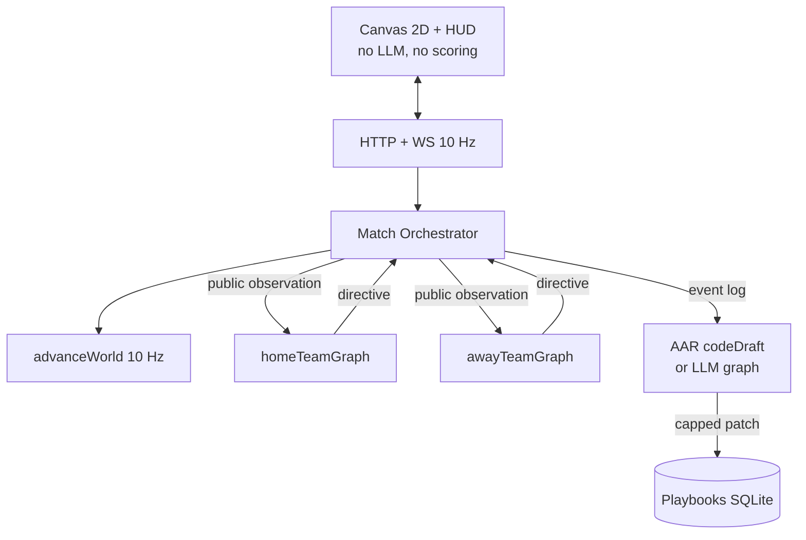
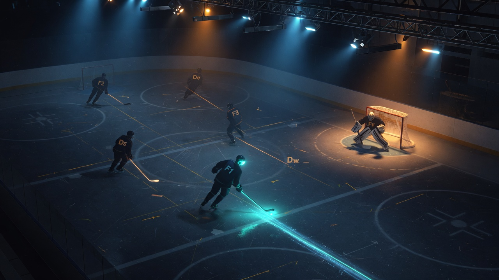
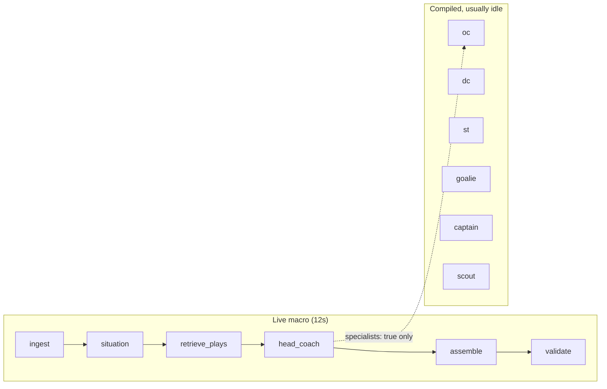
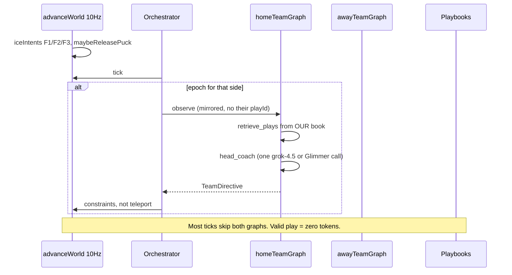
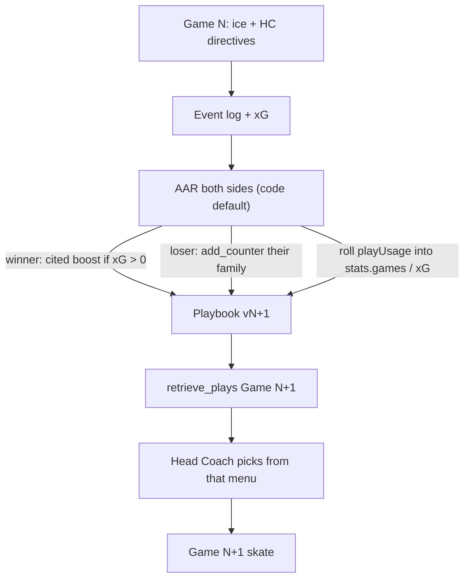
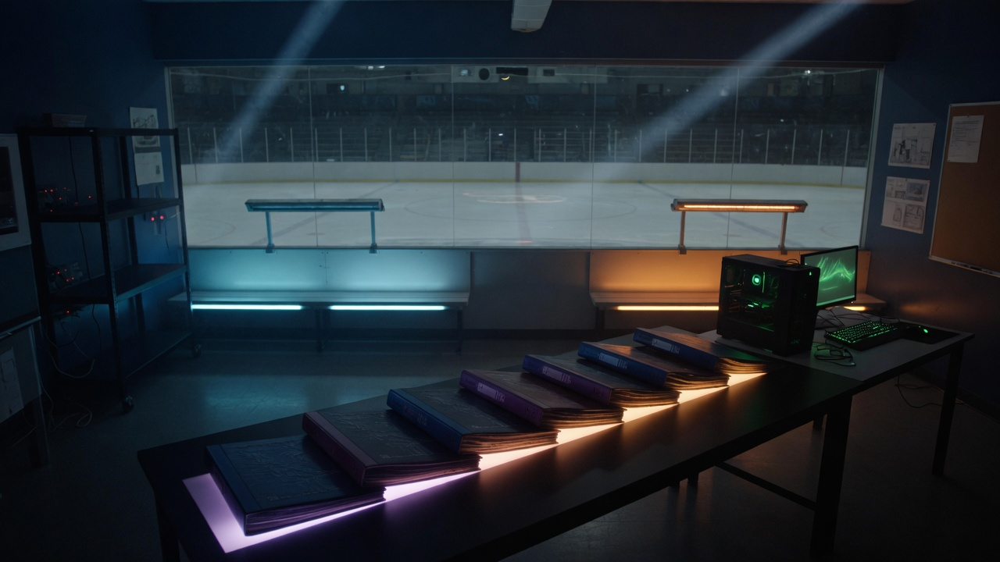
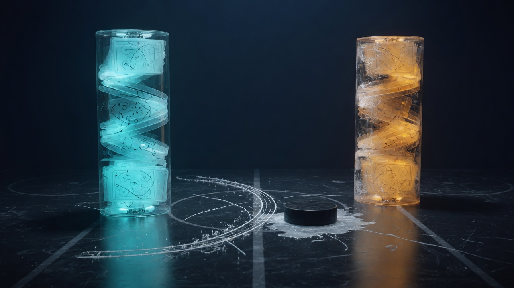

# FORgasan — Graph_Hockey

You wanted two LangGraphs to fight each other at hockey, then get smarter after every result. That is still the product. What we *shipped* is more specific, and this file is honest about it: **two independent benches**, **ice that is code**, **one Head Coach call per live epoch**, and **an After-Action Review that patches a playbook** so game 7 is not a rerun of game 1.

We measured that loop (`ser-emp-7`), gated retrieve, killed offside storms, shipped dump-in, taught AAR to boost 5v5, F2 dump-chase, DZ leftover assemble, film chance-pair, then ice high-slot shots. Evaluate 8 credited bank **2/5**. Evaluate 9 Δ xG **+0.097** would beat the bar; chance mean 5.57 and pairs 3 failed. Plan: [`docs/better-hockey.md`](better-hockey.md).

This is a handbook for *you* — how the repo thinks, what is a graph and what is not, how a call travels, how the team learns *together*, and the scars we paid for on the road to LangGraph learning.

---

## What this project is (in one breath)

Graph_Hockey is a **localhost Node.js hockey game** where **two independently compiled LangGraph.js teams** compete on a **deterministic 2D rink**. A Match Orchestrator ticks physics at 10 Hz. Coaches only speak at *decision epochs* (faceoff, special teams, a possession that has lasted eight seconds). After every win, loss, or tie, **After-Action Review** reads the event log, cites real `eventId`s, and patches a **structured playbook** so game 7 is not a rerun of game 1.

Live default AAR is **`--aar-mode code`**: a cited `codeDraft` in milliseconds, no 45s grok graph. That is *not* `--no-llm`. Live epochs still call the coach. `--no-llm` still never mutates playbooks — it is the control arm.

The browser is a spectator. It never scores, never calls xAI, and never sees the opponent’s playbook. Open `http://127.0.0.1:8787/` after `npm run web`.

| Law | Meaning |
| --- | --- |
| Engine is the referee | `advanceWorld` is the only mutator of puck and bodies |
| Graphs are staff, not skaters | Live staff is **Head Coach**. OC / DC / ST / goalie / scout / captain are compiled, **opt-in**. F1–G are code. |
| Learning is data | Plays are JSON; AAR emits capped, *cited* patches. Retrieve ranks those stats next game. |
| Film is resimulation | Same seed + stored directives. MP4 export is a derivative, not the log |
| Proof is a diff | Control stays v1. Live still writes books. Quality is Δ xG + offsides + no lead-protect skating — not Shot rows, not a version integer. After the retrieve gate, home `retrieveTopChanged` 0/6 can be success (the old 1/6 *was* protect-lead). |

### What we actually have (read this twice)

This is the part people get wrong. We did **not** build twelve LangGraph players who pass to each other.

| Layer | Independent LangGraph? | What it does live |
| --- | --- | --- |
| `homeTeamGraph` / `awayTeamGraph` | **Yes — two compiles** | Separate checkpointers, separate playbooks. Never see the opponent `playId`. |
| Head Coach (`grok-4.5` home; **Muse Glimmer** away) | One node per team graph | **The live staff.** Macro epoch: ingest → situation → retrieve → **HC → assemble → validate**. |
| OC, DC, ST, goalie, scout | Compiled subgraphs | **Off** unless `specialists: true`. Fan-out ate the 12s clock (Scar 9). |
| Captain | Compiled subgraph | Micro only (offside / icing). Still times out. |
| F1 / F2 / F3 / Ds / Dw / G | **No. `src/ice/`** | Every 10 Hz tick. Hunt / pass / shoot / clear. Ice F1 **shoot beats overlay pass/dump**. Overlay shoot/crash/hold/cycle still wins. |
| AAR | **Code path by default** | `--aar-mode code`: `codeOnlyAarReport` + apply. `--aar-mode auto` restores the third LangGraph (45s). `--no-llm` persist-only. |
| Browser | Never | Draws frames. No keys, no scoring, no opponent book. |

They work as a **team** because they share a **play** (JSON formation + `shotPolicy`), not because five skaters vote. Independent agents without a shared sheet all hunt the puck. You already shipped that bug.

If F1 cannot shoot, AAR has nothing to cite. If AAR cannot cite, the next retrieve is the same as game 1. If retrieve ranks `protect-lead` while you are losing, game 7 can be *worse* than game 1. That is the whole learning story.

---

## The map of the code

Think **basement → ice → benches → film room**, not a folder dump.

| Floor | Folder | What you keep in your head |
| --- | --- | --- |
| Basement | `src/engine/` | 200×85 ft rink, 10 Hz Euler, icing/offside/goals, fatigue. Honest chances: Shot then Goal; dump/pass/clear freeze even if G clips. |
| Skaters (code) | `src/ice/` | F1/F2/F3/Ds/Dw/G every tick. F1 shoot / pass / clear. Not a graph. |
| Benches | `src/agents/` | Two `StateGraph`s. Live macro is Head Coach → assemble. |
| Referee | `src/orchestrator/` | Tick, observe (mirrored), invoke, never an LLM |
| Memory | `src/playbook/` + `src/persist/` | Seed books, SQLite events, replay. Retrieve is code; EN plays stay off 5v5. |
| After hours | `src/aar/` | Default: `codeDraft` + `cite_check`. LLM graph is `--aar-mode auto`. |
| Film | `src/film/` + `src/web/` | Clips, ledger, Canvas 2D. `gh series --json` is the scorecard. |

`src/cli/` is the same host without a browser (`gh simulate --no-llm`). `src/llm/` is xAI plus OpenAI-compat (local Glimmer on `:8080`). `src/config.ts` boots with empty env. Muse default is **local Glimmer**, not hosted Spark.

Contributor cheat sheet: [`AGENTS.md`](../AGENTS.md). The long spec: [`DESIGN.md`](DESIGN.md).

**Why this split:** LangGraph is the *skill you wanted to learn*. If the engine lived inside a prompt, you would learn prompt soup. If the coaches lived inside `stepLive`, you would learn physics. The folders force the lesson: **graphs propose, code disposes.**

---

## Architecture



**Hard law:** the browser draws `SpectatorFrame`s. Scoring is geometric in `src/engine/rules.ts`. A coach who hallucinates a goal is just a JSON object the validator ignores.



F1 is on the ice every tick. The LangGraph is the bench. If F1 cannot shoot, AAR has nothing to cite.

Each team graph **compiles** every specialist so DESIGN’s subgraphs stay in the tree. Live **runs** a thinner path:



Live macro **does not** `Send[]` OC/DC/captain/scout. Opt in with `specialists: true`. That 12s epoch belongs to Head Coach. Micro still hits **Captain only** (`grok-4.3`) — and those still time out on offsides. There is no `route_specialists` node.

AAR **code mode** (live default): load events → `computeActual` → `codeDraft` → `cite_check` → apply. No grok. `--aar-mode auto` is the separate compile: load → intent (LLM) → **actual (code)** → why → winner/loser lens → draft → `cite_check`. The actual node is not allowed to “remember” a shot that is not in the log.

Boosts only stick if that play had **match xG > 0**. A 0-xG boost is rejected and replaced. `--no-llm` still never writes `playbook_versions`.

---

## Technologies we chose (and why)

| Choice | Why | Tradeoff |
| --- | --- | --- |
| TypeScript strict, Node ≥ 20 | Shared types from rink to WS | `allowImportingTsExtensions` + `noEmit` for vitest |
| **npm** + lockfile | pnpm/corepack was EPERM on this Windows host | Design preferred pnpm; we documented the deviation |
| LangGraph.js `StateSchema` | Current Graph API (not `Annotation.Root`) | API drift is a real risk; versions pinned |
| xAI `ChatXAI` Completions | SpaceXAI / `XAI_API_KEY` / `https://api.x.ai/v1` | `modelKwargs.reasoning_effort`, not `.withConfig` |
| `grok-4.5` coach/AAR, `grok-4.3` specialists | Cost: hybrid epochs, not per-tick LLM | 4.5 reasoning cannot be disabled; in-game `low` |
| **Muse Glimmer 30B local** | Away bench at `$0`. llama.cpp OpenAI-compat `127.0.0.1:8080` | Must skip native structured output; JSON often lives in `reasoning_content`; cap 120 tokens to fit 6s |
| `sql.js` (WASM) | `better-sqlite3` needs VS Build Tools; CI has no native addons | Slower than native; adapter in `src/persist/db.ts` |
| Node `http` + `ws` | Fastify was extra surface for a localhost game | Still origin-locked to loopback |
| Canvas 2D, not Phaser | Phaser invites a second clock | ~one file to plot circles on ice |
| Vitest + `FakeListChatModel` | **404 tests**, **zero** live vendor calls in CI | You must inject the fake or skip the factory |
| `@napi-rs/canvas` + ffmpeg | Optional MP4 highlight for a human inbox | Film Room remains the source of truth |

We did **not** pick Unity, OpenAI-as-provider, or RL. Those would hide LangGraph or bankrupt the token budget. We *tried* hosted Muse Spark. It burned tokens for thinking we never used. Local Glimmer is the away bench now. Never `muse-spark-*-contributor`.

---

## How the parts talk to each other

There are **three clocks**, not one “the agents think.” Mixing them is how you get a $4 timeout and no hockey.

| Clock | Rate | Who speaks | Typical call |
| --- | --- | --- | --- |
| Physics | **10 Hz**, every live tick | Engine + `src/ice/` | Zero LLM. F1 may shoot. `shotLock` = one shot per possession. |
| Epoch | Faceoff, ST, 8s possession, last two minutes | **Head Coach** (macro) or **Captain** (micro) | One structured `CoachIntent`. 6s coach / 12s abort. Glimmer max 120 tokens. |
| After the horn | Once per side, per result | **code AAR** (default) or AAR graph | Cite + apply. Live default milliseconds. `--no-llm` never mutates. |



One live tick, spoken slowly:

1. **`advanceWorld`** (`src/engine/step.ts`) fills `iceIntents` (F1/F2/F3), steers, maybe **releases** a pass/shot/clear (`maybeReleasePuck`), and maybe blows a whistle.
2. **`shouldDecide`** (`src/orchestrator/epochs.ts`) asks each side independently: macro stoppage, micro possession review (80 live ticks), or `playStillValid` skip. If valid, **that side skips the LLM**.
3. **`observe`** mirrors geometry so *you* always attack +X. Away’s live `puck.x` and home’s sum to ~0. The opponent `playId` is not in the JSON.
4. **`invokeTeam`** never throws. Live abort is **12s** (`--no-llm` stays 8s). Thread id is `match:{id}:team:{side}:epoch:{n}`. Timeout on opening `default-structure` seeds the book’s 5v5 play, not a silent freeze. `timeoutDirective` strips `playParams` so a late overlay cannot gag ice F1.
5. **`retrieve_plays`** is **code**. It ranks OUR plays by net xG, plus a small bonus if `counters` include a public-geometry `themFamily`. Empty-net families (`pull-early`, `en-scramble`) are **excluded unless strength is `EN`**. That is how last game’s AAR shows up as this epoch’s menu — and how a 20s period does not open 6v5.
6. **`validateDirective`** clamps `playId` to the retrieved list, rejects illegal extra attackers.
7. Directives become constraints on the next physics steps — not teleportation. Ice F1 still **shoots in OZ even if the overlay said pass**. `shotLock` demotes a locked shoot to pass.
8. On `game_over`, **both** AARs run. Live default `--aar-mode code` applies a cited patch without the 45s graph. `--aar-mode auto` still times out into `codeDraft`. `--no-llm` writes a digest and **does not** mutate. Caps: max 3 ops, cited `eventIds` only, boosts need match xG.
9. **`recordMatchFilm`** builds clips. `gh footage --match ID --mp4` is a derivative H.264 file (`data/film-export/`, gitignored). Replay remains canonical. `liveTick` **resets each period** — clip windows must carry the period from the anchor event.

The WebSocket allowlist is snapshots, ticker, cost numbers, one-sided inspect. That is how a HUD can show “1-2-2 dump-and-chase” for Home and still hide Away’s playbook.

### How the team learns together

They do **not** learn by stuffing the whole game into a prompt. They learn because **memory is a versioned playbook** that both the next retrieve and the next skate can see.



Together, specifically:

1. **During the game** they share a play (formation slots, F1 action, `shotPolicy`). That is the team, not five LLMs arguing.
2. **After the horn** each side’s AAR reads the **same public log** plus **their** book. Winners lock what produced xG (`boost` + real `playUsage` rolled into `stats`). Losers write `add_counter` for the **opponent family** that hurt them (`stretch-pass`, `crash-net`, …), not a random family from our own catalog.
3. **`--no-llm` never mutates.** CI can still prove the rink. The 7-game control (`ser-emp-7-nollm`) stayed at book **v1** and `retrieveTopChanged 0/6`. That is the gate that makes a live series scientific.
4. **`--aar-mode code` is not that gate.** Code AAR still applies. Live epochs still call Grok / Glimmer. Mixing those two flags is how you “prove learning” by turning learning off.
5. **Next faceoff**, `retrieve_plays` ranks by those stats and a `themFamily` bonus inferred from **public geometry** (never their `playId`). The coach can only pick from that list. Validator throws away invented ids.
6. **Proof is two diffs**, not a vibe. (a) Did `retrieveTop` move vs the control? (b) Did g0→g6 xG / paired clips get *better*? Tonight: (a) yes, (b) no.

The HTML page animates this loop. If you only remember one picture: **ice writes the log → AAR patches the book → retrieve changes the menu → the same five-man code skates a different play.**

---

## The road tonight — LangGraph learning, measured

Tonight was the first night the *learning machine* was honest enough to measure. We did not invent a new architecture. We stopped lying to the scorecard, stopped paying Spark for thinking tokens, and ran a control.



Seven games as a row of books. The loop is the row getting thicker. Quality is whether game 7 is better hockey than game 1.

### Mile markers

| Marker | What happened | What it taught |
| --- | --- | --- |
| **`ser-learn-7`** | 7×20s 5v5 *before* A–D. Home **8 goals, 0 shots**. Books v1→v8, **retrieveTop 0/6**. Overlay pass gagged ice F1. Carry-in Goal without Shot. AAR LLM timed out. | A version bump is not learning. A Goal without a Shot is not a chance. |
| **A–D on `main`** | Honest chances (Shot then Goal; dump/pass freeze; G is not the OZ scorer). Ice F1 shoot beats overlay pass. `--aar-mode code` applies without the 45s graph. Boost only if match xG > 0. | Repair the *environment* and the *memory write* before you buy more tokens. NHL goldens did not move. |
| **Spark → Glimmer** | Hosted Muse Spark burned tokens. Away bench is now **local `muse-glimmer-30b`** via llama.cpp `:8080`, `$0`, ~36 tok/s. | The learning skill is LangGraph + playbooks, not a cloud invoice. |
| **`ser-glimmer-3`** | Dirty path. Away locked **`pull-early-template` at 5v5**. g1: **106 shots / 108 offsides**. Coach 6s aborts while Glimmer thought. | A 20s period makes `timeRemainingLt 180` always true. EN plays must not be on the 5v5 menu. |
| **EN gate + Glimmer JSON** | Seed `pull-early` is **EN-only**. Retrieve excludes empty-net families unless strength is `EN`. Glimmer: skip native structured, read `reasoning_content`, `GLIMMER_MAX_TOKENS=120`, server `--reasoning off`. | Adapter bugs look like hockey. Fix the adapter *and* the predicate. |
| **`ser-glimmer-fresh`** | Fresh db, 3×20s. 5v5 openings. Offsides **1–1**. retrieveTop **home 2/2, away 1/2**. Books v4. Home xG still down. | The menu *can* move without pulling the goalie. Three games is a smoke, not a proof. |
| **`ser-emp-7` + `--no-llm` control** | Fresh db, 7×20s, seed 7, home xAI / away Glimmer, `--aar-mode code`. Control: same seed, `--no-llm`. | Baseline. Loop yes; home locked protect-lead while losing. |
| **PR-1 retrieve gate on `main`** | `ff23dd5` / GitHub #1. `isLeadProtectPlay` hard-exclude unless leading. | Menu bug closed. Counting Evaluate unblocked. |
| **`ser-emp-8` Evaluate 1** | Same protocol, fresh db. Gate held. Δ xG **+0.176**. Offsides **failed** (g4 away 77, g6 home 63). Bank **0**. | Faceoff left Ds in OZ; 1–2 tick offside loop. |
| **`c1e7707` ice** | NZ faceoff onside clamp, Ds tag-up, no delayed release. | Breaks the leftover-body storm. |
| **`ser-emp-9` Evaluate 2** | Offsides all 0–2. Δ xG **−0.376** beats −0.552. Pairs 3. Bank **1**. | First coded improvement. |
| **Dump-in (PR-4)** | NZ ice `clear` beats overlay dump. `--no-llm` goldens moved: pr8 count 522→301, Shot **1**, Offside **0**, epochs 11. pr4 unchanged. | Dump-and-chase is a live puck, not a stick-carry and not a Shot. |
| **`ser-emp-10` Evaluate 3** | Ice gates held. Δ xG **−0.711**, pairs **1**. AAR boosted **PP umbrella** (g3 share 98%). Bank stays **1**. | A 20s penalty is the series lesson. Next: boost 5v5, not PP. |
| **AAR 5v5 (`6f01c3e`)** | `codeDraft` prefers 5v5/3v3 xG over PP/PK/EN. | Write the even-strength sheet, not the penalty. |
| **`ser-emp-11` Evaluate 4** | Ice gates held. g6 xG **0.46→0.79**. Footage Δ **−0.376** (raw −0.3762), pairs **1**. Bank stays **1**. | Strict bar. One more flat aborts the cycle. |
| **F2 dump-chase (`78b17cb`)** | OZ loose puck: F2 contests. NZ stays onside. pr8 Shot 2, Offside 0, Goal 1. | Second man in on dump-and-chase. |
| **`ser-emp-12` Evaluate 5** | g0 home **3** offsides. Chance mean **5.71**. Δ xG **−0.775**, pairs 0. **Cycle abort.** | F2 leak + late DZ collapse. Away crash-net +0.655. |
| **F2 tighten + DZ leftover** | Deep-OZ second man only (`BLUE+8`). Micro drops last play that fails zone/strength (122 in DZ → breakout). | Stop the 3-offside leak. Stop the 0-chance DZ trap. |
| **`ser-emp-13` / `ser-emp-14`** | Evaluate 6: Δ **−0.365** would beat bar, chance mean 4.57. Evaluate 7: Δ **−0.131**, chance mean 6.43, pairs **1**. | Pairing floor, not Δ xG, blocked the second credit. |
| **Film chance-pair (`db2a458`)** | Same play+zone goal/shot/save pair under Jaccard 0.3. Merge unions signature bags. Goldens unchanged. | Dump-chase film was a Jaccard miss, not identical hockey. |
| **`ser-emp-15` Evaluate 8** | Ice gates held. Pairs **4**. Δ xG **−0.071**. g6 **4–2** home. Bank **2/5**. | Second coded improvement. Next bar Δ **> −0.071**, pairs ≥ 4. |
| **Ice high-slot (`70c4b3b`)** | Ice-source OZ shots wait for BLUE+20. Overlay shoot/crash still BLUE-8. Goldens unchanged. | Dump recoveries carry to the high slot. |
| **`ser-emp-16` Evaluate 9** | Δ xG **+0.097**. Chance mean **5.57**. Pairs **3**. g6 4–1, xG 1.02. Not credited. | g2/g3 sat in the DZ. Do not revert the high slot. |

### The 7-game card (`ser-emp-7`)

Command (do not restart 8787 to run this):

```text
npm run gh -- series --games 7 --period-seconds 20 --seed 7
  --home-provider xai --away-provider muse --aar-mode code
  --db data/ser-emp-7.sqlite --id ser-emp-7 --json
```

Control: same seed, `--no-llm --db data/ser-emp-7-nollm.sqlite --id ser-emp-7-nollm`.

| Game | Score | Home retrieveTop | Away retrieveTop | Home ch/off | Away ch/off |
| --- | --- | --- | --- | --- | --- |
| g0 | 3–2 home | `5v5-122-forecheck` | `oz-crash-net` | 8 / 1 | 3 / 1 |
| g1 | 1–2 away | `5v5-122-forecheck` | `oz-crash-net` | 6 / 1 | 2 / 0 |
| g2 | 1–3 away | `5v5-122-forecheck` | `5v5-212-forecheck` | 4 / 2 | 3 / 1 |
| g3 | 2–4 away | `5v5-122-forecheck` | `5v5-212-forecheck` | 7 / 0 | 5 / 0 |
| g4 | 1–5 away | **`protect-lead-1-1-3`** | `5v5-212-forecheck` | 9 / 1 | 9 / 0 |
| g5 | 2–3 away | `protect-lead-1-1-3` | `5v5-212-forecheck` | 6 / 1 | 6 / 1 |
| g6 | 2–2 tie | `protect-lead-1-1-3` | `5v5-212-forecheck` | 6 / 1 | 3 / 2 |

Books: **v1 → v8** both sides. `retrieveTopChanged`: **home 1/6, away 1/6**. Footage `--compare 0,6`: home Δ xG **−0.552**, **pairs = 0**.

Control (`ser-emp-7-nollm`): books **stay v1**, retrieveTop **0/6 both**, openings frozen on `5v5-122` vs `5v5-212`. g6 away **15 offsides, 0 shots** — that is ice noise, not a staff.



Cyan column: the book is turning. Amber column: the hockey is not yet better. The puck in the middle is still the same 20-second period.

### Honest verdict

**The LangGraph learning *loop* works.** Live AAR applies. Retrieve’s top-1 moved. The `--no-llm` twin proves that movement is not a hash of the seed — it is the write path. Offsides on the live series stayed in **0–2** per side, not the 166 of live-52 or the 108 of the dirty Glimmer opener.

**The LangGraph learning *product* is not proven.** Home, after winning g0, locked `protect-lead-1-1-3` from g4 onward *while losing*. Game 7 was not a better fight than game 1. No paired clips. Home xG fell. Away’s retrieve *did* leave `oz-crash-net` for `5v5-212-forecheck` — a real menu change — and they still did not produce a rising xG curve.

That is not a failure of “we should run 20 more games.” It is a retrieve / predicate bug: **a lead-protect play must not win the menu when you are trailing.** Until that is gated, more series will teach the same wrong lesson faster.

### Evaluate 1 after the gate (`ser-emp-8`)

Same protocol, fresh db, gate on `main`. Control `ser-emp-8-nollm` stayed v1 / 0/6. Live books **v8**. Home retrieveTop stayed `5v5-122-forecheck`. Event scan: **zero** lead-protect skating; `protect-lead` games **0**. Footage `--compare 0,6`: home Δ xG **+0.176**, pairs **0**.

**Still not improved.** Offsides left 0–2: g2 home 5, g4 away **77**, g5 home 3, g6 home **63** / away 8. Bank **0/5**. Live counters: [`better-hockey.md`](better-hockey.md).

Do not raise timeouts as the fix. Do not implement `--aar-mode code` as `noLlm: true`.

---

## Bugs, scars, and how we fixed them

These are not hypothetical. They showed up in design review or PR review and would have shipped a *wrong hockey game*.

### Scar 1 — The graph that never called Head Coach

**What.** `epochKind` lived on the observation, but the router read **graph state**. Missing top-level `epochKind` on `invoke` made every epoch micro (or failed Zod). grok-4.5 never ran.

**Root.** LangGraph conditional edges see compiled state, not your mental model of “the observation is the input.”

**Fix.** `TeamGraphInvokeInput.epochKind` is required. Tests stream-visit `head_coach` on macro and assert micro never does.

**Lesson.** If a field decides a branch, put it where the framework actually looks, and write a visit test.

### Scar 2 — Possession without a face

**What.** Closest player in stick reach got the puck even if they were facing the wrong way. `lastStick` became a fake `stick-puck`, which would later legalize a kicked “goal.”

**Root.** Tie-break “nearest body” ran before the 70° facing cone.

**Fix.** Only the facing-in-reach pool can possess. Empty pool: puck stays loose. Tests at 70° award, 70.1° deny.

**Lesson.** Last-contact kinds are load-bearing for rules. A cheap possession helper can poison the rulebook.

### Scar 3 — Occupancy scored a kick

**What.** A skate-puck into the net, then a later stick touch while the puck sat in the crease, counted as a goal.

**Root.** Goal predicate used “puck is in the volume,” not “puck *crossed the plane this tick* with stick-puck.”

**Fix.** `crossedIntoNet(prev, now)` plus last contact `stick-puck`. Kick toward net is no-goal.

**Lesson.** Sports engines need events (crossings), not states (occupancy), for scoring.

### Scar 4 — Empty net confused power play

**What.** Skater counts included the extra attacker, so a PP goal against a PK empty net did not expire the minor, and even-strength 6v5 dumps looked shorthanded for icing.

**Root.** One “how many humans on ice” helper used for two different questions.

**Fix.** Box counts for PP/SH; EN is a separate overlay. Restore G/F4 when the delayed-penalty window closes.

**Lesson.** Name the question (`boxSkaterCounts` vs `onIce.length`) or you will mix special teams with empty net for the rest of the file.

### Scar 5 — `situation` the node vs `situation` the channel

**What.** LangGraph.js refused a node named `situation` when that was also a state key.

**Root.** Framework collision, not hockey.

**Fix.** Node still conceptually “situation”; it writes `classifiedSituation`.

**Lesson.** Read the Graph API error. Don’t invent a `route_specialists` node either — `Send` is not a state update.

### Scar 6 — Pairing too strict to show improvement

**What.** Jaccard ≥ 0.7 on event-type bags refused to pair “Goal against” with a later “Save” on the same play.

**Root.** The outcome *changing* is the film you wanted.

**Fix.** Same `playId` + zone first; Jaccard prefer 0.7, fallback 0.3.

**Lesson.** Similarity thresholds must match the product question, not a paper default.

### Scar 7 — Graphs that never shot

**What.** live-50: 2–2, **xG 0.00**. Seed `shotPolicy: shoot` was ignored. Players hunted the puck and stuffed it through their own net.

**Root.** `maybeReleasePuck` only fired on an LLM overlay. `--no-llm` and timed-out coaches never set `playParams.shotPolicy`. Nearest-skater hunt walked through the crease.

**Fix.** `src/ice/`: F1 hunts / passes / shoots / clears every tick. Overlay still wins. Own crease is the goalie’s. `routeClearOfOwnNet`. Pass/clear tagged `stickRelease` so they are not Shot/xG.

**Lesson.** If the learning loop needs xG, the **environment** must be able to shoot without a coach.

### Scar 8 — AAR that timed out and learned nothing

**What.** Live matches showed `applied: false` because the 45s AAR graph died and `codeOnlyAarReport` wrote `ops: []`.

**Root.** Timeout path skipped `codeDraft`. `--no-llm` correctly never mutates; live timeout accidentally behaved the same.

**Fix.** Timeout/error AAR runs `codeDraft` + `cite_check`. Winners get a cited boost; losers a cited `add_counter`. `--no-llm` still persist-only.

**Lesson.** A fallback that writes an empty patch is not a fallback. It is a silent no-op.

### Scar 9 — Head Coach never left `default-structure`

**What.** live-51: Grok 1–0 Muse, 13 real shots — and **all 24 epochs** logged `playId: default-structure`. Ice scored. The staff watched.

**Root.** Macro epoch is 12s. Coach 6s, then `Send[]` to 3–4 specialists at 4s. Head Coach ignored the abort signal. Parse-fail JSON-retried. `invokeTeam` on abort returned opening `last` (`default-structure`) forever.

**Fix.** Live macro is HC → assemble. One structured call, signal attached, no JSON retry. Timeout seeds the book 5v5 play. Specialists stay compiled, opt-in.

**Lesson.** Fan-out that cannot finish inside the abort budget is not a staff. It is a denial of service on your own coach.

### Scar 10 — 211 ok epochs, still a machine-gun

**What.** live-52: Muse 3–1, opening plays `5v5-122-forecheck` vs `stretch-pass-nz`, **211/212 epochs ok**, books v3/v5. Also **118 shots**, many identical 0.017 xG from home C every tick in P3, 166 offsides, and a “HOME GOAL” tagged `h-G`.

**Root.** Coaches now pick plays. Ice F1 still releases every tick while facing the net. Captain micros still time out on offside. `liveTick` resets each period (clip windows need the anchor’s period).

**Fix.** `shotLock`: one shot per possession; Save/Rebound grants one extra. AAR rolls real `playUsage` xG into `play.stats` (never `--no-llm`). Retrieve bonuses a play whose `counters` include a public-geometry `themFamily`. Loser `add_counter` cites **their** family. `gh series --json` prints distinct chances, offsides, and retrieveTop — not Shot-row count.

**Lesson.** “The graph ran” is not “they play hockey.” Count distinct chances, not Shot rows.

### Scar 11 — Goals that were not chances

**What.** `ser-learn-7`: home **8 goals, 0 shots**. Carry-in occupancy plus a goalie clip became Goal. Overlay `pass` sat on F1 so ice never shot. AAR had Goals to celebrate and nothing honest to boost.

**Root.** Scoring still trusted occupancy / last contact more than “there was a Shot this possession.” Overlay pass beat ice F1 shoot.

**Fix.** Honest chances in `src/engine/rules.ts`: attacking Goal needs a recent attacking Shot (`GOAL_REBOUND_TICKS`). Dump/pass/clear `waveOffNetEntry` even if G clips. Actor is the shooter, not G. Ice F1 shoot beats overlay pass/dump (`releasePolicy` in `tactics.ts`).

**Lesson.** If the label on the event is the training signal, fake labels teach fake hockey.

### Scar 12 — The 45s AAR we did not need

**What.** Live AAR still paid for a grok-4.5 graph that routinely timed out into the code path we already trusted.

**Root.** “Learning is a LangGraph” was treated as “every apply must walk the 45s compile.” `--no-llm` was the only skip — and that skip correctly refuses to mutate.

**Fix.** `--aar-mode code` runs `codeOnlyAarReport` and **still applies**. Live simulate/series/web default to `code`. `--aar-mode auto` restores the LLM graph. Tests assert `code` is not `noLlm`.

**Lesson.** The graph is a tool. The cited patch is the product. Do not bill a graph that the timeout already replaced.

### Scar 13 — Boosting a play that never shot

**What.** AAR could `boost` the opening 5v5 because it was *on the ice*, even at 0 xG. Retrieve then locked that play. `ser-learn-7` retrieveTop never moved.

**Root.** Usage maps onto whoever was assigned, not whoever created chance.

**Fix.** `boost` only if `playUsage.xgFor > 0`. Reject `zero-xg-boost` and **replace** with a play that did shoot. Always `ensureMandatoryBoost` after the gate. Stats still roll.

**Lesson.** Memory writes need the same honesty as the event log. A boost is a claim about xG.

### Scar 14 — Spark burned the night; Glimmer hid the JSON

**What.** Hosted Muse Spark was a token furnace. Local Glimmer then returned empty `content` (JSON in `reasoning_content`) and blew the 6s coach budget thinking (~580 tokens) until the server got `--reasoning off` *and* we capped 120 tokens.

**Root.** OpenAI-compat is not OpenAI. Native `withStructuredOutput` parsed an empty string. `reasoning: off` in the request is not the same as llama-server `--reasoning off`.

**Fix.** Default Muse = local `muse-glimmer-30b` at `http://127.0.0.1:8080/v1`. `skipNativeStructured` when the model name contains `glimmer`. `extractMessageText` reads content then `additional_kwargs.reasoning_content`. `GLIMMER_MAX_TOKENS = 120`. Cost table: $0.

**Lesson.** Local models are adapters, not drop-in ChatGPT. Prove JSON-in-6s with a ping before you run a series.

### Scar 15 — Empty-net at even strength, and protect-lead while trailing

**What.** Dirty `ser-glimmer-3` g1: away `pull-early-template`, **106 shots / 108 offsides**. Later, honest `ser-emp-7` home retrieve locked **`protect-lead-1-1-3` from g4 while they were losing 1–5**.

**Root.** `pull-early` listed strength `["EN","5v5"]` and a `timeRemainingLt 180` trigger that is *always true* on a 20s period. Retrieve ranked it. Separately, net-xG ranking does not care that you are trailing — a lead-protect play with leftover stats wins the menu.

**Fix (retrieve half shipped).** Seed strength is **`["EN"]` only**. `isEmptyNetPlay` excludes `pull-early` / `en-scramble` unless query strength is `EN`. `isLeadProtectPlay` hard-excludes unless `scoreState === "leading"` (`ff23dd5`). `ser-emp-8`: zero lead-protect skating, games stayed 0.

**Not yet:** offsides in the 0–2 band after the gate (`ser-emp-8` g4 away 77, g6 home 63). Score-state retrieve is no longer the blocker.

**Lesson.** Predicates that are true in a short experiment will dominate retrieve. Short periods are a microscope. Closing the menu leak can uncover the next ice leak on the same 20s clock.

---

## Pitfalls to avoid next time

- **Do not LLM every tick.** 36,000 live ticks × 12 bodies is not a “small experiment.” Epochs or you are buying latency.
- **Do not return `Send[]` from a random node.** Conditional edge or `Command.goto`, and list `ends`. Empty list must still assemble.
- **Do not keep `MessagesValue` on a match-long thread.** Per-epoch `thread_id` or your period-3 prompt is the whole game.
- **Do not store 36k JSON frames.** Replay is the footage. Clip index is the catalog. MP4 is mail, not memory.
- **Do not `Send[]` specialists on a 12s live epoch.** Head Coach first, or the abort freezes `default-structure` for the whole match.
- **Do not treat AAR timeout as “code digest, empty ops.”** Live still has to apply a cited patch.
- **Do not treat `--aar-mode code` as `--no-llm`.** Code applies. `--no-llm` is the control that must not write books.
- **Do not count Shot events as skill** until F1 cannot fire every tick at the same xG. Count distinct chances.
- **Do not call a version bump “learning.”** Pass = `retrieveTop` moved *and* g0→g6 quality vs a `--no-llm` twin.
- **Do not retrieve empty-net families at 5v5.** 20s periods make “last three minutes” always true.
- **Do not let `protect-lead` win retrieve while trailing.** Gated on `main`. Another 7-gamer without that gate would lock it harder.
- **Do not credit Δ xG while offsides explode.** `ser-emp-8` +0.176 with g4 77 / g6 63 offsides is not better hockey.
- **Do not raise timeouts as the fix.** Cap tokens. Skip native structured. Attach the abort signal.
- **Do not mix lockfiles.** This machine uses npm because pnpm died on corepack. Pick one on a new clone.
- **Do not bind `0.0.0.0` “just for a demo.”** Origin lock and loopback are the product, not a nicety.
- **Do not name a node the same as a state channel** in LangGraph.js.
- **Do not treat `--no-llm` as optional.** It is how CI proves the engine without credits — and how a series proves the write path.

---

## What good engineers did here

- **Referee in code.** Fairness is testable without an API key.
- **Two compiles, not `side` on one graph.** Information hiding is structural.
- **404 tests, fakes for every LLM node.** `setCreateChatModel` / `FakeListChatModel`.
- **PR slices.** Engine → stub graphs → rink → coaches → AAR → series → honest chances → code AAR → Glimmer. Each independently reviewable.
- **Caps on learning.** Max 3 AAR ops, cited events only, winner cannot retire a play that just worked from one lucky bounce, boost needs match xG.
- **Golden hashes.** Short periods (`GRAPH_HOCKEY_PERIOD_SECONDS=5`) keep CI honest without 36k ticks. A–D did not move pr7/pr8.
- **Credentials stay in `.env`.** Health exposes `llmConfigured: boolean`, never the key. `.env` is not committed. Local Glimmer key is `local`.
- **Control arm.** Same seed, `--no-llm`, books must stay v1. Without that, “retrieveTop moved” is a story.
- **Honest scorecard.** `gh series --json` prints chances, offsides, opening play, retrieveTop. Footage `--compare 0,6` prints Δ xG and paired clips. We published the negative quality result.

---

## Lessons you can steal

1. **Hybrid agentic systems:** deterministic world + sparse LLM decisions. The world is the unit test; the LLM is a policy overlay.
2. **Cite or discard.** If an agent is allowed to change long-term memory, every mutation needs a pointer into a log you already trust.
3. **Visit tests for graphs.** Assert node names in a stream, not “the prompt looks right.”
4. **Mirror observations.** Fairness bugs love coordinate frames. Home + away `puck.x ≈ 0` is a one-liner that caught leaks.
5. **Product of learning is two diffs.** (a) Did the menu change vs a no-write control? (b) Did the hockey get better? Shipping (a) without (b) is still progress — as long as you say so.
6. **Windows native addons fail in CI.** Plan a WASM/JS adapter before you promise sqlite3.
7. **Local models are adapters.** Reasoning channels, empty `content`, token budgets, and server flags are part of the contract. Ping JSON-in-timeout before a series.
8. **Short experiments lie about time predicates.** If a trigger is “last three minutes,” a 20s period is always the last three minutes.
9. **A shared sheet is the team.** Five independent hunters are not a bench. The play is the coordination. Retrieve is how last game’s sheet reaches this faceoff.

---

## Where to go next

Live counters live in [`docs/better-hockey.md`](better-hockey.md) (bank **2/5**, cycle 2, flat 1/3, attempts 4/5).

1. **DZ F1 outlet pass**, then Evaluate 10. Evaluate 9 Δ xG **+0.097** would credit; chance mean 5.57 and pairs 3 failed (g2/g3 hemmed). Need Δ **> −0.071**, pairs ≥ **4**, chance mean ≥ 6.
2. **Captain micro** stays off.
3. **HITL later.** LangGraph `interrupt()`, off the 12s clock.
4. Glimmer is up on `:8080`. Do not restart 8787 unless asked. Do not raise timeouts.
5. Keep `AGENTS.md` honest: `src/ice/` is environment. `--aar-mode code` is not `--no-llm`.

---

## Glossary

| Term | Plain meaning |
| --- | --- |
| Epoch | A moment we bother the LLM (not every physics tick) |
| Directive | The legal action sheet the engine will skate |
| Playbook | Versioned JSON plays, not a system prompt |
| `cite_check` | Drop AAR ops that don’t point at this match’s events |
| `--aar-mode code` | Cited `codeDraft`, apply, no AAR LLM graph. Live default. Not `--no-llm`. |
| `--no-llm` | No coach calls, no playbook mutation. The control arm. |
| `retrieveTop` | The #1 play retrieve would hand the coach at that snapshot |
| Glimmer | Local Muse 30B on llama.cpp `:8080`. Away bench. $0. |
| Resimulation | Replay by running the engine again with stored directives |
| Inspect side | Operator toggle: see *one* team’s play name |

---

*Generated 2026-08-26. `main` is playable. Evaluate 9 not credited (Δ xG +0.097, chance mean 5.57, pairs 3). Bank 2/5. Cycle 2 attempts 4/5, flat 1/3. Plan: `docs/better-hockey.md`. HITL not in v1.*
