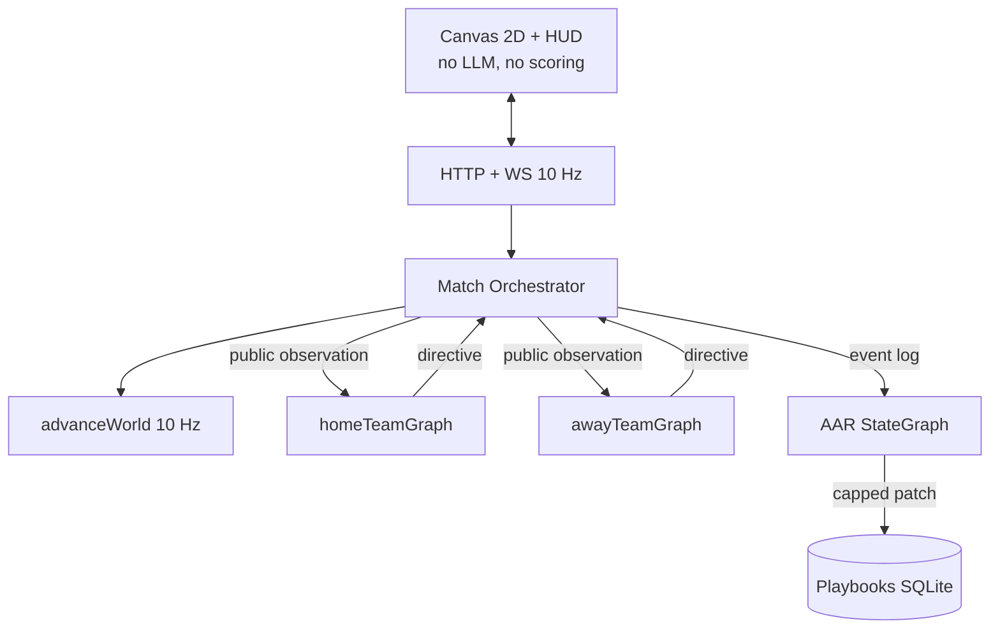

# FORgasan — Graph_Hockey

You wanted two LangGraphs to fight each other at hockey, then get smarter after every result. That is the whole product. The rest of this file is how we kept the LLMs from inventing goals, how the benches actually coordinate, and what we learned by shipping it in small PRs instead of one heroic dump.

This is a handbook for *you* — how the repo thinks, where the scars are, and what a good engineer would steal from it.

---

## What this project is (in one breath)

Graph_Hockey is a **localhost Node.js hockey game** where **two independently compiled LangGraph.js teams** compete on a **deterministic 2D rink**. A Match Orchestrator ticks physics at 10 Hz. Coaches only speak at *decision epochs* (faceoff, special teams, a possession that has lasted eight seconds). After every win, loss, or tie, a **third graph** — the After-Action Review — reads the event log, cites real `eventId`s, and patches a **structured playbook** so game 7 is not a rerun of game 1.

The browser is a spectator. It never scores, never calls xAI, and never sees the opponent’s playbook. Open `http://127.0.0.1:8787/` after `npm run web`.

| Law | Meaning |
| --- | --- |
| Engine is the referee | `advanceWorld` is the only mutator of puck and bodies |
| Graphs are staff, not skaters | Head Coach + OC / DC / ST / goalie / scout / captain |
| Learning is data | Plays are JSON objects; AAR emits capped patches, not a longer prompt |
| Film is resimulation | Same seed + stored directives, not an MP4 |

---

## The map of the code

Think **basement → ice → benches → film room**, not a folder dump.

| Floor | Folder | What you keep in your head |
| --- | --- | --- |
| Basement | `src/engine/` | 200×85 ft rink, 10 Hz Euler, icing/offside/goals, fatigue |
| Benches | `src/agents/` | Two `StateGraph`s, `Send` fan-out, per-epoch `thread_id` |
| Referee | `src/orchestrator/` | Tick, observe (mirrored), invoke, never an LLM |
| Memory | `src/playbook/` + `src/persist/` | Seed books, SQLite events, replay |
| After hours | `src/aar/` | Third graph: intent / actual / why / cite_check |
| Film | `src/film/` + `src/web/` | Clips, ledger, Canvas 2D |

`src/cli/` is the same host without a browser (`gh simulate --no-llm`). `src/llm/` is xAI-only factories plus a circuit breaker. `src/config.ts` boots with empty env.

Contributor cheat sheet: [`AGENTS.md`](../AGENTS.md). The long spec: [`DESIGN.md`](DESIGN.md).

**Why this split:** LangGraph is the *skill you wanted to learn*. If the engine lived inside a prompt, you would learn prompt soup. If the coaches lived inside `stepLive`, you would learn physics. The folders force the lesson: **graphs propose, code disposes.**

---

## Architecture

**Hard law:** the browser draws `SpectatorFrame`s. Scoring is geometric in `src/engine/rules.ts`. A coach who hallucinates a goal is just a JSON object the validator ignores.

Each team graph compiles to:

`START → ingest → situation → retrieve_plays → (macro) head_coach ⇉ Send specialists → assemble → validate → END`

Micro epochs skip Head Coach (`grok-4.5`) and hit **Captain only** (`grok-4.3`). Empty specialist list still reaches assemble — there is no `route_specialists` node. LangGraph.js wants `Send` from `Command.goto` or a conditional edge, not a node that returns an array.

AAR is a **separate compile**: load → intent (LLM) → **actual (code)** → why → winner/loser lens → draft → `cite_check`. The actual node is not allowed to “remember” a shot that is not in the log.

---

## Technologies we chose (and why)

| Choice | Why | Tradeoff |
| --- | --- | --- |
| TypeScript strict, Node ≥ 20 | Shared types from rink to WS | `allowImportingTsExtensions` + `noEmit` for vitest |
| **npm** + lockfile | pnpm/corepack was EPERM on this Windows host | Design preferred pnpm; we documented the deviation |
| LangGraph.js `StateSchema` | Current Graph API (not `Annotation.Root`) | API drift is a real risk; versions pinned |
| xAI `ChatXAI` Completions | SpaceXAI / `XAI_API_KEY` / `https://api.x.ai/v1` | `modelKwargs.reasoning_effort`, not `.withConfig` |
| `grok-4.5` coach/AAR, `grok-4.3` specialists | Cost: hybrid epochs, not per-tick LLM | 4.5 reasoning cannot be disabled; in-game `low` |
| **sql.js** (WASM) | `better-sqlite3` needs VS Build Tools; CI has no native addons | Slower than native; adapter in `src/persist/db.ts` |
| Node `http` + `ws` | Fastify was extra surface for a localhost game | Still origin-locked to loopback |
| Canvas 2D, not Phaser | Phaser invites a second clock | ~one file to plot circles on ice |
| Vitest + `FakeListChatModel` | 297 tests, **zero** live xAI in CI | You must inject the fake or skip the factory |

We did **not** pick Unity, OpenAI-as-provider, or RL. Those would hide LangGraph or bankrupt the token budget.

---

## How the parts talk to each other

One live tick, spoken slowly:

1. **`advanceWorld`** (`src/engine/step.ts`) integrates bodies, applies the current play’s steering targets from `src/engine/tactics.ts`, and maybe blows a whistle.
2. **`shouldDecide`** (`src/orchestrator/epochs.ts`) asks each side independently: is this a macro stoppage, a micro possession review (80 live ticks), or is `playStillValid` still true? If valid, **that side skips the LLM**.
3. **`observe`** mirrors geometry so *you* always attack +X. Away’s live `puck.x` and home’s sum to ~0. The opponent `playId` is not in the JSON.
4. **`invokeTeam`** never throws. Each side has its own 8s `AbortController`. Thread id is `match:{id}:team:{side}:epoch:{n}` so prompts do not balloon.
5. **`validateDirective`** clamps `playId` to the retrieved list, rejects illegal extra attackers.
6. Directives become constraints on the next physics steps — not teleportation.
7. On `game_over`, **both** AAR graphs run. `--no-llm` writes a code-only digest and **does not** mutate the book. Auto-apply caps: max 3 ops, cited `eventIds` only.
8. **`recordMatchFilm`** builds clips. A 7-game series (`gameSeed = seed + gameIndex`) writes `improvement_ledger` rows and pairs “same play, later game” for `/film?series=`.

The WebSocket allowlist is snapshots, ticker, cost numbers, one-sided inspect. That is how a HUD can show “1-2-2 dump-and-chase” for Home and still hide Away’s playbook.

---

## Bugs, scars, and how we fixed them

These are not hypothetical. They showed up in design review or PR review and would have shipped a *wrong hockey game*.

### Scar 1 — The graph that never called Head Coach

**What.** `epochKind` lived on the observation, but the router read **graph state**. Missing top-level `epochKind` on `invoke` made every epoch micro (or failed Zod). grok-4.5 never ran.

**Root.** LangGraph conditional edges see compiled state, not your mental model of “the observation is the input.”

**Fix.** `TeamGraphInvokeInput.epochKind` is required. Tests stream-visit `head_coach` on macro and assert micro never does.

**Lesson.** If a field decides a branch, put it where the framework actually looks, and write a visit test.

### Scar 2 — Possession without a face

**What.** Closest player in stick reach got the puck even if they were facing the wrong way. `lastStick` became a fake `stick-puck`, which would later legalize a kicked “goal.”

**Root.** Tie-break “nearest body” ran before the 70° facing cone.

**Fix.** Only the facing-in-reach pool can possess. Empty pool: puck stays loose. Tests at 70° award, 70.1° deny.

**Lesson.** Last-contact kinds are load-bearing for rules. A cheap possession helper can poison the rulebook.

### Scar 3 — Occupancy scored a kick

**What.** A skate-puck into the net, then a later stick touch while the puck sat in the crease, counted as a goal.

**Root.** Goal predicate used “puck is in the volume,” not “puck *crossed the plane this tick* with stick-puck.”

**Fix.** `crossedIntoNet(prev, now)` plus last contact `stick-puck`. Kick toward net is no-goal.

**Lesson.** Sports engines need events (crossings), not states (occupancy), for scoring.

### Scar 4 — Empty net confused power play

**What.** Skater counts included the extra attacker, so a PP goal against a PK empty net did not expire the minor, and even-strength 6v5 dumps looked shorthanded for icing.

**Root.** One “how many humans on ice” helper used for two different questions.

**Fix.** Box counts for PP/SH; EN is a separate overlay. Restore G/F4 when the delayed-penalty window closes.

**Lesson.** Name the question (`boxSkaterCounts` vs `onIce.length`) or you will mix special teams with empty net for the rest of the file.

### Scar 5 — `situation` the node vs `situation` the channel

**What.** LangGraph.js refused a node named `situation` when that was also a state key.

**Root.** Framework collision, not hockey.

**Fix.** Node still conceptually “situation”; it writes `classifiedSituation`.

**Lesson.** Read the Graph API error. Don’t invent a `route_specialists` node either — `Send` is not a state update.

### Scar 6 — Pairing too strict to show improvement

**What.** Jaccard ≥ 0.7 on event-type bags refused to pair “Goal against” with a later “Save” on the same play.

**Root.** The outcome *changing* is the film you wanted.

**Fix.** Same `playId` + zone first; Jaccard prefer 0.7, fallback 0.3.

**Lesson.** Similarity thresholds must match the product question, not a paper default.

---

## Pitfalls to avoid next time

- **Do not LLM every tick.** 36,000 live ticks × 12 bodies is not a “small experiment.” Epochs or you are buying latency.
- **Do not return `Send[]` from a random node.** Conditional edge or `Command.goto`, and list `ends`. Empty list must still assemble.
- **Do not keep `MessagesValue` on a match-long thread.** Per-epoch `thread_id` or your period-3 prompt is the whole game.
- **Do not store 36k JSON frames.** Replay is the footage. Clip index is the catalog.
- **Do not mix lockfiles.** This machine uses npm because pnpm died on corepack. Pick one on a new clone.
- **Do not bind `0.0.0.0` “just for a demo.”** Origin lock and loopback are the product, not a nicety.
- **Do not name a node the same as a state channel** in LangGraph.js.
- **Do not treat `--no-llm` as optional.** It is how CI proves the engine without credits.

---

## What good engineers did here

- **Referee in code.** Fairness is testable without an API key.
- **Two compiles, not `side` on one graph.** Information hiding is structural.
- **297 tests, fakes for every LLM node.** `setCreateChatModel` / `FakeListChatModel`.
- **PR slices.** Engine → stub graphs → rink → coaches → AAR → series. Each independently reviewable.
- **Caps on learning.** Max 3 AAR ops, cited events only, winner cannot retire a play that just worked from one lucky bounce.
- **Golden hashes.** Short periods (`GRAPH_HOCKEY_PERIOD_SECONDS=5`) keep CI honest without 36k ticks.
- **Credentials stay in `.env`.** Health exposes `llmConfigured: boolean`, never the key.

---

## Lessons you can steal

1. **Hybrid agentic systems:** deterministic world + sparse LLM decisions. The world is the unit test; the LLM is a policy overlay.
2. **Cite or discard.** If an agent is allowed to change long-term memory, every mutation needs a pointer into a log you already trust.
3. **Visit tests for graphs.** Assert node names in a stream, not “the prompt looks right.”
4. **Mirror observations.** Fairness bugs love coordinate frames. Home + away `puck.x ≈ 0` is a one-liner that caught leaks.
5. **Product of learning is a diff.** Playbook version N+1 is a better demo than a paragraph of “the team adapted.”
6. **Windows native addons fail in CI.** Plan a WASM/JS adapter before you promise sqlite3.

---

## Where to go next

1. Merge `execute-plan/ffa7c1ff-pr-15b-featfilm-series-improvement-board-and-beforeafter` to `main` when you are ready for the default branch to be the game.
2. Put `XAI_API_KEY` in `.env` and check **Use LLM** on the rink — watch cost HUD and AAR actually mint counters.
3. Run `npm run gh -- series --games 7` with the key; open `/film?series=` and see whether Original Six’s 1-2-2 still dies to crash-net.
4. PR 16 (stretch): LangGraph `interrupt()` HITL coach, off the default compile path.
5. Optional: native `better-sqlite3` behind `src/persist/db.ts` once Build Tools exist.
6. Optional: thin interpolation on the canvas (engine stays 10 Hz).
7. Keep the learning map in `AGENTS.md` honest when you add nodes — new files should map to a Graph API concept.

---

## Glossary

| Term | Plain meaning |
| --- | --- |
| Epoch | A moment we bother the LLM (not every physics tick) |
| Directive | The legal action sheet the engine will skate |
| Playbook | Versioned JSON plays, not a system prompt |
| `cite_check` | Drop AAR ops that don’t point at this match’s events |
| Resimulation | Replay by running the engine again with stored directives |
| Inspect side | Operator toggle: see *one* team’s play name |

---

*Generated 2026-08-25. Playable tip: `execute-plan/ffa7c1ff-pr-15b-…`. Tests: 297. HITL not in v1.*
