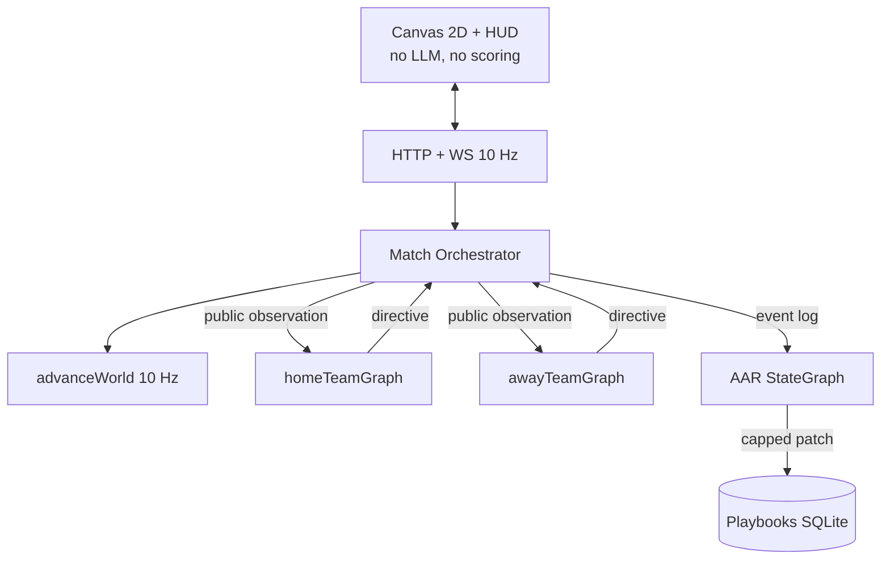

# FORgasan — Graph_Hockey

You wanted two LangGraphs to fight each other at hockey, then get smarter after every result. That is the whole product. The rest of this file is how we kept the LLMs from inventing goals, how the benches actually coordinate, and what we learned by shipping it in small PRs instead of one heroic dump.

This is a handbook for *you* — how the repo thinks, where the scars are, and what a good engineer would steal from it.

---

## What this project is (in one breath)

Graph_Hockey is a **localhost Node.js hockey game** where **two independently compiled LangGraph.js teams** compete on a **deterministic 2D rink**. A Match Orchestrator ticks physics at 10 Hz. Coaches only speak at *decision epochs* (faceoff, special teams, a possession that has lasted eight seconds). After every win, loss, or tie, a **third graph** — the After-Action Review — reads the event log, cites real `eventId`s, and patches a **structured playbook** so game 7 is not a rerun of game 1.

The browser is a spectator. It never scores, never calls xAI, and never sees the opponent’s playbook. Open `http://127.0.0.1:8787/` after `npm run web`.

| Law | Meaning |
| --- | --- |
| Engine is the referee | `advanceWorld` is the only mutator of puck and bodies |
| Graphs are staff, not skaters | Head Coach + OC / DC / ST / goalie / scout / captain |
| Learning is data | Plays are JSON objects; AAR emits capped patches, not a longer prompt |
| Film is resimulation | Same seed + stored directives. MP4 export is a derivative, not the log |

---

## The map of the code

Think **basement → ice → benches → film room**, not a folder dump.

| Floor | Folder | What you keep in your head |
| --- | --- | --- |
| Basement | `src/engine/` | 200×85 ft rink, 10 Hz Euler, icing/offside/goals, fatigue |
| Skaters (code) | `src/ice/` | F1/F2/F3/Ds/Dw/G every tick. F1 shoot / pass / clear. Not a graph. |
| Benches | `src/agents/` | Two `StateGraph`s. Live macro is Head Coach → assemble. |
| Referee | `src/orchestrator/` | Tick, observe (mirrored), invoke, never an LLM |
| Memory | `src/playbook/` + `src/persist/` | Seed books, SQLite events, replay |
| After hours | `src/aar/` | Third graph: intent / actual / why / cite_check |
| Film | `src/film/` + `src/web/` | Clips, ledger, Canvas 2D |

`src/cli/` is the same host without a browser (`gh simulate --no-llm`). `src/llm/` is xAI-only factories plus a circuit breaker. `src/config.ts` boots with empty env.

Contributor cheat sheet: [`AGENTS.md`](../AGENTS.md). The long spec: [`DESIGN.md`](DESIGN.md).

**Why this split:** LangGraph is the *skill you wanted to learn*. If the engine lived inside a prompt, you would learn prompt soup. If the coaches lived inside `stepLive`, you would learn physics. The folders force the lesson: **graphs propose, code disposes.**

---

## Architecture

**Hard law:** the browser draws `SpectatorFrame`s. Scoring is geometric in `src/engine/rules.ts`. A coach who hallucinates a goal is just a JSON object the validator ignores.

F1 is on the ice every tick. The LangGraph is the bench. If F1 cannot shoot, AAR has nothing to cite.

Each team graph compiles to:

`START → ingest → situation → retrieve_plays → (macro) head_coach → assemble → validate → END`

Live macro **does not** `Send[]` OC/DC/captain/scout. Specialists stay compiled; opt in with `specialists: true`. That 12s epoch belongs to Head Coach. Micro still hits **Captain only** (`grok-4.3`) — and those still time out on offsides (see Scar 10). There is no `route_specialists` node.

AAR is a **separate compile**: load → intent (LLM) → **actual (code)** → why → winner/loser lens → draft → `cite_check`. The actual node is not allowed to “remember” a shot that is not in the log.

---

## Technologies we chose (and why)

| Choice | Why | Tradeoff |
| --- | --- | --- |
| TypeScript strict, Node ≥ 20 | Shared types from rink to WS | `allowImportingTsExtensions` + `noEmit` for vitest |
| **npm** + lockfile | pnpm/corepack was EPERM on this Windows host | Design preferred pnpm; we documented the deviation |
| LangGraph.js `StateSchema` | Current Graph API (not `Annotation.Root`) | API drift is a real risk; versions pinned |
| xAI `ChatXAI` Completions | SpaceXAI / `XAI_API_KEY` / `https://api.x.ai/v1` | `modelKwargs.reasoning_effort`, not `.withConfig` |
| `grok-4.5` coach/AAR, `grok-4.3` specialists | Cost: hybrid epochs, not per-tick LLM | 4.5 reasoning cannot be disabled; in-game `low` |
| **sql.js** (WASM) | `better-sqlite3` needs VS Build Tools; CI has no native addons | Slower than native; adapter in `src/persist/db.ts` |
| Node `http` + `ws` | Fastify was extra surface for a localhost game | Still origin-locked to loopback |
| Canvas 2D, not Phaser | Phaser invites a second clock | ~one file to plot circles on ice |
| Vitest + `FakeListChatModel` | 365 tests, **zero** live vendor calls in CI | You must inject the fake or skip the factory |
| `@napi-rs/canvas` + ffmpeg | Optional MP4 highlight for a human inbox | Film Room remains the source of truth |

We did **not** pick Unity, OpenAI-as-provider, or RL. Those would hide LangGraph or bankrupt the token budget.

---

## How the parts talk to each other

One live tick, spoken slowly:

1. **`advanceWorld`** (`src/engine/step.ts`) fills `iceIntents` (F1/F2/F3), steers, maybe **releases** a pass/shot/clear (`maybeReleasePuck`), and maybe blows a whistle.
2. **`shouldDecide`** (`src/orchestrator/epochs.ts`) asks each side independently: macro stoppage, micro possession review (80 live ticks), or `playStillValid` skip. If valid, **that side skips the LLM**.
3. **`observe`** mirrors geometry so *you* always attack +X. Away’s live `puck.x` and home’s sum to ~0. The opponent `playId` is not in the JSON.
4. **`invokeTeam`** never throws. Live abort is **12s** (`--no-llm` stays 8s). Thread id is `match:{id}:team:{side}:epoch:{n}`. Timeout on opening `default-structure` seeds the book’s 5v5 play, not a silent freeze.
5. **`validateDirective`** clamps `playId` to the retrieved list, rejects illegal extra attackers.
6. Directives become constraints on the next physics steps — not teleportation. Ice F1 still shoots in OZ even if the coach is late.
7. On `game_over`, **both** AAR graphs run. `--no-llm` writes a digest and **does not** mutate. Live timeout still runs `codeDraft` + `cite_check` and **auto-applies**. Caps: max 3 ops, cited `eventIds` only.
8. **`recordMatchFilm`** builds clips. `gh footage --match ID --mp4` is a derivative H.264 file (`data/film-export/`, gitignored). Replay remains canonical. `liveTick` **resets each period** — clip windows must carry the period from the anchor event.

The WebSocket allowlist is snapshots, ticker, cost numbers, one-sided inspect. That is how a HUD can show “1-2-2 dump-and-chase” for Home and still hide Away’s playbook.

---

## Bugs, scars, and how we fixed them

These are not hypothetical. They showed up in design review or PR review and would have shipped a *wrong hockey game*.

### Scar 1 — The graph that never called Head Coach

**What.** `epochKind` lived on the observation, but the router read **graph state**. Missing top-level `epochKind` on `invoke` made every epoch micro (or failed Zod). grok-4.5 never ran.

**Root.** LangGraph conditional edges see compiled state, not your mental model of “the observation is the input.”

**Fix.** `TeamGraphInvokeInput.epochKind` is required. Tests stream-visit `head_coach` on macro and assert micro never does.

**Lesson.** If a field decides a branch, put it where the framework actually looks, and write a visit test.

### Scar 2 — Possession without a face

**What.** Closest player in stick reach got the puck even if they were facing the wrong way. `lastStick` became a fake `stick-puck`, which would later legalize a kicked “goal.”

**Root.** Tie-break “nearest body” ran before the 70° facing cone.

**Fix.** Only the facing-in-reach pool can possess. Empty pool: puck stays loose. Tests at 70° award, 70.1° deny.

**Lesson.** Last-contact kinds are load-bearing for rules. A cheap possession helper can poison the rulebook.

### Scar 3 — Occupancy scored a kick

**What.** A skate-puck into the net, then a later stick touch while the puck sat in the crease, counted as a goal.

**Root.** Goal predicate used “puck is in the volume,” not “puck *crossed the plane this tick* with stick-puck.”

**Fix.** `crossedIntoNet(prev, now)` plus last contact `stick-puck`. Kick toward net is no-goal.

**Lesson.** Sports engines need events (crossings), not states (occupancy), for scoring.

### Scar 4 — Empty net confused power play

**What.** Skater counts included the extra attacker, so a PP goal against a PK empty net did not expire the minor, and even-strength 6v5 dumps looked shorthanded for icing.

**Root.** One “how many humans on ice” helper used for two different questions.

**Fix.** Box counts for PP/SH; EN is a separate overlay. Restore G/F4 when the delayed-penalty window closes.

**Lesson.** Name the question (`boxSkaterCounts` vs `onIce.length`) or you will mix special teams with empty net for the rest of the file.

### Scar 5 — `situation` the node vs `situation` the channel

**What.** LangGraph.js refused a node named `situation` when that was also a state key.

**Root.** Framework collision, not hockey.

**Fix.** Node still conceptually “situation”; it writes `classifiedSituation`.

**Lesson.** Read the Graph API error. Don’t invent a `route_specialists` node either — `Send` is not a state update.

### Scar 6 — Pairing too strict to show improvement

**What.** Jaccard ≥ 0.7 on event-type bags refused to pair “Goal against” with a later “Save” on the same play.

**Root.** The outcome *changing* is the film you wanted.

**Fix.** Same `playId` + zone first; Jaccard prefer 0.7, fallback 0.3.

**Lesson.** Similarity thresholds must match the product question, not a paper default.

### Scar 7 — Graphs that never shot

**What.** live-50: 2–2, **xG 0.00**. Seed `shotPolicy: shoot` was ignored. Players hunted the puck and stuffed it through their own net.

**Root.** `maybeReleasePuck` only fired on an LLM overlay. `--no-llm` and timed-out coaches never set `playParams.shotPolicy`. Nearest-skater hunt walked through the crease.

**Fix.** `src/ice/`: F1 hunts / passes / shoots / clears every tick. Overlay still wins. Own crease is the goalie’s. `routeClearOfOwnNet`. Pass/clear tagged `stickRelease` so they are not Shot/xG.

**Lesson.** If the learning loop needs xG, the **environment** must be able to shoot without a coach.

### Scar 8 — AAR that timed out and learned nothing

**What.** Live matches showed `applied: false` because the 45s AAR graph died and `codeOnlyAarReport` wrote `ops: []`.

**Root.** Timeout path skipped `codeDraft`. `--no-llm` correctly never mutates; live timeout accidentally behaved the same.

**Fix.** Timeout/error AAR runs `codeDraft` + `cite_check`. Winners get a cited boost; losers a cited `add_counter`. `--no-llm` still persist-only.

**Lesson.** A fallback that writes an empty patch is not a fallback. It is a silent no-op.

### Scar 9 — Head Coach never left `default-structure`

**What.** live-51: Grok 1–0 Muse, 13 real shots — and **all 24 epochs** logged `playId: default-structure`. Ice scored. The staff watched.

**Root.** Macro epoch is 12s. Coach 6s, then `Send[]` to 3–4 specialists at 4s. Head Coach ignored the abort signal. Parse-fail JSON-retried. `invokeTeam` on abort returned opening `last` (`default-structure`) forever.

**Fix.** Live macro is HC → assemble. One structured call, signal attached, no JSON retry. Timeout seeds the book 5v5 play. Specialists stay compiled, opt-in.

**Lesson.** Fan-out that cannot finish inside the abort budget is not a staff. It is a denial of service on your own coach.

### Scar 10 — 211 ok epochs, still a machine-gun

**What.** live-52: Muse 3–1, opening plays `5v5-122-forecheck` vs `stretch-pass-nz`, **211/212 epochs ok**, books v3/v5. Also **118 shots**, many identical 0.017 xG from home C every tick in P3, 166 offsides, and a “HOME GOAL” tagged `h-G`.

**Root.** Coaches now pick plays. Ice F1 still releases every tick while facing the net. Captain micros still time out on offside. `liveTick` resets each period (clip windows need the anchor’s period).

**Fix.** `shotLock`: one shot per possession; Save/Rebound grants one extra. AAR rolls real `playUsage` xG into `play.stats` (never `--no-llm`). Retrieve bonuses a play whose `counters` include a public-geometry `themFamily`. Loser `add_counter` cites **their** family. `gh series --json` prints distinct chances, offsides, and retrieveTop — not Shot-row count.

**Lesson.** “The graph ran” is not “they play hockey.” Count distinct chances, not Shot rows.

---

## Pitfalls to avoid next time

- **Do not LLM every tick.** 36,000 live ticks × 12 bodies is not a “small experiment.” Epochs or you are buying latency.
- **Do not return `Send[]` from a random node.** Conditional edge or `Command.goto`, and list `ends`. Empty list must still assemble.
- **Do not keep `MessagesValue` on a match-long thread.** Per-epoch `thread_id` or your period-3 prompt is the whole game.
- **Do not store 36k JSON frames.** Replay is the footage. Clip index is the catalog. MP4 is mail, not memory.
- **Do not `Send[]` specialists on a 12s live epoch.** Head Coach first, or the abort freezes `default-structure` for the whole match.
- **Do not treat AAR timeout as “code digest, empty ops.”** Live still has to apply a cited patch.
- **Do not count Shot events as skill** until F1 cannot fire every tick at the same xG.
- **Do not mix lockfiles.** This machine uses npm because pnpm died on corepack. Pick one on a new clone.
- **Do not bind `0.0.0.0` “just for a demo.”** Origin lock and loopback are the product, not a nicety.
- **Do not name a node the same as a state channel** in LangGraph.js.
- **Do not treat `--no-llm` as optional.** It is how CI proves the engine without credits.

---

## What good engineers did here

- **Referee in code.** Fairness is testable without an API key.
- **Two compiles, not `side` on one graph.** Information hiding is structural.
- **Tests, fakes for every LLM node.** `setCreateChatModel` / `FakeListChatModel`.
- **PR slices.** Engine → stub graphs → rink → coaches → AAR → series. Each independently reviewable.
- **Caps on learning.** Max 3 AAR ops, cited events only, winner cannot retire a play that just worked from one lucky bounce.
- **Golden hashes.** Short periods (`GRAPH_HOCKEY_PERIOD_SECONDS=5`) keep CI honest without 36k ticks.
- **Credentials stay in `.env`.** Health exposes `llmConfigured: boolean`, never the key.

---

## Lessons you can steal

1. **Hybrid agentic systems:** deterministic world + sparse LLM decisions. The world is the unit test; the LLM is a policy overlay.
2. **Cite or discard.** If an agent is allowed to change long-term memory, every mutation needs a pointer into a log you already trust.
3. **Visit tests for graphs.** Assert node names in a stream, not “the prompt looks right.”
4. **Mirror observations.** Fairness bugs love coordinate frames. Home + away `puck.x ≈ 0` is a one-liner that caught leaks.
5. **Product of learning is a diff.** Playbook version N+1 is a better demo than a paragraph of “the team adapted.”
6. **Windows native addons fail in CI.** Plan a WASM/JS adapter before you promise sqlite3.

---

## Where to go next

`main` **is** the game. live-52 proved Head Coach can pick `5v5-122-forecheck` / `stretch-pass-nz` and AAR still bumps books. The next work is hockey quality, not more folders.

1. **7-game LLM series (20s periods, clean db).** `npm run gh -- series --games 7 --home-provider xai --away-provider muse --period-seconds 20`. Pass = retrieveTop actually moves, not just a version bump. 60s is a later demo.
2. **Captain micro budget.** Offside/icing still `Send`s captain into a 4s timeout (`structured:specialist:captain`). Same pattern as Scar 9: skip the specialist or give micro a code fallback and **do not JSON-retry**.
3. **Offside rate.** Counted on the series scorecard; F2 tag-up / NZ pass targets still need ice work.
4. **Goal attribution.** live-52 “HOME GOAL” actor `h-G` in OZ. Audit `maybeGoal` + last contact so a goalie cannot be the scorer of an attacking-zone goal unless that is actually what happened.
5. **HITL later.** LangGraph `interrupt()` for a human coach, **off** the default compile. Do not put it on the 12s clock.
6. Keep `AGENTS.md` honest: `src/ice/` is environment, not a graph. `gh footage --mp4` is derivative.

---

## Glossary

| Term | Plain meaning |
| --- | --- |
| Epoch | A moment we bother the LLM (not every physics tick) |
| Directive | The legal action sheet the engine will skate |
| Playbook | Versioned JSON plays, not a system prompt |
| `cite_check` | Drop AAR ops that don’t point at this match’s events |
| Resimulation | Replay by running the engine again with stored directives |
| Inspect side | Operator toggle: see *one* team’s play name |

---

*Generated 2026-08-25. `main` is playable. Shot lock + retrieve stats + series scorecard. live-52: Muse 3–1, 211/212 epochs ok. HITL not in v1.*
