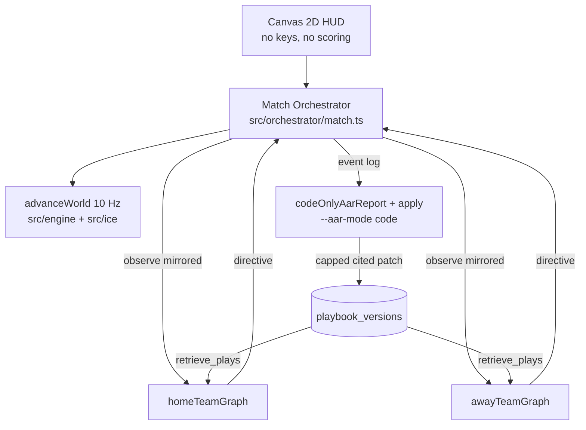
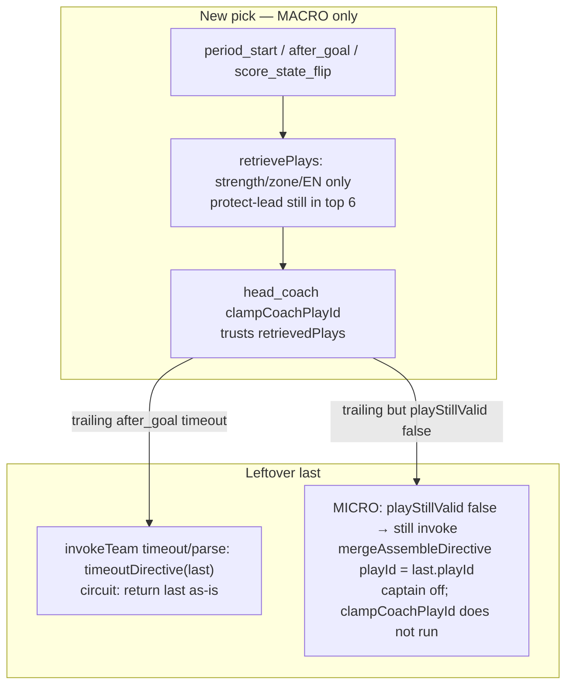
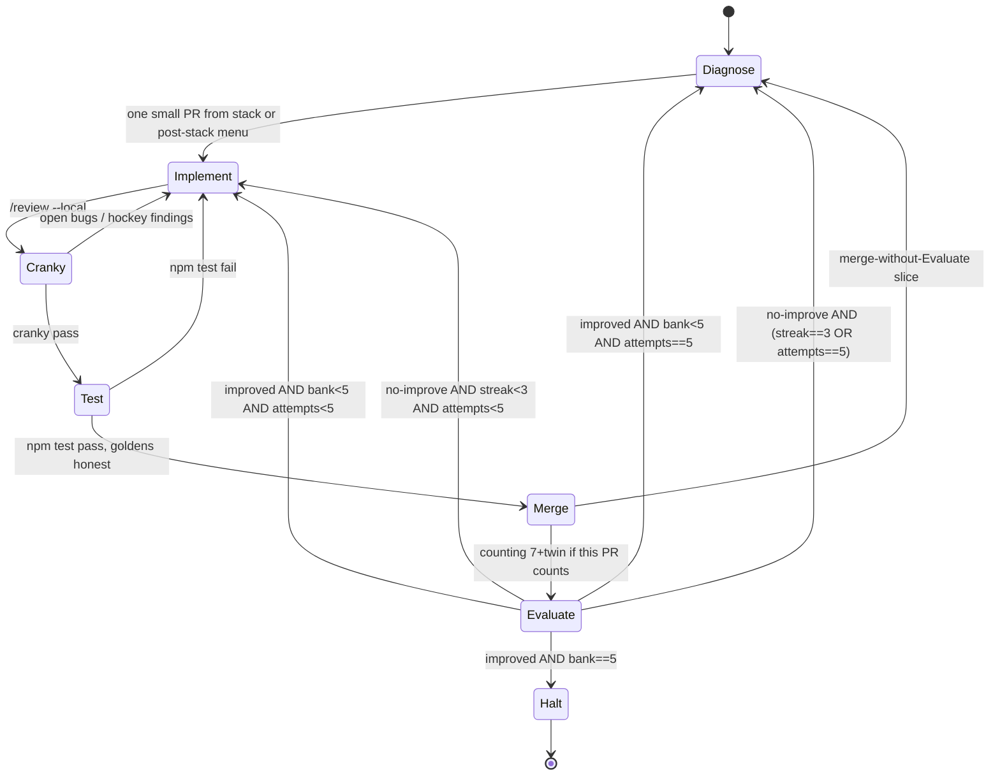

# Better hockey after a proven learning loop (Graph_Hockey)

| Field | Value |
| --- | --- |
| **Author** | Graph_Hockey staff (design) |
| **Date** | 2026-08-26 |
| **Status** | **In experiment — cycle 1, Evaluate 1 done, not improved.** Plan rev 3 still governs the coded bar. |
| **Repo** | `C:\Users\gasan\Graph_Hockey` (private, `main` playable) |
| **Success criterion** | **Five empirical improvements.** Not five attempts. Not five version bumps. Not “stop when the numbered PR stack is done.” Keep cycling (including a **post-stack Diagnose menu**) until `improvements == 5` or the user stops. |
| **PLAN_ID** | `f1d4bdeb` (resume leftover PRs with `/execute-plan --resume f1d4bdeb` after Evaluate context) |

---

## Experiment log (do not lose this)

This is the live scoreboard. Update it after every counting Evaluate. Handbook: [`FORgasan.md`](FORgasan.md).

| Counter | Value | Notes |
| --- | --- | --- |
| **Bank** (goal) | **0 / 5** | Only `homeΔxG > previousBestΔxG` credits, and only if every pass gate holds |
| Previous-best home Δ xG | **−0.552** | `ser-emp-7` g0→g6. Not updated (Evaluate 1 failed offsides) |
| Cycle | **1** | Diagnose → implement → cranky → test → merge → Evaluate |
| Attempts this cycle | **1 / 5** | Counting Evaluates only |
| Flat streak | **1 / 3** | 3 consecutive no-improve → re-Diagnose (bank kept) |
| On `main` | retrieve gate **#1** (`ff23dd5`) | `isLeadProtectPlay` hard-exclude unless `scoreState === "leading"` (omit ⇒ exclude) |
| Glimmer | **stopped** (transport) | Restart llama-server `:8080 --reasoning off` before the next live series. Do not restart 8787 unless asked. |

### Evaluate 1 — `ser-emp-8` (2026-08-26)

Protocol: 7×20s, seed 7, home xAI / away local Glimmer, `--aar-mode code`. Twin: `--no-llm --period-seconds 20` (`ser-emp-8-nollm`). Fresh dbs. Captain unset. Timeouts not raised.

| Gate | Result |
| --- | --- |
| Control honest | **pass** — books v1, retrieveTop 0/6 both, `booksMoved` false |
| Live writes books | **pass** — v1→v8 both. Away retrieveTop **4/6** (diagnostic). Home retrieveTop **0/6** (the old 1/6 *was* protect-lead) |
| Lead-protect skating | **pass** — event scan 0 hits; snapshot `protect-lead-1-1-3.stats.games` stayed **0** |
| Home Δ xG g0→g6 | **+0.176** (would beat −0.552) |
| Chance mean | 15.1 (floor 6). g6 home **62** chances is spray, not skill |
| Pairs `--compare 0,6` | **0** (floor) |
| Offsides 0–2 / side / game | **fail** — g2 home **5**; g4 away **77** (70 shots); g5 home **3**; g6 home **63** / away **8** (home 62 shots) |

**Improved: no.** The retrieve gate held. Coded quality failed on the offside band. Do not credit the bank for Δ xG while g4/g6 are ice storms.

Live card (home retrieve never `protect-lead`):

| G | Score | Home retrieve | Away retrieve | Home ch/off | Away ch/off |
| --- | --- | --- | --- | --- | --- |
| 0 | 3–1 home | `5v5-122-forecheck` | `oz-crash-net` | 9 / 1 | 2 / 1 |
| 1 | 1–2 away | `5v5-122-forecheck` | `5v5-212-forecheck` | 7 / 1 | 2 / 0 |
| 2 | 1–2 away | `5v5-122-forecheck` | `oz-crash-net` | 8 / **5** | 4 / 2 |
| 3 | 5–2 home | `5v5-122-forecheck` | `oz-crash-net` | 10 / 1 | 4 / 1 |
| 4 | 2–3 away | `5v5-122-forecheck` | `5v5-212-forecheck` | 6 / 0 | **69 / 77** |
| 5 | 3–4 away | `5v5-122-forecheck` (open `nz-122-trap`) | `5v5-212-forecheck` | 4 / 3 | 10 / 0 |
| 6 | 2–2 tie | `5v5-122-forecheck` (open `nz-122-trap`) | `oz-crash-net` | **62 / 63** | 14 / 8 |

Control twin matched the old ice-noise pattern (g6 away 15 offsides / 0 shots, books frozen).

### Stack vs GitHub (PLAN_ID `f1d4bdeb`)

| Plan | GitHub | State | Evaluate? |
| --- | --- | --- | --- |
| PR-1 retrieve gate | [#1](https://github.com/gasantiago16/Graph_Hockey/pull/1) | **merged** to `main` | Evaluate 1 done (flat) |
| PR-2 timeout leftover | [#2](https://github.com/gasantiago16/Graph_Hockey/pull/2) | draft, stacked | **merge-without-Evaluate** (skating already clean) |
| PR-3 seed NZ/DZ | [#3](https://github.com/gasantiago16/Graph_Hockey/pull/3) | draft | never |
| PR-4 dump-in | *not implemented* | held | next designed Δ xG mover **after** Diagnose of g4/g6 |
| PR-5 Ds tag-up | [#5](https://github.com/gasantiago16/Graph_Hockey/pull/5) | draft | counting candidate for offside storms |
| PR-6 captain | skipped | env off | — |
| PR-7 `lpTrail` flag | [#4](https://github.com/gasantiago16/Graph_Hockey/pull/4) | draft | never |

After #1 merged, retarget #2’s base to `main` before merging the rest of the stack.

### Next Diagnose (before Evaluate 2)

Do **not** teach dump-and-chase into g4/g6. Look at those two games first (77 and 63 offsides). Then either merge **#5** (Ds tag-up) or implement dump-in (PR-4) if the leak is NZ stick-carry — each still: cranky → `npm test` → merge → counting 7+twin.

---

## Overview

The LangGraph learning **loop** is proven. `ser-emp-7` moved playbooks v1→v8, `retrieveTopChanged` 1/6 per side, and the `--no-llm` twin stayed at book v1 with `retrieveTopChanged` 0/6. The hockey did not get better: home Δ xG g0→g6 **−0.552**, `--compare 0,6` **pairs=0**, and from g4 home retrieve locked `protect-lead-1-1-3` **while losing**.

The remaining product work is independently mergeable PRs that turn “the menu moved” into “game 7 is better hockey than game 1,” measured by a coded Evaluate. Until five Evaluates say **improved**, keep cycling. Failed or flat Evaluates do not increment the bank. After the named ice PRs, Diagnose does not stall: it picks from a **post-stack menu**.

The retrieve **score-state gate** is on `main` (`ff23dd5`). First counting Evaluate is done (`ser-emp-8`). Unit tests are not an Evaluate. Do not start Evaluate 2 until the g4/g6 offside storms have a Diagnose pick (see Experiment log).

---

## Background & Motivation

### What is already proven (do not re-propose)

| Series | Books | retrieveTopChanged | Quality g0→g6 |
| --- | --- | --- | --- |
| `ser-emp-7` live | v1→v8 both | home 1/6, away 1/6 | home Δ xG **−0.552**, `--compare 0,6` **pairs=0**. Home retrieve locked `protect-lead-1-1-3` from g4 **while losing**. Home distinct chances **8, 6, 4, 7, 9, 6, 6** (g6 **6**, series min **4**, mode/typical **6**). |
| `ser-emp-7-nollm` | stay v1 | **0/6** both | control. g6 away 15 offsides / 0 shots = ice noise |

Shipped on `main`: honest chances (Shot then Goal; dump/pass/clear freeze even if G clips); ice F1 shoot beats overlay pass/dump (`releasePolicy` in `src/engine/tactics.ts`); `--aar-mode code` default (**not** `noLlm: true`); boost only if match xG>0; EN-only `pull-early` retrieve; **lead-protect retrieve gate** (`isLeadProtectPlay`); local Glimmer; `shotLock`; series scorecard. Handbook: `docs/FORgasan.md`.

Home `retrieveTopChanged` 1/6 **is** `5v5-122-forecheck` → `protect-lead-1-1-3` at g4. After the gate, that transition is illegal by construction. **Do not** use `retrieveTopChanged > 0` as a hard Evaluate pass.

### The unfixed bug (was Scar 15 retrieve; now ice offsides)

Retrieve score-state is **shipped** (`ff23dd5`). `ser-emp-8` proved home cannot retrieve or skate `protect-lead` while trailing/tied. The quality fail is now **offsides outside 0–2**, especially g4 away 77 and g6 home 63.

### How retrieve used to leak (Scar 15, second half) — fixed on `main`

Pre-`ff23dd5` analysis (kept so Evaluate 1 is interpretable). `playStillValid` evaluates `{ kind: "score", eq: "leading" }` (`all` **and** `any`). `retrievePlays` **did not** — it filtered retired / strength / zoneBias / EN, then ranked by `netXg + scoreTriggerBoost + counterBoost`. After the gate it also hard-excludes `isLeadProtectPlay` unless `scoreState === "leading"`.

`scoreTriggerBoost` adds **+0.1** when a score predicate **matches**. It does **not** exclude the play when the score does **not** match.

Seed `protect-lead-1-1-3` (`data/playbooks/seed-original-six.json`):

- `family`: `protect-113` (listed in `PLAY_FAMILIES` in `src/playbook/similarity.ts`)
- `strength`: `["5v5"]`
- `zoneBias`: `["NZ", "DZ", "any"]` — `"any"` makes it legal in **OZ**
- `triggers`: `[{ "all": [{ "kind": "score", "eq": "leading" }] }]`
- `assignments.shotPolicy`: `"dump"`; forecheck `1-1-3`; NZ left-wing-lock; DZ collapse

Live retrieve **does** pass `scoreState` (`makeRetrievePlays` in `src/agents/nodes/retrievePlays.ts` via `classifiedSituation.scoreState` / `scoreStateFromObservation`). The filter still lets protect-lead through, so leftover net xG (or a `crash-net` counter bonus of `COUNTER_BONUS = 0.25`) can rank it #1 while trailing or tied.

Scorecard `retrieveTopId` (`src/film/chances.ts` 42–45) calls `retrievePlays(book, { strength: "5v5", zone: "OZ" })` **with no `scoreState`**. That is the number `gh series --json` prints. After the gate it will **never** be lead-protect. That is necessary, **not sufficient**, for “they did not skate 1-1-3 while trailing.”

### Evidence from `ser-emp-7` snapshots

Read the JSON, not the rounded table. Reconstruct tests must load these floats.

`data/playbook-snapshots/ser-emp-7/after-game-3.json` original-six **v5** (menu going into g4):

| Play | games | xgFor | xgAgainst | net xG |
| --- | ---: | ---: | ---: | ---: |
| `5v5-122-forecheck` | 4 | `0.6884993987252931` | `0.2918652159623639` | **+0.397** |
| `protect-lead-1-1-3` | 2 | `0.0626237475423774` | `0.12052745668466992` | **−0.058** |

`after-game-4.json` original-six **v6** (the row `gh series` labeled retrieveTop = protect-lead):

| Play | games | xgFor | xgAgainst | net xG |
| --- | ---: | ---: | ---: | ---: |
| `5v5-122-forecheck` | 5 | `1.1036971959752557` | `1.0855651089157887` | **+0.018** |
| `protect-lead-1-1-3` | 3 | `0.24176167635919105` | `0.14546602452306692` | **+0.096** |

Two facts:

1. **Post-game scorecard.** After g4, protect-lead’s leftover net xG (+0.096) beats 122 (+0.018) at 5v5 OZ with no score gate. That is why `retrieveTop` flipped.
2. **In-game skating.** `protect-lead` `games` 2→3 during the 1–5 loss, so they **skated** it in g4 (`applyUsageStats` in `src/playbook/mutate.ts` 363–374 increments `stats.games` when seconds/xG > 0). `5v5-122-forecheck` `zoneBias` is `["NZ","OZ"]` only. In **DZ**, 122 is dropped; protect-lead’s `"any"` plus `["NZ","DZ"]` keeps it on the **macro** retrieve menu (opening / `after_goal` / `period_start`).

`clampCoachPlayId` (`src/agents/nodes/headCoach.ts`) already clamps invented ids to `retrievedPlays`. It runs **only on macro** (HC). It is not how micro re-locks a sheet. Retrieve is still the leak for **new** picks.

### How playId actually changes (code, not the old diagram)

| Path | Code | Can pick protect-lead? |
| --- | --- | --- |
| Macro (`period_start`, `after_goal`, `score_state_flip`, `bench_review`, …) | `epochKindFor` uses `MACRO_REASONS` (`src/orchestrator/epochs.ts` 16–28). `epochRouter` → `head_coach`. `clampCoachPlayId` trusts `retrievedPlays`. | **Yes**, if retrieve offers it. `after_goal` preempts a same-tick lead-change (`epochs.test.ts`). |
| Macro timeout / parse-fail | `invokeTeam` catch → `timeoutDirective(last, seedPlayId)` (`src/orchestrator/invokeTeam.ts` 80–85, 160–170). Circuit (`teamTripped`) returns **`args.last` unchanged** (105–113). | **Yes** leftover: last stays protect-lead after they go trailing. Live call site **does** pass `seedPlayId: defaultPlayIdForBook(...)` (`src/orchestrator/match.ts` 188). |
| Micro (offside, icing, zone_entry, possession_review, …) | `epochRouter` → `assemble_directive` unless `GRAPH_HOCKEY_CAPTAIN=1` (`src/agents/teamGraph.ts` 101–103). Default **off**. `mergeAssembleDirective` micro: `playId = last.playId` when captain suggestion is absent (`src/agents/nodes/assembleDirective.ts` 55–57). `clampDirective` only rejects unknown ids (`validateDirective.ts`). | **Cannot change playId.** If `playStillValid` is false, `shouldDecide` still invokes that side, then assemble **copies last**. Trailing + protect-lead therefore **keeps skating** 1-1-3 until a **macro** epoch (or timeout leftover) replaces it. |

### Secondary poisons (after the gate)

| Layer | File | What still hurts hockey |
| --- | --- | --- |
| Timeout / circuit keeps last play | `src/orchestrator/invokeTeam.ts` `timeoutDirective` + circuit branch | Abort or circuit returns `last`. If last is protect-lead and `after_goal` just made them trailing, they keep it. |
| Micro assemble copies invalid last | `mergeAssembleDirective` micro | `playStillValid` false ⇒ invoke ⇒ copy `last.playId`. Need a drop when last is lead-protect and not leading. |
| Overlay dump never releases | `src/engine/tactics.ts` `releasePolicy` / `maybeReleasePuck` | Overlay wins unless ice is **shoot** beating overlay pass/dump. `policy === "dump" && source !== "ice"` → no release. Ice NZ F1 is hardcoded **`pass`** (`src/ice/roles.ts` 97). `ICE_F1_ACTIONS` is `hunt\|pass\|shoot\|clear` — no `"dump"`. |
| Ds on delayed offside | `src/ice/roles.ts` | F2/F3 honor `taggingUp` via `ozLive`. **Ds** in OZ still target up to `BLUE_LINE_X + 8`. **Dw** OZ is already `BLUE_LINE_X - 4` (onside). Control `ser-emp-7-nollm` g6 away **15 offsides / 0 shots**. Live series stayed 0–2. |
| Captain micro | `src/agents/teamGraph.ts` `epochRouter` | Default **off**. Do not turn it on. Specialists call `invokeStructured` **without** `noJsonRetry` (`src/agents/specialists/compile.ts` 96–101). `wrapSpecialist.ts` does not invoke the LLM. |

---

## Goals & Non-Goals

### Goals

- Fill an **empirical-improvement bank of 5**. Each credit requires a merged PR **and** an Evaluate that meets the coded definition below (**Δ xG strictly better than previous-best** is the only bank mover). Cycle abort does not reset the bank. After the named stack, **keep Diagnosing** from the post-stack menu until the bank is full or the user stops.
- First improving PR: home must **not skate** a lead-protect family while trailing or tied (`DirectiveApplied` vs running score — not merely `retrieveTopId`). Later PRs must not regress that.
- Live offsides stay in the **0–2 per side per game** band (not 108 / 166 / control-g6-15).
- Bank credits **only** when home Δ xG g0→g6 is **strictly** greater than previous-best Δ xG. Pairs is a **floor** (`pairs >= previousBestPairs`, cycle-1 **0**), same as chance mean. Chance-mean floor is **6** (g6 / typical), not 46/7 — a stable 6-chance series is eligible. g6 flicker and pairs 0→1 **cannot** fill the bank.
- Keep the control honest: `--no-llm` books stay v1, `retrieveTopChanged` 0/6, no mutation.
- Keep the live loop writing: `booksMoved` plus applied AAR ops / non-protect-lead `diffPlaybooks`. `retrieveTopChanged` is a **diagnostic**, not a pass gate.

### Non-goals

- Re-proving honest chances, ice F1 shoot-beats-overlay, `--aar-mode code`, boost-if-xG>0, EN retrieve gate, Glimmer adapter, `shotLock`, or the series JSON scorecard as the *product*.
- Per-skater LangGraphs. HITL on the 12s clock. Raising `GRAPH_HOCKEY_EPOCH_TIMEOUT_MS` / `LIVE_EPOCH_TIMEOUT_MS`. Restarting port 8787.
- 60s (or 20-minute) periods as a substitute for counting 20s Evaluates.
- Implementing `--aar-mode code` as `noLlm: true`.
- Wiring Chaos lab (`src/server/http.ts` 501). Chaos must not poison NHL AAR/playbooks.
- Moving NHL goldens unless the PR **intentionally** changes `--no-llm` physics and explains why.
- Spending a counting Evaluate on seed `zoneBias` (PR-3) or a display-only scorecard flag (PR-7).
- Changing the program goal to “N quality metrics then stop when the stack is done.”

---

## Key Decisions

1. **Success is five Evaluates that say improved, not five PRs and not five attempts.** A version bump with the same (or worse) hockey is not improvement. Failed/flat Evaluates do not increment `improvements`. The bank does **not** reset on cycle abort. **5 improvements is the program; 5 attempts is a cycle abort.** After the named PRs, Diagnose uses the post-stack menu.

2. **Do not run a counting 7-game LLM Evaluate until the retrieve score-state gate is merged.** Unit tests and cranky are the PR-1 merge gate; they are not the product Evaluate.

3. **Gate retrieve the same way we gated empty-net plays.** Hard exclude in `retrievePlays`, not a ranking penalty. Family/id allowlist **independent of** `requiredScoreState`. `requiredScoreState` scans `all` **and** `any`; if every trigger group requires the same `score.eq`, that is `need`. Do **not** classify trailing-only cousins as lead-protect.

4. **Lead-protect is legal only when `scoreState === "leading"`.** Tied and trailing are both illegal (FORgasan Scar 15; `ser-emp-7` g6 was a **tie** still locked on protect-lead). Omit `scoreState` (scorecard `retrieveTopId`) ⇒ treat as not-leading ⇒ exclude. That keeps `retrieveTopId(loadPlaybook("original-six")) === "5v5-122-forecheck"`.

5. **Do not encode the gate as `noLlm: true` and do not skip AAR apply.** Live default remains `--aar-mode code` (`shouldApplyRevision` in `src/aar/apply.ts`: apply when `aarMode` is `auto|code` and `noLlm` is false).

6. **Process per attempt: Diagnose → Implement → Cranky (`/review --local`) → `npm test` → Merge → Evaluate.** Cranky is required on **every** PR, including merge-without-Evaluate slices. Do not merge a cranky fail. Do not commit `.env`. `scripts/ping-providers.mjs` is **already in the tree** (not gitignored); do not put keys in it; do not claim it is untracked. Goldens must not move unless the PR says so.

7. **Evaluate protocol is `ser-emp-7` exactly**, plus the operator-env checklist: unset `GRAPH_HOCKEY_CAPTAIN`, do not raise `GRAPH_HOCKEY_EPOCH_TIMEOUT_MS` (default 12_000 = `LIVE_EPOCH_TIMEOUT_MS`), ping `:8080` first. Fresh sqlite. `--games 7 --period-seconds 20 --seed 7 --home-provider xai --away-provider muse --aar-mode code`. Twin: same flags plus `--no-llm` **and** `--period-seconds 20` (otherwise `seriesPeriodSeconds` defaults `--no-llm` series to **5s**). Do not restart 8787.

8. **Δ xG is the hockey mover.** Bank += 1 only if `homeΔxG > previousBestΔxG`. Pairs is a floor (`pairs >= previousBestPairs`), not an OR path. Chance mean is a floor at **6** (not 46/7). Shot rows, version integers, g6 flicker, and pairs 0→1 cannot fill the bank. `retrieveTopChanged` does not prove hockey got better and is not the live-learns pass gate.

9. **Counting-Evaluate order: retrieve gate → (timeout leftover only if the new card still skates 1-1-3) → ice dump-in → Ds tag-up → post-stack Diagnose.** Seed `zoneBias` is merge-without-Evaluate (or fold into PR-1). Scorecard JSON is never an Evaluate attempt. Each PR is independently mergeable. Cranky → `npm test` → merge on all of them.

10. **Captain micro stays off.** `epochRouter` already sends micro to `assemble_directive` unless `captainMicro` / `GRAPH_HOCKEY_CAPTAIN=1`. Do not enable it to “fix” offsides. If a later series ever enables it, `noJsonRetry: true` belongs in `compileSpecialistGraph` (`src/agents/specialists/compile.ts`), not `wrapSpecialist.ts`.

11. **Windows, npm, sql.js WASM, vitest fakes.** Zero live vendor in `npm test`. Away bench is local `muse-glimmer-30b` at `http://127.0.0.1:8080/v1`. Never `muse-spark-*-contributor` (`refuseContributorTier` in `src/llm/profiles.ts`).

12. **Ice PRs that change `advanceWorld` must treat pr7/pr8 goldens as load-bearing.** pr7 `7153fca7…` count **88**; pr8 `271ce6b8…` count **522**, epochs **11**, offsides **0** on 3×5s `--no-llm`. Retrieve-only PRs must not touch them.

---

## Proposed Design

### Architecture (unchanged)



Live **macro**: `ingest → situation → retrieve_plays → head_coach → assemble_directive → validate_directive`. Live **micro** (captain off): `ingest → situation → retrieve_plays → assemble_directive → validate_directive` (copies `last.playId`). Ice F1–G is code every tick. Graphs are staff, not skaters.

### Leak path (macro retrieve + leftover last, not HC clamp on micro)



Implementers: fix **retrieve** for new macro picks; fix **timeoutDirective + circuit + micro assemble** for leftover last. Do not “fix” micro by turning captain on or by expecting `clampCoachPlayId` there.

### Retrieve gate (PR-1)

Add to `src/playbook/retrieve.ts`, next to `isEmptyNetPlay`. Family/id allowlist is **not** `requiredScoreState === "leading"`.

```ts
const LEAD_PROTECT_FAMILIES = new Set(["protect-113"]);

export function isLeadProtectPlay(play: Pick<Play, "id" | "family">): boolean {
  if (LEAD_PROTECT_FAMILIES.has(play.family)) return true;
  return play.id.startsWith("protect-lead") || play.family.startsWith("protect-");
}

/**
 * If every trigger group requires the same score.eq, that state is required.
 * A group requires S when it cannot pass playStillValid unless score is S:
 * - some `all` pred is `{ kind: "score", eq: S }`, or
 * - `all` has no score and every `any` pred is `{ kind: "score", eq: S }`.
 * A score-free group (non-score `any`, or empty triggers) ⇒ not locked.
 * Scans `all` and `any`. Does not treat trailing-only cousins as lead-protect.
 */
export function requiredScoreState(play: Pick<Play, "triggers">): ScoreState | undefined {
  if (play.triggers.length === 0) return undefined;
  const needs: ScoreState[] = [];
  for (const g of play.triggers) {
    const allScore = (g.all ?? []).filter((p) => p.kind === "score").map((p) => p.eq);
    const anyPreds = g.any ?? [];
    const anyScore = anyPreds.filter((p) => p.kind === "score").map((p) => p.eq);
    const anyNonScore = anyPreds.filter((p) => p.kind !== "score");
    let groupNeed: ScoreState | undefined;
    if (allScore.length > 0) {
      const s = allScore[0]!;
      if (!allScore.every((x) => x === s)) return undefined;
      groupNeed = s;
    } else if (anyPreds.length > 0 && anyNonScore.length === 0 && anyScore.length > 0) {
      const s = anyScore[0]!;
      if (!anyScore.every((x) => x === s)) return undefined;
      groupNeed = s;
    } else {
      return undefined;
    }
    needs.push(groupNeed);
  }
  const first = needs[0];
  return needs.every((s) => s === first) ? first : undefined;
}
```

Inside `retrievePlays`’s filter, after the EN check:

```ts
if (isLeadProtectPlay(play) && query.scoreState !== "leading") return false;
const need = requiredScoreState(play);
if (need && query.scoreState !== need) return false;
```

Keep `scoreTriggerBoost(+0.1)` for ranking **among** legal plays when actually leading. Do not replace the exclude with a larger penalty — ranking penalties lose to leftover stats (g4: +0.096 vs +0.018) and to `COUNTER_BONUS` (0.25).

`timeRemainingLt` stays **out** of retrieve — that is why `isEmptyNetPlay` exists. Do not start evaluating clock in `RetrieveQuery`.

A `protect-113` play AAR-tweaked to `score: trailing` stays family-gated (only when leading) **and** `requiredScoreState === "trailing"` (only when trailing) ⇒ empty intersection, dead row. Do not use a turtle family as a push play; mint a new family.

Export `isLeadProtectPlay` / `requiredScoreState` from `src/playbook/index.ts`.

### What PR-1 does not change

- Seed JSON triggers (already `score: leading`). Eligibility is retrieve, not seed rewrite. Dropping `"any"` from `zoneBias` is PR-3 (merge-without-Evaluate), not this diff unless folded in as the same one-sentence change and cranky agrees.
- `playStillValid` (already correct).
- `clampCoachPlayId` (already clamps to retrieved on **macro**).
- AAR `boost` / `applyUsageStats`.
- Goldens, ice, timeouts, captain.

### Timeout leftover + micro assemble drop (PR-2)

`timeoutDirective` today (`src/orchestrator/invokeTeam.ts` 80–85): if `last.playId === default-structure` and `seedPlayId` is set, seed the book’s 5v5 play. Otherwise keep `last` (strip `playParams`). Circuit returns `args.last` **without** calling it.

Live `invokeTeam` already receives `obs` and `seedPlayId: defaultPlayIdForBook(...)`. It does **not** receive the playbook. Add `playbook: Playbook` to `invokeTeam` args (match.ts has `homePlaybook` / `awayPlaybook`).

Do **not** call `isLeadProtectPlay({ id: last.playId, family: last.playId, triggers: [] })`. Resolve the play from the side’s book (`resolvePlay(last.playId, playbook)`), then `isLeadProtectPlay(play)` (family + id + triggers on the real row, including minted `protect-113` cousins).

```ts
export function timeoutDirective(
  last: TeamDirective,
  seedPlayId: string | undefined,
  opts: { obs: TeamObservation; playbook: Playbook },
): TeamDirective {
  const play = resolvePlay(last.playId, opts.playbook);
  const seed = seedPlayId ?? defaultPlayIdForBook(opts.playbook);
  const notLeading = scoreStateFromObservation(opts.obs) !== "leading";
  if (isLeadProtectPlay(play) && notLeading) {
    return defaultDirective(seed); // never throw — invokeTeam never throws
  }
  if (last.playId === DEFAULT_PLAY_ID) return defaultDirective(seed);
  if (last.playParams === undefined) return last;
  const { playParams: _drop, ...rest } = last;
  return rest;
}
```

Same drop on the **circuit** branch (today `directive: args.last`). Missing `seedPlayId` uses `defaultPlayIdForBook(playbook)` (original-six → `5v5-122-forecheck`). **Do not throw** from `timeoutDirective` or `invokeTeam` (`invokeTeam` contract: “Never throws,” including the catch/circuit path). `resolvePlay` already yields `defaultStructurePlay()` for unknown ids (`store.ts` 55–58). Do not change `LIVE_EPOCH_TIMEOUT_MS = 12_000`.

**Micro assemble** (same PR): when `isMicro` and `last.playId` resolves to a lead-protect play and `scoreStateFromObservation(obs) !== "leading"`, **one** playId source:

```ts
playId =
  state.retrievedPlays.find((p) => !isLeadProtectPlay(p))?.id ??
  defaultPlayIdForBook(playbook);
```

Do **not** default to `defaultPlayIdForBook` first: that is always the first active 5v5 (`5v5-122-forecheck`, NZ/OZ only). In **DZ** trailing the first retrieved non-protect-lead is `5v5-breakout-d-to-winger`. Today invoke-because-invalid then copies last — that is the leftover skate after they go trailing without a successful macro HC. Unit test: DZ trailing + last protect-lead → breakout (not 122).

Macro assemble without `coachIntent` already uses `defaultPlayIdForBook`, not last. Keep that. Optionally also clamp `intent.playId` to `retrievedIds` (HC already did); not required if retrieve is gated.

### Seed zoneBias (PR-3 — merge-without-Evaluate)

`protect-lead-1-1-3.zoneBias`: drop `"any"` → `["NZ","DZ"]`. Leading OZ stays on 122 / cycle / crash. **No counting 7-gamer.** Fold into PR-1 if cranky still sees one idea; otherwise merge after cranky/`npm test` and skip Evaluate.

### Ice dump-in stays live (next designed quality Evaluate after the gate)

Today (`src/engine/tactics.ts` `releasePolicy` / `maybeReleasePuck`; `src/ice/roles.ts` 97; `src/ice/types.ts`):

- Overlay wins unless ice is **shoot** beating overlay pass/dump (`overlayYieldsToIceShoot`).
- `policy === "dump" && source !== "ice"` → no release.
- Ice NZ F1 is hardcoded `pass`. `iceActionToPolicy("clear") === "dump"`. There is **no** `"dump"` in `ICE_F1_ACTIONS`.

**`releasePolicy` contract (one sentence):** NZ ice `clear` beats overlay dump (`source: "ice"`, `kind: "clear"`); OZ overlay dump still yields to ice shoot; assignment-only dump without ice still does not release.

Do **not** add `"dump"` to `ICE_F1_ACTIONS`. Prefer existing `f1Action: "clear"`.

Concrete:

1. `roles.ts`: when F1 has the puck and `z === "NZ"` and `shotPolicyOf(world, side, play) === "dump"`, set `f1Action = "clear"` (DZ stays `clear`, OZ stays `shoot` beating overlay dump).
2. `releasePolicy`: after the ice-shoot-beats-overlay-pass/dump branch, if `ice === "dump" && overlay === "dump"`, take ice (`source: "ice"`). That is how overlay dump actually releases. Changing only `roles.ts` does **not** dump — overlay would still win with `source: "overlay"`.
3. `maybeReleasePuck` already releases ice dump as `stickRelease: "clear"` (not Shot, not xG). Net entry of a clear still `waveOffNetEntry`. The puck **stays live** unless icing or offside.

Unit test required: overlay `shotPolicy: "dump"` + NZ ice `clear` → possessor null, **no** Shot row. Keep existing `rules.test.ts` dump-into-net Freeze tests.

This PR **will** move pr8 if dump releases change `--no-llm` 3×5s physics. Update `fixtures/golden/pr8-simulate-seed42.json` **only if** the new hash is explained (dump-ins exist; Shot count does not explode; offsides still 0 or explained). pr7 scripted sequence should stay if the script never dumps.

### Ice Ds tag-up (PR-5)

`computeIceIntent` (`src/ice/roles.ts`):

- `ONSIDE_ALONG = BLUE_LINE_X - 4`
- `ozLive = z === "OZ" && !taggingUp`
- F2/F3 already clamp to `ONSIDE_ALONG` when `!ozLive`
- **Ds** in OZ: `min(max(alongPuck - 18, BLUE_LINE_X - 4), BLUE_LINE_X + 8)` **ignores `taggingUp`** — this is the offside leak
- **Dw** in OZ: already `BLUE_LINE_X - 4` (onside). Do not demand a Dw behavior change.

Fix: when `taggingUp`, **Ds** target `ONSIDE_ALONG`. NZ pass already refuses a mate across the blue (`passReceiver`). Keep that.

Live band is already 0–2; this is to stop control-g6-style 15-offside noise from leaking into a live Evaluate. Same golden discipline as dump-in.

### Captain (only if Evaluate still shows specialist visits)

Default path is already assemble-only on micro. Do not set `GRAPH_HOCKEY_CAPTAIN=1`. Skip this PR while env is off.

If a later series enables it: set `noJsonRetry: true` in `compileSpecialistGraph` for `captain` (or all specialists) in `src/agents/specialists/compile.ts` 96–101. `wrapSpecialist.ts` is the parent Send wrapper, not the LLM call. `headCoach.ts` already passes `{ noJsonRetry: true }` for HC only.

### Scorecard (never a counting Evaluate)

Current `gh series --json` already prints per game: score, `distinctChances`, `offsides`, xG, `openingPlayId`, book versions, `retrieveTopId`, plus `learning.retrieveTopChanged` and `booksMoved`. `gh footage --series ID --compare 0,6 --json` prints `deltas.home.xgFor` and `pairs.length`.

**Evaluate scans events now** (criterion 3). Do not wait for a display-only `protectLeadWhileTrailing` field. A later JSON flag is optional cosmetics and **must not** occupy an Evaluate attempt.

### Post-stack Diagnose menu (required so bank=5 is reachable)

After dump-in + Ds tag-up, if `improvements < 5`, **do not stall**. Re-read the last Evaluate card and pick **one** independently reviewable PR from this menu (or a new one the card names). Each still: cranky → `npm test` → merge → counting Evaluate.

| Look at | Likely files | Hockey question |
| --- | --- | --- |
| AAR boost / usage targeting | `src/aar/nodes/draftRevision.ts` `codeDraft`, `pickBoostPlay`; `applyUsageStats` | Did we boost the chance-creating play or the opening sheet? |
| NZ pass vs dump-and-chase carry | `src/ice/roles.ts` NZ `pass`; `passReceiver` | After dump-in ships, is NZ still a stick-carry? |
| Chance clustering | `src/film/chances.ts` `CHANCE_GAP_TICKS = 15`; `shotLock` | Distinct chances stuck while xG moves, or the reverse? |
| F2 contest of dump-ins / loose puck | `src/ice/roles.ts` F2 hunt | Dump-in live but no F2 on the puck? |
| Icing after dump release | `src/engine/rules.ts` `callIcing` / `startIcingRace` | Dump-in PR created icing storms? |
| `inferThemFamily` false crash-net | `retrieve.ts` `COUNTER_BONUS` | Counter bonus still distorting a legal 5v5 menu? |
| Away crash-net / 212 leftover | expansion seed, away retrieveTop diagnostic | Away menu honest but xG flat? |
| Epoch abort rate | `epoch_invocations` ok/timeout | Glimmer JSON-in-6s, not a timeout raise. |
| Film pairing | `src/film/pairClips.ts` prefer 0.7 / fallback 0.3 | pairs=0 because signatures never match, not because hockey is identical? |
| Formation slots vs dump policy | seed 122 `shotPolicy: dump` | OZ ice shoot already wins; leftover is NZ (dump-in PR) or DZ clear. |

Do **not** spend cycle attempts on seed-only zoneBias or scorecard cosmetics.

---

## Merge–Test–Evaluate Cycle

Goal: `improvements == 5`. Stop the program when the bank is full **or** the user stops.

**5 improvements is the program; 5 attempts is a cycle abort.**



On Diagnose after abort: `attempts = 0`, `flatStreak = 0`, **bank kept**. Pick the next real hockey PR (stack remainder or post-stack menu).

### Counters

| Counter | Resets when | Increments when | Halt / abort |
| --- | --- | --- | --- |
| `improvements` (bank) | **never** (until user stops) | Evaluate == improved | `== 5` → stop program |
| `attempts` (this cycle) | cycle abort → Diagnose | every **counting** Evaluate | `== 5` without filling remaining bank slots → Diagnose |
| `flatStreak` | improved Evaluate **or** cycle abort | Evaluate == no-improve | `== 3` consecutive → Diagnose |

Per cycle: at most 5 counting Evaluates, **or** abort early on 3 consecutive no-improvement Evaluates. Merge-without-Evaluate PRs do **not** increment `attempts`. Consecutive-no-improvement counter resets on abort. Empirical-improvement bank does **not** reset.

If the 5th attempt of a cycle **improves** but `bank < 5`: Diagnose (new cycle, streak=0, bank kept), do **not** stay in the same cycle.

### Inner loop (one attempt)

1. **Diagnose** (first time, and after a cycle abort). Read retrieve / ice / captain / dump / scorecard / post-stack menu against the last Evaluate (or `ser-emp-7` on cycle 1). Pick **one** independently reviewable PR.
2. **Implement** that PR only.
3. **Cranky.** `/review --local` per `C:\Users\gasan\.grok\bundled\skills\review\SKILL.md`. Fix findings. Do not merge a cranky fail.
4. **Test.** `npm test` from repo root. Zero live vendor. Goldens must not move unless the PR intentionally updates them and the commit message explains why.
5. **Merge** to `main`. Do not commit `.env`.
6. **Evaluate** if this PR counts (see PR Plan). Only after the retrieve gate is on `main`.

### Exact Evaluate CLI

```text
Operator env (required, both arms):
  unset GRAPH_HOCKEY_CAPTAIN          # else compileTeamGraph enables captain micro
  do not set GRAPH_HOCKEY_EPOCH_TIMEOUT_MS above default 12000
  ping http://127.0.0.1:8080/v1 first (scripts/ping-providers.mjs; local-only)
  do not restart 8787
  do not pass --aar-mode as a substitute for --no-llm
```

Live (fresh db):

```text
npm run gh -- series --games 7 --period-seconds 20 --seed 7
  --home-provider xai --away-provider muse --aar-mode code
  --db data/ser-emp-<N>.sqlite --id ser-emp-<N> --json
```

Control (same seed; `--period-seconds 20` is mandatory so `--no-llm` does not fall back to 5s):

```text
npm run gh -- series --games 7 --period-seconds 20 --seed 7
  --no-llm --aar-mode code
  --db data/ser-emp-<N>-nollm.sqlite --id ser-emp-<N>-nollm --json
```

Footage:

```text
npm run gh -- footage --series ser-emp-<N> --db data/ser-emp-<N>.sqlite --compare 0,6 --json
```

Protect-lead skating check (Evaluate **now**, not PR-7). For each live `matchId`, `listEvents` and walk in order:

- `Goal` with `payload.side` (`src/engine/rules.ts` 938–941) increments that side’s running score.
- `DirectiveApplied` with `payload.side === home` (or away) and `directive.playId` resolving to `isLeadProtectPlay`: if that side’s running `us <= them` (tied or trailing) ⇒ **gate regression**, Evaluate = no-improve.
- Corroborate with snapshot `protect-lead-1-1-3.stats.games` delta: increment during a game that side **never led** is the same fail.

`--aar-mode code` is **not** `--no-llm`. Code AAR still applies (`codeOnlyAarReport` + `applyAarRevision`). Live epochs still call grok-4.5 / Glimmer. Do not raise timeouts as the fix. 60s periods are a later demo, not a counting Evaluate.

If `:8080` is down, abort the Evaluate — do not swap in Spark.

### Coded “improved”

**Baseline (cycle 1 previous-best):** `ser-emp-7` vs `ser-emp-7-nollm` in `docs/FORgasan.md`.

| Metric | Baseline | Source | Role |
| --- | --- | --- | --- |
| Control books | v1 both | `learning.booksMoved` false | **pass gate** |
| Control `retrieveTopChanged` | 0/6 both | `learning.retrieveTopChanged` | **pass gate** (honesty) |
| Live `booksMoved` | true at least one side | versions last > first | **pass gate** (loop writes) |
| Applied AAR / digest | ops applied; `diffPlaybooks` g0→g6 has non-protect-lead changes | ledger `aarOps`; snapshots | **pass gate** (loop writes) |
| Live `retrieveTopChanged` | home 1/6 was the bug | `learning.retrieveTopChanged` | **diagnostic only** |
| Lead-protect skating while trailing/tied | g4 `games` 2→3 during 1–5 | **events** + snapshot games | **pass gate** (must be absent) |
| Live offsides | 0–2 / side / game | `matches[i].*.offsides` | **pass gate** |
| Home Δ xG g0→g6 | **−0.552** | footage `deltas.home.xgFor` | **only bank credit** |
| Home chance **mean** | **6** (g6 / typical; series min was 4) | mean of `matches[*].home.distinctChances` | **floor** (not a credit) |
| `--compare 0,6` pairs | **0** | footage `pairs.length` | **floor** (`>= previousBestPairs`; not a credit) |

An Evaluate **improves** iff **ALL** of:

1. **Control still honest.** `--no-llm` books stay v1, `retrieveTopChanged` 0/6 both sides, `shouldApplyRevision({ noLlm: true })` did not write `playbook_versions` (`booksMoved` false).

2. **Live still writes books.** At least one side `booksMoved` (version last > first) **and** at least one of: (a) a live AAR report with `applied` ops, (b) `diffPlaybooks(after-g0, after-g6)` has `added`/`changed`/`removed` on a play that is **not** only protect-lead `stats`. `retrieveTopChanged` is printed as a diagnostic. After PR-1 it may be **0/6** on home (the illegal transition is gone) and still be a valid Evaluate. A version bump with **zero** applied ops and **only** protect-lead stat churn is not “learns.”

3. **Hockey quality** (Δ xG is the mover; cannot be gamed by Shot-row count, version integers, g6 flicker, or pairs 0→1):
   - Home must **not skate** `protect-lead` / `protect-113` / id prefix `protect-lead` while trailing **or tied**. Scan `DirectiveApplied` vs running score (above). `retrieveTopId` remaining `5v5-122-forecheck` is **necessary, not sufficient**. `openingPlayId` is the first directive at 0–0; do not use it as the only check. First improving PR should make skating-while-not-leading false; later PRs must not regress it.
   - Offsides stay in the live **0–2** band per side per game. Control g6 15 offsides is ice noise on the **control** arm, not an automatic live fail.
   - Series home chance **mean ≥ 6** (g6 / typical of `ser-emp-7`). A stable seven-game 6-chance series is **eligible**. Do **not** floor at 46/7 (≈6.571); that rejects mean 6.0 and would also reject a dump-in series that trades spray shots for higher xG. Not a bank credit.
   - Pairs **floor:** `pairs >= previousBestPairs` (cycle-1 **0**). Not a bank credit. pairs 0→1 with Δ xG merely “not worse” does **not** increment the bank.
   - **Bank credit (the only mover):** `homeΔxG > previousBestΔxG`. Cycle-1 previous-best Δ xG is **−0.552**. There is **no** OR path.

A version bump with the same (or worse) hockey is **not** improvement.

**Previous best** (Δ xG and pairs floor) updates only on an improved Evaluate. Chance mean stays a **fixed** floor at 6 (does not ratchet to 46/7).

### What does not count

- `npm test` green.
- Playbook `version` integers.
- Shot event count.
- `retrieveTopChanged` alone (and, after the gate, `retrieveTopChanged === 0` is not an automatic fail).
- g6 `distinctChances` 6→7 while Δ xG does not beat previous-best.
- pairs 0→1 (or 1→2…) while Δ xG is not **strictly** greater than previous-best — including Δ xG exactly equal to previous-best. There is no pairs-only credit.
- 3-game smokes (`ser-glimmer-fresh`).
- 60s demos.
- An Evaluate started before the retrieve gate merged.
- Merge-without-Evaluate slices (PR-3, PR-7).

---

## API / Interface Changes

### `RetrieveQuery` (no new fields)

`scoreState?: ScoreState` already exists and is already passed from `makeRetrievePlays`. The change is filter semantics.

### New exports (`src/playbook/retrieve.ts` → `src/playbook/index.ts`)

```ts
export function isLeadProtectPlay(play: Pick<Play, "id" | "family">): boolean;
export function requiredScoreState(play: Pick<Play, "triggers">): ScoreState | undefined;
```

### `retrievePlays` contract (after)

| Query | `protect-lead-1-1-3` in results? |
| --- | --- |
| `{ strength: "5v5", zone: "OZ" }` (no score) | **no** |
| `{ …, scoreState: "trailing" }` | **no** |
| `{ …, scoreState: "tied" }` | **no** |
| `{ …, scoreState: "leading" }` | yes, if strength/zone match; +0.1 rank boost |
| EN / `pull-early` | unchanged (`isEmptyNetPlay`) |

### `retrieveTopId` (unchanged call, new implication)

```42:45:src/film/chances.ts
export function retrieveTopId(book: Playbook | undefined): string | undefined {
  if (!book) return undefined;
  return retrievePlays(book, { strength: "5v5", zone: "OZ" })[0]?.id;
}
```

After the gate this is the **opening-menu** top-1 (tied/unknown score), not “what they would retrieve if leading,” and **not** proof they did not skate 1-1-3 mid-game.

### `timeoutDirective` + `invokeTeam` (PR-2)

Add `playbook: Playbook`. Drop path: `defaultDirective(seedPlayId ?? defaultPlayIdForBook(playbook))`. **Never throw.** Same drop on the circuit branch. Call site already has `obs` and `seedPlayId`. `invokeTeam` remains never-throws.

### Tests that must move with PR-1 (not goldens)

- `src/playbook/retrieve.test.ts`: original-six trailing/tied/omitted scoreState must not contain `protect-lead-1-1-3`; leading may. Reconstruct after-g4 stats from the snapshot floats (or load `after-game-4.json` original-six v6) and assert trailing still excludes it. Cover `requiredScoreState` with score in `any`, and a score-free group ⇒ not locked.
- `src/film/chances.test.ts`: `retrieveTopId(original-six)` stays `5v5-122-forecheck`; add inflated protect-lead stats → still not top without scoreState.
- `src/agents/teamGraph.test.ts` `"clamps a playId that is not in retrievedPlays"`: observation is NZ **tied** (`score: { us: 0, them: 0 }`). Drop `protect-lead-1-1-3` from the allowed set:

```ts
expect(["5v5-122-forecheck", "nz-122-trap"]).toContain(out.directive?.playId);
```

NHL goldens (`fixtures/golden/pr7-replay-seed42.json`, `pr8-simulate-seed42.json`) **must not** change in PR-1/PR-2.

---

## Data Model Changes

No SQLite schema change. No playbook JSON schema change (`PlayPredicate` already has `kind: "score"`).

Optional seed edit (PR-3, no Evaluate): `protect-lead-1-1-3.zoneBias` from `["NZ","DZ","any"]` → `["NZ","DZ"]`.

Playbook snapshots under `data/playbook-snapshots/<seriesId>/` remain the Evaluate artifact. New series ids (`ser-emp-8`, …); do not overwrite `ser-emp-7` / `ser-emp-7-nollm`.

---

## Alternatives Considered

### A. Ranking penalty instead of exclude

Add −∞ / −10 when score mismatches, or only apply `scoreTriggerBoost` when matching (today’s +0.1).

**Reject.** g4 leftover net xG already beats 122 (+0.096 vs +0.018). `COUNTER_BONUS` is 0.25. Any finite penalty is a future Scar 15. The EN gate succeeded because it was a **hard exclude**.

### B. Fix it only in the Head Coach prompt

`COACH_SYSTEM` already says “Pick exactly one playId from retrievedPlays.” Glimmer/Grok can still pick the #1 dump. `clampCoachPlayId` trusts the list and **does not run on micro**.

**Reject.** The list is the product for new macro picks. Leftover last is timeout + micro assemble.

### C. Retire `protect-lead-1-1-3` from the seed

Removes the family from original-six. AAR `mint` / `tweak_trigger` can recreate it. Trailing benches still need a legal 5v5 DZ menu (`dz-collapse`, `5v5-breakout-d-to-winger`).

**Reject as the only fix.** Keep the play for **leading** late-game hockey. Gate retrieve.

### D. Bigger ice rewrite before retrieve

Tempting because control g6 is 15 offsides / 0 shots and dump-and-chase does not dump. An ice-first 7-gamer will **re-lock protect-lead** (FORgasan: “another 7-gamer will only lock it harder”).

**Reject as PR-1.** Ice dump-in is the next **counting quality** Evaluate after the gate.

### E. Change the program goal to “stop when the stack is done”

**Reject.** User decision: bank stays 5. Post-stack Diagnose menu is the designed next work.

---

## Security & Privacy Considerations

- No keys in the browser or WS payloads (`src/web/`, spectator frames). Unchanged.
- `.env` is gitignored. Do not commit it.
- `scripts/ping-providers.mjs` **is tracked**. It prints status only (file header: never the secret). Do not add keys to it.
- Loopback only (`DEFAULT_HTTP_HOST = 127.0.0.1`). Do not bind `0.0.0.0`.
- `--no-llm` remains the control that must not mutate playbooks (`shouldApplyRevision`).
- Chaos lab stays 501. Do not share NHL playbook rows with a chaos match.
- Away Muse is local Glimmer; `refuseContributorTier` must keep rejecting `muse-spark-*-contributor`.

Threat model for this work is **wrong training signal**, not a new network surface: if retrieve offers lead-protect while trailing, AAR cites that sheet and game 7 learns to turtle.

---

## Observability

Evaluate artifacts (required, per series id):

| Signal | Where |
| --- | --- |
| Per-game score, chances, offsides, xG, opening play, retrieveTop, book version | `gh series --json` (`src/cli/main.ts` `cmdSeries`) |
| `retrieveTopChanged`, `booksMoved` | `payload.learning` (`retrieveTopChanged` = diagnostic) |
| Home/away Δ xG, pairs | `gh footage --series ID --compare 0,6 --json` |
| Book bodies / `diffPlaybooks` | `data/playbook-snapshots/<id>/after-game-N.json` |
| Lead-protect skating | `listEvents` `DirectiveApplied` vs running `Goal` score |
| Epoch ok / timeout | `epoch_invocations` (do not “fix” timeouts by raising the budget) |

Alert (human, after each Evaluate): if any live `DirectiveApplied` is lead-protect while that side’s running score is tied/trailing ⇒ **gate regression**, Evaluate = no-improve, do not increment bank. Do **not** treat `retrieveTopId === 5v5-122-forecheck` as sufficient.

Do not add metrics servers. Localhost CLI + sqlite events are the scorecard.

---

## Rollout Plan

- No feature flag. Retrieve exclude is always-on.
- Staged by **PR**, not by percentage: PR-1 merge → **first counting Evaluate** → timeout leftover only if skating remains → ice dump-in as the next designed quality Evaluate.
- Rollback: revert the single PR. Seed books remain valid. `--no-llm` CI does not call retrieve score-state in goldens (pr8 compiles graphs `noLlm: true` and uses `defaultPlayIdForBook`, not HC pick).
- If PR-1 Evaluate has **no skating** but Δ xG is not strictly better than −0.552: bank stays 0, streak 1, next counting PR is ice dump-in (and merge PR-2 without Evaluate if tests cover leftover).

---

## Risks

| Sev | Risk | Mitigation |
| --- | --- | --- |
| **P0** | Counting Evaluate before the gate | Hard rule: no 7-game LLM Evaluate until PR-1 is on `main`. |
| **P0** | `--no-llm` twin accidentally 5s periods | Always pass `--period-seconds 20` on **both** arms. |
| **P1** | `retrieveTopChanged` was the bug; treating 0/6 as fail | Diagnostic only. Loop writes = `booksMoved` + AAR ops / non-protect-lead diffs. |
| **P1** | Overlay dump still wins if only `roles.ts` changes | `releasePolicy`: ice `clear` beats overlay dump. Unit test overlay dump + NZ clear. |
| **P1** | Timeout sketch using `family: last.playId` misses mints | Resolve play from playbook; missing seed → `defaultPlayIdForBook`; never throw; circuit branch too. |
| **P1** | Micro copies invalid last; Evaluate only looks at `retrieveTopId` | Event scan vs running score **now**. PR-2 drops last on micro assemble. |
| **P1** | Glimmer down / JSON-in-reasoning | Ping `:8080` first; `skipNativeStructured`; `GLIMMER_MAX_TOKENS=120`. Do not swap Spark. |
| **P2** | 20s variance | Bank credit is Δ xG only; pairs and chance mean (≥6) are floors. Do not “fix” with 60s. Cycle abort after 3 flats → re-diagnose (post-stack menu). |
| **P2** | Ice PR moves pr8 | Intentional golden update + explanation; if offsides explode, revert ice. |
| **P2** | Stack too short for bank=5 | Post-stack Diagnose menu. Do not cash chance flicker. |
| **P2** | Cranky nits stall the bank | Fix bugs. Hockey-related suggestions fix. Pure style: address or `wontfix` in the review file, then merge. |
| **P2** | Enabling captain micro to “help” offsides | Do not. Unset `GRAPH_HOCKEY_CAPTAIN`. Ice Ds tag-up is code. |
| **P2** | Spending Evaluates on PR-3 / PR-7 | Marked merge-without-Evaluate / never-Evaluate. |

---

## Open Questions

None that block **PR-1**. These implementer choices are **decided** in this revision:

| Choice | Decision |
| --- | --- |
| Overlay vs ice dump precedence | NZ ice `clear` beats overlay dump; OZ overlay dump still yields to ice shoot; assignment-only dump does not release; no new `ICE_F1_ACTIONS` value. |
| Learns metric after the gate | `booksMoved` + applied AAR / non-protect-lead `diffPlaybooks`. `retrieveTopChanged` diagnostic. |
| PR-2 includes micro assemble? | **Yes** — `retrievedPlays.find(p => !isLeadProtectPlay(p))?.id ?? defaultPlayIdForBook(playbook)`. Test DZ trailing. |
| Bank=5 vs a tight quality bar | Bank stays 5. Credit only `homeΔxG > previousBestΔxG`. Pairs and chance mean (≥6) are floors. Post-stack Diagnose menu. |
| Missing seed on timeout drop | `defaultPlayIdForBook(playbook)`. Never throw from `invokeTeam` / `timeoutDirective`. |

Remaining work after ice is **Diagnose**, not a user product question.

---

## References

- Handbook: `C:\Users\gasan\Graph_Hockey\docs\FORgasan.md` (Scar 15, `ser-emp-7` card, next-work list)
- Contributor map: `C:\Users\gasan\Graph_Hockey\AGENTS.md`
- Long spec: `C:\Users\gasan\Graph_Hockey\docs\DESIGN.md`
- Retrieve: `src/playbook/retrieve.ts` (`retrievePlays`, `playStillValid` 107–111, `scoreStateFor`, `isEmptyNetPlay`, `scoreTriggerBoost`, `COUNTER_BONUS`)
- Live retrieve node: `src/agents/nodes/retrievePlays.ts`
- Situation: `src/agents/nodes/situation.ts` (`scoreStateFromObservation`)
- HC clamp: `src/agents/nodes/headCoach.ts` (`clampCoachPlayId`) — **macro only**
- Assemble: `src/agents/nodes/assembleDirective.ts` (`mergeAssembleDirective` micro copies `last.playId`)
- Timeout / circuit: `src/orchestrator/invokeTeam.ts` (`timeoutDirective`, circuit `args.last`)
- Epoch skip: `src/orchestrator/epochs.ts` (`MACRO_REASONS`, `shouldDecide`, `after_goal` preempts)
- AAR apply: `src/aar/apply.ts` (`shouldApplyRevision`); `src/aar/runAar.ts` (`codeOnlyAarReport`)
- Mutate caps: `src/playbook/mutate.ts` (`applyPlaybookRevision`, `applyUsageStats`, `zero-xg-boost`)
- Ice: `src/ice/roles.ts` (`computeIceIntent`, `taggingUp`, `ONSIDE_ALONG`, NZ `pass`); `src/ice/types.ts` `ICE_F1_ACTIONS`
- Dump/release: `src/engine/tactics.ts` (`releasePolicy`, `maybeReleasePuck`, `iceActionToPolicy`)
- Offside/wave-off: `src/engine/rules.ts` (`maybeOffside`, `waveOffNetEntry`, `maybeGoal`, Goal `payload.side`)
- Specialists: `src/agents/specialists/compile.ts` (`invokeStructured` without `noJsonRetry`)
- Scorecard: `src/film/chances.ts`, `src/film/improvement.ts`, `src/film/pairClips.ts`
- CLI: `src/cli/main.ts` (`USAGE`, `seriesPeriodSeconds`, `cmdSeries`, `cmdFootage`)
- Series host: `src/sim/series.ts` (`runSeries`, playbook compiled **per game**, not per tick)
- Seeds: `data/playbooks/seed-original-six.json`, `data/playbooks/seed-expansion.json`
- Snapshots: `data/playbook-snapshots/ser-emp-7/after-game-3.json` (v5), `after-game-4.json` (v6)
- Goldens: `fixtures/golden/pr7-replay-seed42.json` (`7153fca7…`, count 88), `fixtures/golden/pr8-simulate-seed42.json` (`271ce6b8…`, count 522, epochs 11)
- Review skill: `C:\Users\gasan\.grok\bundled\skills\review\SKILL.md`

---

## PR Plan

Each PR: independently mergeable. **Cranky `/review --local` → `npm test` → merge** on every PR, including slices that do not count. One-sentence hockey change is the product claim, not a version bump.

Counting-Evaluate budget is expensive (live 7×20s LLM + twin). Do not spend an attempt on seed-only or JSON-flag PRs.

### PR-1 — Retrieve score-state gate (blocker; first counting Evaluate)

| | |
| --- | --- |
| **Title** | `retrieve: exclude lead-protect unless actually leading` |
| **Files** | `src/playbook/retrieve.ts`, `src/playbook/retrieve.test.ts`, `src/playbook/index.ts`, `src/film/chances.test.ts`, `src/agents/teamGraph.test.ts` |
| **Deps** | none. `makeRetrievePlays` already passes `scoreState`. |
| **Description** | Add `isLeadProtectPlay` (family/id only) and `requiredScoreState` (`all` **and** `any`). Hard-exclude in `retrievePlays` unless `query.scoreState === "leading"` (omit ⇒ exclude). Keep EN gate and `scoreTriggerBoost`. Reconstruct `ser-emp-7` after-g4 **snapshot floats** in unit tests. |
| **Tests** | trailing/tied/omitted never return `protect-lead-1-1-3`; leading may; `retrieveTopId(original-six)` stays `5v5-122-forecheck`; after-g4 stats still exclude when trailing; score in `any` / score-free group; teamGraph clamp allow-list drops protect-lead on a tied NZ obs. **Do not** touch pr7/pr8. |
| **Cranky** | `/review --local` on the retrieve diff. Fail if the gate is a ranking penalty, if `code` AAR is wired as `noLlm`, or if goldens move. |
| **Hockey** | Home cannot **retrieve** `protect-lead-1-1-3` while trailing or tied. |
| **Evaluate** | **First counting 7-game + twin** after merge. Pass requires **no lead-protect skating** (event scan), control honest, live writes books. Δ xG may still be ≤ −0.552 — if skating is gone and Δ xG is not strictly better, bank does **not** increment. |

### PR-2 — Timeout + micro assemble drop leftover last

| | |
| --- | --- |
| **Title** | `invokeTeam: drop lead-protect last when not leading` |
| **Files** | `src/orchestrator/invokeTeam.ts`, `src/orchestrator/invokeTeam.test.ts`, `src/orchestrator/match.ts` (pass `playbook`), `src/agents/nodes/assembleDirective.ts`, `src/agents/nodes/assembleDirective.test.ts` |
| **Deps** | PR-1 (`isLeadProtectPlay`) |
| **Description** | Resolve play from the side playbook (id → family + triggers). If `isLeadProtectPlay(play) && scoreStateFromObservation(obs) !== "leading"`, return `defaultDirective(seedPlayId ?? defaultPlayIdForBook(playbook))`. **Never throw.** Same drop on the **circuit** branch. Micro assemble: `retrievedPlays.find(p => !isLeadProtectPlay(p))?.id ?? defaultPlayIdForBook(playbook)`. Do not change 12s/8s budgets. |
| **Tests** | trailing obs + last `protect-lead-1-1-3` + seed `5v5-122-forecheck` → 122; minted id with `family: protect-113` also drops; leading obs keeps last; **missing seed → `defaultPlayIdForBook` (no throw)**; circuit path drops; micro assemble **DZ** trailing + last protect-lead → first retrieved non-protect-lead (`5v5-breakout-d-to-winger`), not 122. |
| **Cranky** | Fail if timeouts are raised, family is `last.playId`, or the live path **throws**. |
| **Hockey** | A 12s abort or a micro copy cannot leave a trailing bench in 1-1-3 dump. |
| **Evaluate** | Counting 7+twin **only if** the PR-1 card still shows lead-protect skating. If PR-1 already clean, merge-without-Evaluate (tests cover leftover). |

### PR-3 — Seed: protect-lead is NZ/DZ only (no Evaluate)

| | |
| --- | --- |
| **Title** | `seed: protect-lead zoneBias drops any` |
| **Files** | `data/playbooks/seed-original-six.json`, `src/playbook/retrieve.test.ts` |
| **Deps** | PR-1 preferred |
| **Description** | `zoneBias: ["NZ","DZ"]`. Leading OZ stays on 122 / cycle / crash. Fold into PR-1 if cranky still sees one idea. |
| **Tests** | OZ leading retrieve does not contain `protect-lead-1-1-3`. DZ leading still can. |
| **Cranky** | Fail if strength/triggers/EN seeds are drive-by edited. |
| **Hockey** | A lead is protected in NZ/DZ, not by dumping from the offensive slot. |
| **Evaluate** | **Never.** Merge-without-Evaluate. |

### PR-4 — Dump-in actually leaves the stick and stays live (next quality Evaluate)

| | |
| --- | --- |
| **Title** | `ice: NZ dump releases as clear; puck stays live` |
| **Files** | `src/ice/roles.ts`, `src/ice/roles.test.ts`, `src/engine/tactics.ts`, `src/engine/tactics.test.ts`, `src/engine/rules.test.ts` (wave-off still not a Goal). Goldens **only if** pr8 hash moves, with explanation. |
| **Deps** | PR-1 merged and at least one Evaluate showing protect-lead **skating** is gone (otherwise dump PR teaches 1-1-3 dump while losing). |
| **Description** | **`releasePolicy`:** NZ ice `clear` beats overlay dump (`source: "ice"`, `kind: "clear"`); OZ overlay dump still yields to ice shoot; assignment-only dump without ice still does not release. `roles.ts`: NZ F1 with dump policy emits `f1Action: "clear"` (existing `ICE_F1_ACTIONS`; do **not** add `"dump"`). |
| **Tests** | Overlay dump + NZ ice clear → possessor null, **no Shot**; OZ ice shoot still beats overlay dump; dump-into-net is Freeze not Goal. If pr8 moves: new hash, count, epochs, offsides called out in the PR body. |
| **Cranky** | Fail if dump becomes Shot/xG, if only `roles.ts` changes, or if timeouts change. |
| **Hockey** | Dump-and-chase is a live puck in the OZ, not a carry on the stick and not a fake Goal. |
| **Evaluate** | Counting 7+twin. First **designed** Δ xG mover after the gate. |

### PR-5 — Delayed-offside Ds tag up

| | |
| --- | --- |
| **Title** | `ice: Ds tag up on delayed offside` |
| **Files** | `src/ice/roles.ts`, `src/ice/roles.test.ts`. Goldens only if pr8 moves. |
| **Deps** | PR-1. Sequence after PR-4 if both touch `roles.ts`. |
| **Description** | When `world.delayedOffside?.attacking === side`, **Ds** target `ONSIDE_ALONG`. Dw OZ is already `BLUE_LINE_X - 4` — no behavior change. |
| **Tests** | Delayed-offside world: Ds target `x` on the defensive side of the attacking blue. Do not assert a Dw change. Live 0–2 band must not become 108. |
| **Cranky** | Fail if this is sold as a timeout fix or as a Dw rewrite. |
| **Hockey** | Attackers tag up instead of skating a 15-offside shift with zero shots. |
| **Evaluate** | Counting 7+twin. Live offsides must stay 0–2. |

### PR-6 — Captain micro (skip while env is off)

| | |
| --- | --- |
| **Title** | `captain: noJsonRetry if micro is ever enabled` |
| **Files** | `src/agents/specialists/compile.ts` (the LLM call). Not `wrapSpecialist.ts`. |
| **Deps** | Diagnose after a cycle abort. Skip if epoch logs show no `captain` visits. |
| **Description** | Do not set `GRAPH_HOCKEY_CAPTAIN=1`. If a series did: `invokeStructured(..., { label: \`specialist:${role}\`, noJsonRetry: true })` in `compile.ts`. |
| **Tests** | `epochRouter({ epochKind: "micro" }) === "assemble_directive"` without env. |
| **Cranky** | Fail if HITL or specialist fan-out returns. |
| **Hockey** | Offside review does not spend the epoch aborting grok-4.3. |
| **Evaluate** | Only if this PR actually merged a behavior change. |

### PR-7 — Scorecard flag (never an Evaluate)

| | |
| --- | --- |
| **Title** | `series json: flag lead-protect while trailing` |
| **Files** | `src/film/chances.ts`, `src/cli/main.ts`, tests |
| **Deps** | Optional cosmetics after event-scan Evaluates are boring to do by hand. |
| **Description** | Print the boolean the Evaluate already computes from events. **Do not** replace Δ xG / chances / pairs. |
| **Tests** | Synthetic event log. |
| **Cranky** | Fail if this becomes Shot-row counting. |
| **Hockey** | None — judging tool. |
| **Evaluate** | **Never.** Does not increment `attempts`. |

### Cycle-1 suggested sequence

1. ~~Merge **PR-1**. Counting Evaluate.~~ **Done.** Skating gone. Δ xG **+0.176** but offsides failed → bank 0, streak 1.
2. Merge **PR-2** (cranky/test). Counting Evaluate **only if** skating remained. **It did not** — merge-without-Evaluate. Retarget base to `main`.
3. **PR-3** optional, merge-without-Evaluate.
4. **Diagnose g4/g6 offside storms** before dump-in. Then either **PR-5** Ds tag-up or **PR-4** dump-in as the next counting Evaluate — not dump-in into 77-offside hockey.
5. If `improvements < 5`, **Diagnose from the post-stack menu**. Repeat until bank == 5 or the user stops.

Independently mergeable means: PR-1 can ship without ice; PR-5 can ship without dump release; PR-3 can ship without timeout. Do not bundle retrieve + ice in one cranky diff.
