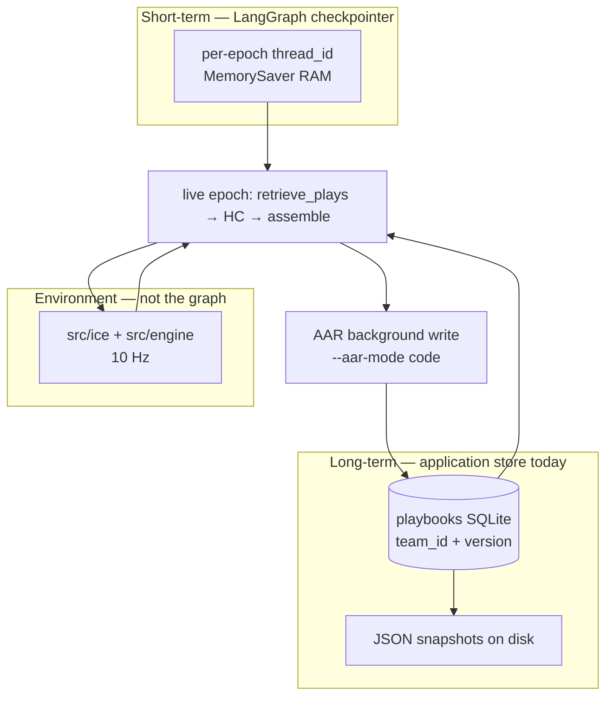

# Knowledge and learning — Graph_Hockey (LangGraph staffs)

| Field | Value |
| --- | --- |
| **Date** | 2026-08-26 |
| **Status** | Plan after cycle 2 abort. Bank **2/5** on hockey quality. Write path proven. **Retention across series not proven.** |
| **Scoreboard** | [`better-hockey.md`](better-hockey.md) |
| **Bibliography** | [`ANNOTATED_BIBLIOGRAPHY.md`](ANNOTATED_BIBLIOGRAPHY.md) |
| **Handbook** | [`FORgasan.md`](FORgasan.md) |

This document is the plan to **prove** three different things we have been saying as one sentence. Deep-research review (2026-08-26) says they are not the same proof.

---

## Key Decisions

1. **Split proofs: write path, retention/transfer, hockey quality.** A version bump is (1). Carry-forward books into a new series is (2). Δ xG vs previous-best is (3). Do not cash (3) for ice-only PRs as “the graph learned,” and do not cash (1) as (2).

2. **Playbooks stay on the agent side of the Sutton cut.** `src/ice/` and `src/engine/` are environment. AAR + retrieve + SQLite `playbooks` are agent memory. Experimenter ice edits change the MDP; they are not LangGraph learning (Sutton & Barto Ch. 3.1; Jiang 2019).

3. **AAR is background memory writing.** LangGraph documents hot-path vs background writes; background exists to keep live-turn latency down. Live epochs stay 12s. Do not raise timeouts. Do not put Store `put` on the 10 Hz tick.

4. **Retention Evaluate does not require LangGraph `BaseStore`.** Official Store is `compile({ store })`. We do not do that today (`compileTeamGraph` is checkpointer-only). Proving C6 needs **not wiping** `latestPlaybook` between series A and series B. Wiring `BaseStore` is an honesty/alignment PR, not the proof.

5. **Transfer test is retrieve-and-use, not stats on 122.** Home `retrieveTop` 0/6 after the lead-protect gate can be success (illegal sheet gone). Proof that *memory changed the policy* is: later episode executes a different play or different params **because** retrieve saw the stored book, vs a seed-fresh twin. Quality vs `--no-llm` still required for *beneficial* transfer (Feng et al.: retrieved skills can hurt).

6. **Quality bank stays 5 Δ xG credits.** Retention gets its **own** pass/fail and does **not** steal a bank slot. Ice PRs that fix chance mean may still take a counting quality Evaluate.

7. **Carry-forward before more ice, unless Glimmer is down.** Cycle 3 Diagnose named F2 OZ-carry support. That is still valid hockey. The *learning* hole is larger: we have never probed a v8 book on a new series. Recommended order below. Glimmer was killed; do not restart `:8080` unless asked. Ice + unit tests do not need it. Live Evaluates do.

---

## Progress (honest, measured)

### Proof 1 — Write path (proven)

Inside **one** sqlite, live AAR applies. Books v1→v8. `--no-llm` twin stays v1, `retrieveTopChanged` 0/6, `booksMoved` false. Snapshots: `data/playbook-snapshots/<seriesId>/before.json` + `after-game-N.json`. Code: `ensureSeedPlaybooks` then `latestPlaybook` each game (`src/sim/series.ts`, `src/persist/playbooks.ts`).

This is CoALA “learning = write LTM” **within a series**. It is also LangGraph’s background-write pattern (AAR after the result, not on the 12s epoch).

### Proof 2 — Maintain knowledge (not proven across series)

Every counting Evaluate uses a **fresh** db (`data/ser-emp-N.sqlite`). `ensureSeedPlaybooks` inserts seed JSON as v1. The v8 book from last night is a snapshot on disk, not the next series’ opening menu.

Checkpointer is `MemorySaver` (RAM) with a **per-epoch** `thread_id`. That is correct for “don’t stuff the whole match into the prompt.” It also means **zero** long-term knowledge lives in LangGraph checkpoints. All of it has to be playbooks. We then discard the playbooks between experiments.

`ensureSeedPlaybooks` **would** keep v2+ if we reused the same db. The protocol, not the table, is the hole.

Voyager’s retention test is a **new world** with the old skill library. ExpeL’s exam is one shot with the experience pool. Hu et al. 2026: Task B starts from memory accumulated on Task A. We have not run that protocol.

### Proof 3 — Get better at hockey (bank 2/5)

| | Then (`ser-emp-7`) | Now |
| --- | ---: | ---: |
| Lead-protect while losing | g4–g6 locked | **0** skating hits |
| Live offsides | 0–2 (control storms) | live **0–2** |
| Credited home Δ xG | — | **−0.376** then **−0.071** |
| Last two series Δ xG | — | **+0.097** (uncashed: chance mean &lt; 6) |
| Pairs floor | 0 | credited **4** |
| Bank | 0 | **2 / 5** |

g6 on Evaluate 9/10 was a **4–1** with xG **1.02**. Middle games (g2 6s OZ / 27s DZ) kill chance mean. High-slot and DZ outlet did **not** move g0/g6 hashes vs each other — ice quality is real when they have OZ; volume is not.

Home still opens **`5v5-122-forecheck`** every live game. AAR boosts 122. That is confirmatory memory on the default play, not a new skill (C7). Away sometimes moves 212 ↔ crash-net (diagnostic).

---

## How LangGraph says memory works (mapped to this repo)



| CoALA / LangGraph type | In Graph_Hockey | Hot or background |
| --- | --- | --- |
| Working / short-term | Per-epoch graph state + checkpointer | Hot (12s) |
| Semantic | `play.stats` xG, `counters`, family | Background AAR |
| Episodic | Event log, film clips, snapshots | After the game |
| Procedural | Seed JSON assignments + ice code; AAR `boost` / `tweak` | Ice is env; play JSON is agent |
| Grounding | `advanceWorld` | Every tick |

**We do not compile with `store`.** Official long-term memory is `builder.compile({ checkpointer, store })` and nodes `runtime.store.put/search`. Ours is SQLite beside the graph. Research verdict on “this *is* LangGraph Store”: **fails**. Research verdict on “this *can* be valid agent LTM”: **holds** if the next episode actually reads it.

---

## Goals

- Prove **retention**: series B opens from series A’s after-game-6 books; a seed-fresh twin does not.
- Prove **transfer**: at least one later game **executes** a non-seed play (or non-seed params) because retrieve ranked the stored book, not because ice changed.
- Keep proving **quality**: bank to 5 on Δ xG with the existing floors (pairs, chance mean, offsides, no lead-protect skating).
- Optional later: wrap playbooks in `BaseStore` so the pitch matches LangGraph docs.

## Non-goals

- Fine-tuning grok / Glimmer weights. CoALA lists that as one learning mode; it is not v1.
- Per-skater LangGraphs. Captain micro. Raising timeouts. Restarting 8787. Restarting Glimmer unless asked.
- Calling ice PRs “the graph learned.”
- Implementing `--aar-mode code` as `noLlm: true`.
- Spending a quality-bank slot on cosmetics (PR-7 scorecard flag).

---

## Proposed design

### Retention protocol (new counting *learning* Evaluate, not a quality-bank steal)

Three arms, same seed 7, 7×20s, captain unset, timeouts not raised:

| Arm | Books at g0 | LLM | What it proves |
| --- | --- | --- | --- |
| **Carry** | Load `ser-emp-15` (or latest credited) `after-game-6` original-six + expansion | xAI vs Glimmer, `--aar-mode code` | Memory survived |
| **Seed-fresh live** | Seed JSON v1, fresh db | same | Isolates carry vs “this ice always looks like that” |
| **`--no-llm` control** | Seed v1 | none | Write path still honest on the fresh arm |

**Pass (retention):** carry g0 `playbookVersion` > 1 **and** carry g0 `retrieveTopId` or play `stats` (xG/games) **differ** from seed-fresh g0 **and** `--no-llm` still v1.

**Pass (beneficial transfer, optional same run):** carry home Δ xG or chance mean **strictly better** than seed-fresh live, with offsides 0–2 and no lead-protect skating.

**Fail honestly:** if carry and seed-fresh are identical hockey and identical retrieve, the stored book is dead weight (confirmatory 122). Then the next PR is retrieve/AAR targeting, not more ice.

CLI sketch (one flag, no new architecture):

```text
npm run gh -- series --from-snapshot data/playbook-snapshots/ser-emp-15/after-game-6.json
  --games 7 --period-seconds 20 --seed 7
  --home-provider xai --away-provider muse --aar-mode code
  --db data/ser-retain-1.sqlite --id ser-retain-1 --json
```

`runSeries` already calls `currentBook = latestPlaybook ?? seed`. Add an insert of snapshot rows **before** the loop when `--from-snapshot` is set. Do not call `resetPlaybookToSeed`. `--no-llm` must refuse to apply AAR (already true).

### Transfer instrumentation (merge-without-Evaluate if it is JSON-only)

`gh series --json` already prints `retrieveTopId` and `openingPlayId`. Add **executed play mix**: seconds or chance share per `playId` (we have `playUsage` in AAR). Print `openingPlayId === retrieveTopId` rate. Do not replace Δ xG.

### Quality track (cycle 3, existing bar)

Still valid Diagnose: F2 support on the OZ carry so high-slot walks have an outlet (chance mean ≥ 6). That is **environment**. It may earn a quality-bank credit. It does not prove retention.

Glimmer is down. Ice + tests can ship. Live Evaluate waits for `:8080`.

### Optional LangGraph Store adapter (later)

A `PlaybookStore` implementing `BaseStore`: namespace `["playbook", teamId]`, key `version` or `latest`. `compileTeamGraph({ store })`. Retrieve node reads `runtime.store`. **Do not** block retention on this. Pitch honesty only.

---

## PR Plan

| PR | Title | Files | Deps | Evaluate? |
| --- | --- | --- | --- | --- |
| **Docs** | Document three proofs + bibliography | `docs/*`, README | none | **Never** |
| **PR-R1** | `--from-snapshot` / `--from-db` seed series from stored books | `src/sim/series.ts`, `src/cli/main.ts`, persist helpers, tests | Docs | **Yes — retention Evaluate** (`ser-retain-1`) when Glimmer is up. Does **not** increment quality bank. |
| **PR-R2** | Series JSON: executed play mix / usage share | `src/film/chances.ts`, CLI, tests | none | Never (instrumentation) |
| **PR-H1** | F2 support on OZ carry (cycle 3 ice) | `src/ice/roles.ts`, tests, goldens if pr8 moves | none | Counting **quality** Evaluate 11 if ice ships and Glimmer is up |
| **PR-R3** | Optional `BaseStore` playbook adapter | `src/playbook/`, `teamGraph.ts` | R1 | Only if retrieve path actually reads Store |

Independently mergeable: R2 and H1 do not need R1. R1 is the learning proof. Cranky → `npm test` on all. Goldens move only if H1 changes `--no-llm` physics.

### Suggested sequence

1. Merge this docs set (this PR).
2. Implement **PR-R1** (carry-forward). Unit tests with a fake snapshot. No live LLM.
3. When Glimmer is back: **retention Evaluate** + seed-fresh twin + `--no-llm`. Publish the card in `better-hockey.md` under a **Retention** heading, not the quality bank.
4. If carry is dead weight (still 122, same hockey): Diagnose retrieve/AAR (boost something retrieve will pick). If carry helps: keep quality cycle (H1 / chance mean).
5. Bank 5 is still the hockey program. Retention is how we show the LangGraph **kept** the lesson.

---

## Risks

| Risk | Mitigation |
| --- | --- |
| Carry-forward uses a book trained on **old ice** | Snapshot from a series whose ice matches `main` (e.g. `ser-emp-15` or later). Do not carry `ser-emp-7` protect-lead books. |
| Operator thinks `env` seed 7 “resets memory” | Seed reseeds **physics**. Playbooks are separate. Document on the CLI help line. |
| Quality bank confused with retention | Separate heading, separate series ids `ser-retain-*`. |
| BaseStore rewrite stalls hockey | Optional. R1 first. |
| Glimmer down | Do not restart unless asked. R1 tests are `--no-llm`. Live wait. |

---

## Open Questions

Answered in Key Decisions unless you override:

| Question | Recommended |
| --- | --- |
| Carry-forward vs F2 ice first? | **R1 next** for the learning claim. H1 in parallel if you want hockey volume while Glimmer is down (unit tests only until `:8080`). |
| Quality bank vs retention slot? | **Separate.** Bank stays Δ xG. |
| Wire official Store now? | **No.** After R1 pass. |

---

## Inner loop (unchanged)

Diagnose → Implement → Cranky (`/review --local`) → `npm test` → Merge → Evaluate if the PR counts. `--aar-mode code` is not `--no-llm`. Do not commit `.env`. Do not raise `GRAPH_HOCKEY_EPOCH_TIMEOUT_MS`.
